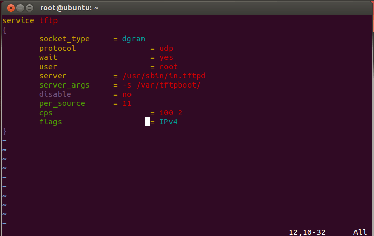
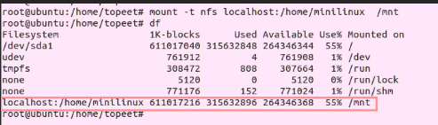
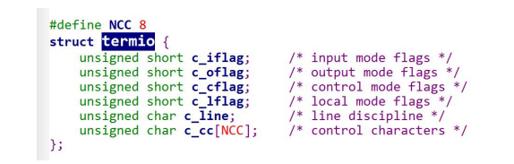
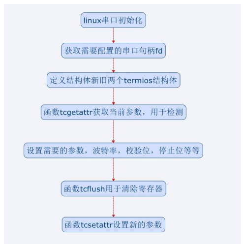

<<<<<<< HEAD
## 嵌入式开机启动运行 ##

目的：开机启动 /bin/helloworld

```
vi /etc/init.d/rcS
```

添加 " /bin/helloworld & "，添加运行指令


## 镜像烧写 - OTG烧写 ##

1. 进入uboot模式

2. 创建 eMMC     分区并格式化。如果原来已经做过此步骤，则可以跳过，不必每次烧写前都分区和格式化。在超级终端中，输入下面分区和格式化命令。

3. 1. 输入分区命令“fdisk      -c 0”

4. 1. 输入命令“fatformat mmc 0:1”
   2. 输入命令“ext3format mmc 0:2”
   3. 输入命令“ext3format mmc 0:3”
   4. 输入命令“ext3format mmc 0:4”
   5. 输入命令“fastboot”

1.  在 Windows 命令行中，输入下面的命令：

2. 1. 输入烧写 uboot 命令“fastboot.exe      flash bootloader u-boot-TOP-4412.bin”
   2. 输入烧写 zImage 内核命令“fastboot.exe      flash kernel zImage”
   3. 输入烧写 ramdisk 命令“fastboot.exe      flash ramdisk ramdisk-uboot.img”
   4. 输入烧写 system 文件系统命令“fastboot.exe      flash system system.img”
   5. 输入擦除命令“fastboot -w”
   6. 输入重启开发板命令“fastboot reboot”


## curl库移植 ##

编译器：arm-2014.05-29-arm-none-linux-gnueabi-i686-pc-linux-gnu.tar.bz2

一. curl库简介

>curl主要功能就是用不同的协议连接和沟通不同的服务器，也就是相当封装了的sockPHP 支持libcurl（允许你用不同的协议连接和沟通不同的服务器）。 lcurl当前支持http, https, ftp, gopher, telnet, dict, file, 和ldap 协议。libcurl同样支持HTTPS证书授权，HTTP POST, HTTP PUT, FTP 上传（当然你也可以使用PHP的ftp扩展）, HTTP基本表单上传，代理，cookies,和用户认证。

二.移植

1，解压压缩包进进入解压后的目录

```
tar -vxf curl-7.65.0.tar.gz
cd curl-7.65.0
```

2，配置编译参数，输入以下命令

```shell
./configure --prefix=/usr/local/curl/ --host=arm-linux-gnueabihf CC=arm-linux-gnueabihf-gcc CXX=arm-linux-gnueabihf-g++ --with-ssl=/usr/local/openssl
```

--prefix=/usr/local/curl/   指定安装路径为/usr/local/curl/

--host  指定运行平台为arm

CC和 CXX  指定交叉编译器

–with-ssl  使用https（在百度AI快速入门里面说明了libcurl需要支持https）

--with-wolfssl 不使用ssl

3.编译并安装

```shell
make && make install
```

最后我们可以看到在 /usr/local/目录下已经安装好了头文件和库文件


## man命令的使用 ##

man的分页

• man命令的8个分页： 

• man 1 – 一般命令。常见的linux命令，例如ls，cd，cat等等 

• man 2 – 用来放内核提供的系统调用或者函数。例如man 2 fork等 

• man 3 – C库函数

• man 4 – 特殊文件，例如设备和驱动程序 

• man 5 – 文件格式。包括完全使用文本配置文件定制系统的操作，大量的配置文 件，网络服务列表，可用的shell列表等等 

• man 6 – 游戏和屏幕保护程序。 

• man 7 – 杂类文件。 

• man 8 – 系统管理命令，超级用户可能需要用到它们。 

 

手册页的框架

• 各种命令选项差异很大，但是手册页的内容是有规律可以掌握的 

• 最简单的手册包含5个部分:名称、大纲、描述、一些事例和其它相关资料的引用 

​	– name（名称）给出命令、函数或文件格式的名称，以及对软件作用的单 行的准确描述 

​	– synopsis（大纲）简要描述如何使用这个软件 

​	– description（描述）讨论特性、使用方法和命令行上可以使用的所有选项 

​	– examples（示例）部分给出实用程序的一般用途、常见的特殊情况和解释 

​	– See Also（参见）提供相关资料的引用，比如其他相关命令、重要的系统 文件、行业标准规范等等。 

​	– 其它特殊部


## TFTP服务器搭建 ##

**搭建服务器**

– 安装xinetd，sudo apt-get install xinetd 

– 安装tftp 和tftpd，sudo apt-get install tftp tftpd 

– 配置/etc/xinetd.d/tftp文件(一定要对齐，严格按照格式输入！)

```
service tftp
{
        socket_type = dgram
        protocol = udp
        wait = yes
        user = root
        server = /usr/sbin/in.tftpd
        server_args = -s /var/tftpboot/
        disable = no
        per_source= 11
        cps = 100 2
        flags = IPv4
}
```



 

**tftp文件中的/var/tftpboot是服务器的目录**

– 新建tftp服务器目录mkdir /var/tftpboot 

– 修改权限为777 

– 重启xinetd服务sudo /etc/init.d/xinetd restart

 

**本机测试**

– 在/var/tftpboot 下面建立一个文件test.c，输入任意内容

– 启动另一个终端

– 输入命令tftp 127.0.0.1 

– 输入get test.c

– 输入q可以退出

– 退出后，使用ls命令可以发现当前目录下有test文件，如果这个文件和服务器中的test文件内容一模一样，表明服务器搭建成功

**开发板连接**

```
tftp -g -l test -r test.c 192.168.1.109
tftp -g -l local.conf -r local.conf 192.168.3.102
```

 

## NFS服务器搭建 ##

安装Ubuntu NFS服务

```
apt-get install nfs-kernel-server
```

​	• 安装过程弹出对话，选择Y，回车继续安装

• 配置/etc/exports

​	– 最后一行添加/home/minilinux/ *(rw,sync,no_root_squash) 

​	– /home/minilinux/表示要共享的目录，根据实际情况修改

​	– *：代表允许所有的网络段访问

​	– rw：是可读写权限

​	– sync：是资料同步写入内存和硬盘

​	– no_root_squash：是Ubuntu nfs 客户端分享目录使用者的权限，如果客户端使用的是root 用户，那么对于该共享目录而言，该客户端就具有root 权限

 

• 重启portmap 服务

​	– /etc/init.d/portmap restart 

​	( rpcbind 已经取代 portmap ,应该运行 /etc/init.d/rpcbind restart )

• 重启nfs 服务

​	– /etc/init.d/nfs-kernel-server restart

 

NFS网络文件系统

• NFS 是Network FileSystem 的缩写，protocol），NFS 是基于UDP/IP 协议的应用。

• 它的最大功能就是可以通过网络让不同的机器，不通的操作系统彼此共享文件，可以通过NFS 挂载远程主机的目录，访问该目录就像访问本地目录一样，所以也可以简单的将它看做一个文件服务器。

• 通过NFS 服务，我们可以实现在线调试文件系统或应用程序，而不用像传统的方式生成文件系统镜像，然后烧写到iTOP-4412 的eMMC 里，在启动开发板。通过NFS 服务可以提高我们的调试效率。

• Android或者Qt文件系统太大，启动过慢；最小 linux系统却非常适合使用NFS网络文件系统来调试。

 

**Ubuntu测试**

在虚拟机 Ubuntu 控制台输入“mount -t nfs localhost:/home/minilinux /mnt”命令，这个命令可以把/home/minilinux 挂载到/mnt 目录下。记着使用“df”命令查看是否挂载成功



 

**开发板测试**

• 配置缺省文件

– 作者的是SCP核心板+精英版

• 配置内核

- 确保为同一网段,在/etc/eth0-setting修改ip

• 进入Networking support

​	– 选中Networking options然后进入

​		• 选中IP: kernel level autoconfiguration

• 进入File systems

​	– 选中Network File Systems然后进入

​		• 选中以下选项

​		“NFS client support”，“NFS client support for NFS version 3”，“NFS client support for the NFSv3 ACL protocol extension”，“NFS client support for NFS version 4”，“NFS client support for NFSv4.1”，“Root file system on NFS”一共六个选项

• 保存退出

• 编译内核烧写

– 注释掉网卡调试信息drivers/net/usb/dm9620.c，关键词LEN_PLOAD，注释掉三行打印信息

– 编译make zImage

– 烧写新的内核

```
mount -t nfs -o nolock 192.168.3.14:/home/minilinux /mnt/nfs
mount -t nfs 192.168.3.101:/home/minilinux /mnt/nfs
mount -t nfs localhost:/home/minilinux /mnt
```

上面 IP 地址，用户需要修改为自己 Ubuntu 的 IP


## 字符类 ADC 模数转换 ##

第 14 行，设备节点为 char *adc = "/dev/adc"。 
第 21 行，打开设备节点文件。 
第 26 行，使用 read 函数，将读取数字赋予 buffer。 
第 30 和 31 行，做个简单地换算，将读取的数值转化为电阻值。

示例：

```c
#include <stdio.h>
#include <stdlib.h>
#include <fcntl.h>
#include <errno.h>
#include <unistd.h>
#include <sys/types.h>
#include <sys/stat.h>
#include <string.h>
#include <stdint.h>
#include <termios.h>
//#include <android/log.h>
//#include <sys/ioctl.h>
int main(void){
    int fd;
    char *adc = "/dev/adc";
    char buffer[512];
    int len=0, r=0;
    
    memset(buffer,0,sizeof(buffer));
        printf("adc ready!\n");
    
    if((fd = open(adc, O_RDWR|O_NOCTTY|O_NDELAY))<0)
        printf("open adc err!\n");
    else{
        printf("open adc success!\n");
        
        len=read(fd,buffer,10); 
        
        if(len == 0)
            printf("return null\n");
        else{
            r = atoi(buffer);
            r = (int)(r*10000/4095);    //Datas  transition to Res
            printf("res value is %d\n",r);
        }           
    }
}
```


## 串口通信-RS232串口通信 ##

​		RS-232 是 EIA(Electronic Industries Association)定义的串行通信的电器接口。RS-232 事实上有三种(A,B 和 C)，它们分别采用不同的电压来表示 on 和 off。最被广泛使用的是 RS-232C，它将 mark(on)比特的电压定义为-3V 到-12V 之间，而将 space(off)的电压定义到 +3V 到+12V 之间。虽然 RS-232C 标准说信号最远被传输 8m，但事实上你可以使用它传输 更长的距离，直到信号波特率已经小到不行了为止。 RS-232 的连结线中除去用来传入传出数 据的电线，还有一些用来提供时序，状态和握手的电线。 

​		RS232 有两种标准定义，25 针和 8 针的。不过即使是 8 针，在大多数场合工程师也觉得 太多了，绝大多数情况下都是只使用 TX，RX 针脚发送和接收信号，再加上一个 GND 地脚。 其它定义大家可以通过网络了解一下。

​		在 linux 下串口编程流程比较容易理解，如下所示：

​		Linux串口编程流程 -> 开始 -> 打开串口 -> 初始化串口 -> 发送和接受数据 -> 关闭


## 串口通信-发送数据 ##

```c
#include <stdio.h>
#include <string.h>
#include <unistd.h>
#include <sys/types.h>
#include <sys/stat.h>
#include <fcntl.h>
#include <termios.h>
#include <errno.h>
int set_opt(int,int,int,char,int); //初始化函数
void main()
{
    int fd,wr_static,i=10;
    char *uart3 = "/dev/ttySAC3";
    char *buffer = "hello world!\n";
    
    printf("\r\nitop4412 uart3 writetest start\r\n");
    
    if((fd = open(uart3, O_RDWR|O_NOCTTY|O_NDELAY))<0){
        printf("open %s is failed",uart3);
    }
    else{
        printf("open %s is success\n",uart3);
        set_opt(fd, 115200, 8, 'N', 1); 
        while(i--)
        {
            wr_static = write(fd,buffer, strlen(buffer));
            if(wr_static<0)
                printf("write failed\n");
            else{
                printf("wr_static is %d\n",wr_static);
            }
            sleep(1);
        }
    }
    close(fd);
}

int set_opt(int fd,int nSpeed, int nBits, char nEvent, int nStop)
{
    struct termios newtio,oldtio;
    if  ( tcgetattr( fd,&oldtio)  !=  0) { 
        perror("SetupSerial 1");
        return -1;
    }
    bzero( &newtio, sizeof( newtio ) );
    //bzero(void *s,n);将字符串s的前n个字节置为0，
    //一般来说n通常取sizeof(s),将整块空间清零。
    newtio.c_cflag  |=  CLOCAL | CREAD;
    newtio.c_cflag &= ~CSIZE;
    switch( nBits )
    {
    case 7:
        newtio.c_cflag |= CS7;
        break;
    case 8:
        newtio.c_cflag |= CS8;
        break;
    }
    switch( nEvent )
    {
    case 'O':
        newtio.c_cflag |= PARENB;
        newtio.c_cflag |= PARODD;
        newtio.c_iflag |= (INPCK | ISTRIP);
        break;
    case 'E': 
        newtio.c_iflag |= (INPCK | ISTRIP);
        newtio.c_cflag |= PARENB;
        newtio.c_cflag &= ~PARODD;
        break;
    case 'N':  
        newtio.c_cflag &= ~PARENB;
        break;
    }
    switch( nSpeed )
    {
    case 2400:
        cfsetispeed(&newtio, B2400);
        cfsetospeed(&newtio, B2400);
        break;
    case 4800:
        cfsetispeed(&newtio, B4800);
        cfsetospeed(&newtio, B4800);
        break;
    case 9600:
        cfsetispeed(&newtio, B9600);
        cfsetospeed(&newtio, B9600);
        break;
    case 115200:
        cfsetispeed(&newtio, B115200);
        cfsetospeed(&newtio, B115200);
        break;
    case 460800:
        cfsetispeed(&newtio, B460800);
        cfsetospeed(&newtio, B460800);
        break;
    default:
        cfsetispeed(&newtio, B9600);
        cfsetospeed(&newtio, B9600);
        break;
    }
    if( nStop == 1 )
        newtio.c_cflag &=  ~CSTOPB;
    else if ( nStop == 2 )
    newtio.c_cflag |=  CSTOPB;
    newtio.c_cc[VTIME]  = 0;
    newtio.c_cc[VMIN] = 0;
    tcflush(fd,TCIFLUSH);
    if((tcsetattr(fd,TCSANOW,&newtio))!=0)
    {
        perror("com set error");
        return -1;
    }
//  printf("set done!\n\r");
    return 0;
}
```


## 串口通信-打开串口 ##

1. 进入 dev 目录，输入查找命令“ls tty*"找到对应驱动文件

2. 编写简单的 uartopen.c 文件

   ```c
   #include <stdio.h>
   #include <sys/types.h>
   #include <sys/stat.h>
   #include <fcntl.h>
   #include <unistd.h>
   #include <string.h>
   
   void main(){
       int fd;
       char *uart3 = "/dev/ttySAC3";
   
       if((fd = open(uart3,O_RDWR|O_CREAT,0777))<0){
           printf("open %s failed!\n",uart3);
       }
       else{
       	printf("open %s is success!\n",uart3);
       }
   
       close(fd);
   }
   
   ```

   第 13 行，打开“/dev/ttySAC3”设备节点，方法和 led 等字符的方法类似。

   第 14 行，打开不成功则发送“open %s is failed!”。

   第 17 行，打开成功则发送“open %s is success!”。

   第 20 行，使用 close 函数关闭文件
   
   

## 串口通信-初始化 ##

**termio 结构体**

打开“arch\arm\include\asm”目录下的“termios.h”头文件。

如下图所示，可以看到这个 termio 结构体的定义



成员 tcflag_t c_iflag：输入模式标志

成员 tcflag_t c_oflag：输出模式标志

成员 tcflag_t c_cflag：控制模式标志

成员 tcflag_t c_lflag：本地模式标志

成员 cc_t c_line：line discipline

成员 cc_t c_cc[NCC]：control characters

**函数 tcgetatt**

函数 tcgetattr 用于读取当前串口的参数值，在实际应用中，一般用于先确认该串口是否能 够配置，做检测用。

需要用到头文件 **#include<termios.h>和#include<unistd.h>**。

函数原型为 **int tcgetattr(int fd, struct termios \*termios_p)**。 

参数 1：fd 是 open 返回的文件句柄。

参数 2：*termios_p 是前面介绍的结构体。 使用这个函数前可以先定义一个 termios 结构体，用于存储旧的参数。

 

**函数 tcsetattr** 

前面介绍了读取串口配置参数的函数，tcsetattr 函数是设置串口参数的函数。

**int tcsetattr(int fd, int optional_actions,const struct termios \*termios_p);** 

参数 1：fd 是 open 返回的文件句柄。 

参数 2：optional_actions 是参数生效的时间。 

有三个常用的值：TCSANOW：不等数据传输完毕就立即改变属性；TCSADRAIN：等待 所有数据传输结束才改变属性；TCSAFLUSH：清空输入输出缓冲区才改变属性。 

参数 3：*termios_p 在旧的参数基础上修改的后的参数。 

执行成功返回 0，失败返回-1 

一般在初始化最后会使用这个函数。

 

**波特率相关的函数**

函数 cfsetispeed 和 cfsetospeed 用于**修改串口的波特率**，函数 cfgetispeed 和 cfgetospeed 可以用于**获取当前波特率**。在实际应用中，这个经常需要用到，例如修改默认的波特率。波特率相关的函数需要用到头文件**#include<termios.h>**和**#include<unistd.h>**。

先介绍设置波特率的函数。

函数 **int cfsetispeed(struct termios \*termios_p, speed_t speed);** 

参数 1：*termios_p 是前面介绍的结构体。 

参数 2：speed 波特率，常用的 B2400，B4800，B9600，B115200，B460800 等等。 

执行成功返回 0，失败返回-1

 

函数 **int cfsetospeed(struct termios \*termios_p, speed_t speed);**

参数 1：*termios_p 是前面介绍的结构体。

参数 2：speed 波特率，常用的 B2400，B4800，B9600，B115200，B460800 等等。

执行成功返回 0，失败返-1

 

下面介绍获取波特率的函数。

函数 **speed_t cfgetispeed(const struct termios \*termios_p)**。用于读取当前串口输入的波特率。

参数 1：*termios_p 是前面介绍的结构体。

返回值为 speed_t

 

函数 **speed_t cfgetospeed(const struct termios \*termios_p)**。这个函数用于读取当前输出的波特率。

参数 1：*termios_p 是前面介绍的结构体。

返回值为 speed_t 类型，当前波特率。

 

**函数 tcflush**

函数 tcflush 用于清空串口中没有完成的输入或者输出数据。在接收或者发送数据的时候， 串口寄存器会缓存数据，这个函数用于清除这些数据。 

原型为 **int tcflush(int fd, int queue_selector);** 

参数 1：fd 是 open 返回的文件句柄。 

参数 2：控制 tcflush 的操作。 

有三个常用数值，TCIFLUSH 清除正收到的数据，且不会读取出来；TCOFLUSH 清除正 写入的数据，且不会发送至终端；TCIOFLUSH 清除所有正在发生的 I/O 数据。 

执行成功返回 0，失败返回-1

 

**其它函数的使用** 

在串口中还有其它的参数需要了解，其它的函数需要学习。 大家在 linux 下使用串口的时候，如果有其它的参数需要配置，可以在网上搜索相关的资 料，那样针对性更强，有的放矢，效率更高。 

**如下图所示，是串口初始化的流程图。** 



**初始化函数**

```C
int set_opt(int fd,int nSpeed, int nBits, char nEvent, int nStop)
{
    struct termios newtio,oldtio;
    if  ( tcgetattr( fd,&oldtio)  !=  0) { 
        perror("SetupSerial 1");
        return -1;
    }
    bzero( &newtio, sizeof( newtio ) );
    //bzero(void *s,n);将字符串s的前n个字节置为0，
    //一般来说n通常取sizeof(s),将整块空间清零。
    newtio.c_cflag  |=  CLOCAL | CREAD;
    newtio.c_cflag &= ~CSIZE;
    switch( nBits )
    {
    case 7:
        newtio.c_cflag |= CS7;
        break;
    case 8:
        newtio.c_cflag |= CS8;
        break;
    }
    switch( nEvent )
    {
    case 'O':
        newtio.c_cflag |= PARENB;
        newtio.c_cflag |= PARODD;
        newtio.c_iflag |= (INPCK | ISTRIP);
        break;
    case 'E': 
        newtio.c_iflag |= (INPCK | ISTRIP);
        newtio.c_cflag |= PARENB;
        newtio.c_cflag &= ~PARODD;
        break;
    case 'N':  
        newtio.c_cflag &= ~PARENB;
        break;
    }
    switch( nSpeed )
    {
    case 2400:
        cfsetispeed(&newtio, B2400);
        cfsetospeed(&newtio, B2400);
        break;
    case 4800:
        cfsetispeed(&newtio, B4800);
        cfsetospeed(&newtio, B4800);
        break;
    case 9600:
        cfsetispeed(&newtio, B9600);
        cfsetospeed(&newtio, B9600);
        break;
    case 115200:
        cfsetispeed(&newtio, B115200);
        cfsetospeed(&newtio, B115200);
        break;
    case 460800:
        cfsetispeed(&newtio, B460800);
        cfsetospeed(&newtio, B460800);
        break;
    default:
        cfsetispeed(&newtio, B9600);
        cfsetospeed(&newtio, B9600);
        break;
    }
    if( nStop == 1 )
        newtio.c_cflag &=  ~CSTOPB;
    else if ( nStop == 2 )
    newtio.c_cflag |=  CSTOPB;
    newtio.c_cc[VTIME]  = 0;
    newtio.c_cc[VMIN] = 0;
    tcflush(fd,TCIFLUSH);
    if((tcsetattr(fd,TCSANOW,&newtio))!=0)
    {
        perror("com set error");
        return -1;
    }
//  printf("set done!\n\r");
    return 0;
}
```


## 串口通信-接收数据 ##

```c
#include <stdio.h>
#include <string.h>
#include <unistd.h>
#include <sys/types.h>
#include <sys/stat.h>
#include <fcntl.h>
#include <termios.h>
#include <errno.h>
int set_opt(int,int,int,char,int);
//"/dev/ttySAC3"是con2，靠近耳机接口的串口
void main()
{
    int fd,nByte;
    char *uart3 = "/dev/ttySAC3";
    char buffer[512];
    char *uart_out = "please input\r\n";
    memset(buffer, 0, sizeof(buffer));    //数组清零
    if((fd = open(uart3, O_RDWR|O_NOCTTY))<0)
        printf("open %s is failed",uart3);
    else{
        set_opt(fd, 115200, 8, 'N', 1);
        write(fd,uart_out, strlen(uart_out));
        while(1){
            while((nByte = read(fd, buffer, 512))>0){
                buffer[nByte+1] = '\0';         
                write(fd,buffer,strlen(buffer));
                memset(buffer, 0, strlen(buffer));
                nByte = 0;
            }
        }
    }
}
int set_opt(int fd,int nSpeed, int nBits, char nEvent, int nStop)
{
    struct termios newtio,oldtio;
    if  ( tcgetattr( fd,&oldtio)  !=  0) { 
        perror("SetupSerial 1");
        return -1;
    }
    bzero( &newtio, sizeof( newtio ) );
    newtio.c_cflag  |=  CLOCAL | CREAD;
    newtio.c_cflag &= ~CSIZE;
    switch( nBits )
    {
        case 7:
            newtio.c_cflag |= CS7;
            break;
        case 8:
            newtio.c_cflag |= CS8;
            break;
    }
    switch( nEvent )
    {
    case 'O':
        newtio.c_cflag |= PARENB;
        newtio.c_cflag |= PARODD;
        newtio.c_iflag |= (INPCK | ISTRIP);
        break;
    case 'E': 
        newtio.c_iflag |= (INPCK | ISTRIP);
        newtio.c_cflag |= PARENB;
        newtio.c_cflag &= ~PARODD;
        break;
    case 'N':  
        newtio.c_cflag &= ~PARENB;
        break;
    }
    switch( nSpeed )
    {
        case 2400:
            cfsetispeed(&newtio, B2400);
            cfsetospeed(&newtio, B2400);
            break;
        case 4800:
            cfsetispeed(&newtio, B4800);
            cfsetospeed(&newtio, B4800);
            break;
        case 9600:
            cfsetispeed(&newtio, B9600);
            cfsetospeed(&newtio, B9600);
            break;
        case 115200:
            cfsetispeed(&newtio, B115200);
            cfsetospeed(&newtio, B115200);
            break;
        case 460800:
            cfsetispeed(&newtio, B460800);
            cfsetospeed(&newtio, B460800);
            break;
        default:
            cfsetispeed(&newtio, B9600);
            cfsetospeed(&newtio, B9600);
            break;
    }
    if( nStop == 1 )
        newtio.c_cflag &=  ~CSTOPB;
    else if ( nStop == 2 )
        newtio.c_cflag |=  CSTOPB;
        newtio.c_cc[VTIME]  = 0;
        newtio.c_cc[VMIN] = 0;
        tcflush(fd,TCIFLUSH);
    if((tcsetattr(fd,TCSANOW,&newtio))!=0)
    {
        perror("com set error");
        return -1;
    }
    
    //  printf("set done!\n\r");
    return 0;
}
```


## 网络通信-搭建web服务器(*) ##

原理: 使用 boa 搭建 web 服务器

 

• 第一步：boa的拷贝解压 

​	– 官网地址www.boa.org 

​	– 使用ssh软件拷贝到Ubuntu系统中（arm的Ubuntu环境） 

​	– 解压#tar -vxf boa-0.94.13.tar.gz 

​	– #cd boa-0.94.13 

• 第二步：boa生成Makefile编译文件 

​	– #cd src 

​	– 运行#./configure 

​	– 当前目录下生成Makefile编译

• 第三步：修改Makefile里面的两个参数 

​	– #vi Makefile（或者#vim Makefile） 

​	– 查找到有CC = gcc的行，在31行左右（使用vi编辑器的查找命令#/CC = gcc） 

​	– 替换为CC = arm-none-linux-gnueabi-gcc -static 修改编译器 

​	– 查找到有CPP = gcc -E的行，在32行左右 

​	– CPP = arm-none-linux-gnueabi-gcc -E -static 

​	– 保存退出 

​	– 输入#make 开始编译 

• 第四步：编译过程中会出现错误 

​	– #vi compat.h 

​	– 查找到有 #define TIMEZONE_OFFSET(foo) foo##->tm_gmtoff 的行，在123行 左右，替换为 #define TIMEZONE_OFFSET(foo) foo->tm_gmtoff 

​	– 保存退出 

​	– 继续编译 

• 第五步：生成boa文件，给boa瘦身 

​	– #ls查看boa是否生成 

​	– #ll boa查看其大小932743 

​	– 使用瘦身命令#arm-none-linux-gnueabi-strip boa 

​	– #ll boa查看其大小64234

• 第六步：NFS系统文件处理 

​	– 拷贝编译生成的boa到NFS文件系统的bin目录下 

​	– 在NFS文件系统的etc目录下建立boa文件夹 

​	– 在NFS文件系统的目录下建立www文件夹 

​	– 在NFS文件系统的www目录下面建立文件夹cgi-bin目录 

• 第七步：添加配置文件和用户组 

​	– 拷贝boa-0.94.13目录下面默认的boa.conf到NFS文件系统的etc/boa中

​	– 拷贝虚拟机下面/etc目录下的mime.types到NFS文件系统的etc目录下面

• 第八步：用户组，如果使用的是QT裁剪过来的则不需要执行这一步 

​	– 在NFS文件系统的etc目录下用命令#vi group命令建立group文件 

​	– 在group文件中添加root:*:0: 

• 第九步：修改配置文件boa.conf 

​	– 进到NFS文件系统的etc/boa目录，打开boa.conf文件#vi boa.conf 

​	– 查找到有Group nogroup的行，在50行左右，替换为Group root 

​	– 查找到有#ServerName [www.your.org.here](http://www.your.org.here) 的行，在95行左右，替换为 ServerName [www.your.org.here](http://www.your.org.here) (去掉注释)

​	– 查找到有DocumentRoot /var/www的行，在115行左右，替换为 DocumentRoot /www（注意：这里的“/www”就是前面步骤我们使用 mkdir创建的www目录） 

​	– 查找到有ScriptAlias /cgi-bin/ /usr/lib/cgi-bin/的行，在194行左右，替换为 ScriptAlias /cgi-bin/ /www/cgi-bin

• 第十步：添加自动运行脚本，建立网页 

​	– 打开etc/init.d/rcS文件，定位到最后一行

​	– 添加boa &到自动启动，保存退出 

​	– 进入到前面创建的www目录 

​	– vi index.html命令建立index.html 

​	– 拷贝网页代码，保存退出


## 网络通信-web控制led ##

原理使用CGI程序

 

• 第一步：替换index.html代码 

​	– 进入上期视频建立的www目录中，打开index.html 

​	– 拷贝新的程序代码到index.html

• 第二步：CGI程序 

​	– 打开在etc/boa中的boa.conf文件 

​	– 查找ScriptAlias /cgi-bin/ /www/cgi-bin/，这是指定的CGI程序的存储目录 

• 第三步：myled.c 

​	– 进入www/cgi-bin目录 

​	– 将myled.c拷贝进去 

​	– 编译#arm-none-linux-gnueabi-gcc -o myled.cgi myled.c -static 

​	– 修改权限#chmod 777 myled.cg

 

• myled.c 

• printf函数输出的基本格式，简单明了，容易懂 

• char *getenv(char *envvar) 

​	– getenv("QUERY_STRING") 

​	– 该函数用来取得参数envvar环境变量的内容 

​	– QUERY_STRING获取网页传过来的数据 

index.html

```html
<!DOCTYPE html PUBLIC "-//W3C//DTD XHTML 1.0 Transitional//EN" "http://www.w3.org/TR/xhtml1/DTD/xhtml1-transitional.dtd">
<html xmlns="http://www.w3.org/1999/xhtml">
<head>
<meta http-equiv="Content-Type" content="text/html; charset=utf-8" />
<title>led远程控制</title>
<style type="text/css">
body {
  background-color: #999900;
  text-align: center;
}
.ziti {
  font-size: 24px;
}
.juzhong {
  text-align: center;
}
.hsz {
  text-align: center;
}
.hsz td {
  color: #00F;
  font-size: 18px;
}
.hsz {
  background-color: #FCC;
}
.juzhong table {
  text-align: center;
}
.juzhong table tr {
}
#h1 {
  background-color: #0FC;
}
#h2 {
  background-color: #FF9;
}
.h3 {
  background-color: #0CF;
}
.ys1 {
  font-size: 24px;
}
.STYLE1 {font-size: 36px}
</style>
</head>
<body class="juzhong">
<table width="900" border="0" align="center" cellpadding="0" cellspacing="0">
  <tr>
    <td><p class="STYLE1">&nbsp;</p>
    <p class="STYLE1">iTOP-4412 WEB SERVER </p></td>
  </tr>
 
  <tr>
    <td height="30">&nbsp;</td>
  </tr>
  <tr>
    <td><form action="/cgi-bin/myled.cgi" method="get" enctype="application/x-www-form-urlencoded" name="form1" target="_blank" id="form1">
      <table width="300" border="1" align="center" cellpadding="1" cellspacing="1">
        <tr>
          <td>Led1</td>
          <td><input name="led1" type="checkbox" id="led1" value="1" />
            <label for="led1"></label></td>
        </tr>
        <tr>
          <td>Led2</td>
          <td><input name="led2" type="checkbox" id="led2" value="2" />
            <label for="led2"></label></td>
        </tr>
       
        <tr>
          <td colspan="2"><input type="submit" name="submit" id="submit" value="submit" /></td>
          </tr>
      </table>
    </form></td>
  </tr>
  <tr>
    <td ><p>&nbsp;</p>    </td>
  </tr>
</table>
<p>&nbsp;</p>
</body>
</html>
```

myled.c 

```c
#include <stdio.h>
#include <stdlib.h>
int main()
{
    char *data;
    int leds[2] = {0, 0};
    long m, n;
    int exit=0,i,fd;
    printf("Content-Type:text/html;charset=gb2312\n\n");
    printf("<html>\n"); 
    printf("<body>\n");
    printf("<title>iTOP-4412</title> ");
    printf("<h3>iTOP-4412</h3> ");
    data = getenv("QUERY_STRING");
    printf("<p>receive data:%s</p>",data);
    
    while(*data != '\0')
    {
        if(*data=='=')
        switch(*(data+1))
        {
            case '1':leds[0]=1;break;
            case '2':leds[1]=1;break;
            default:exit=1;break;
        }
        if(exit == 1)
            break;
        data++;
    }
    fd=open("/dev/leds",0);
    for(i=0;i<2;i++)
    {
        if(leds[i]==1)
            printf("<p>%d\t</p>",i+1);
        ioctl(fd,leds[i],i);
    }
    printf("</body>\n");
    printf("</html>\n");
    return 0;
}
```

=======
## 嵌入式开机启动运行 ##

目的：开机启动 /bin/helloworld

```
vi /etc/init.d/rcS
```

添加 " /bin/helloworld & "，添加运行指令


## 镜像烧写 - OTG烧写 ##

1. 进入uboot模式

2. 创建 eMMC     分区并格式化。如果原来已经做过此步骤，则可以跳过，不必每次烧写前都分区和格式化。在超级终端中，输入下面分区和格式化命令。

3. 1. 输入分区命令“fdisk      -c 0”

4. 1. 输入命令“fatformat mmc 0:1”
   2. 输入命令“ext3format mmc 0:2”
   3. 输入命令“ext3format mmc 0:3”
   4. 输入命令“ext3format mmc 0:4”
   5. 输入命令“fastboot”

1.  在 Windows 命令行中，输入下面的命令：

2. 1. 输入烧写 uboot 命令“fastboot.exe      flash bootloader u-boot-TOP-4412.bin”
   2. 输入烧写 zImage 内核命令“fastboot.exe      flash kernel zImage”
   3. 输入烧写 ramdisk 命令“fastboot.exe      flash ramdisk ramdisk-uboot.img”
   4. 输入烧写 system 文件系统命令“fastboot.exe      flash system system.img”
   5. 输入擦除命令“fastboot -w”
   6. 输入重启开发板命令“fastboot reboot”


## curl库移植 ##

编译器：arm-2014.05-29-arm-none-linux-gnueabi-i686-pc-linux-gnu.tar.bz2

一. curl库简介

>curl主要功能就是用不同的协议连接和沟通不同的服务器，也就是相当封装了的sockPHP 支持libcurl（允许你用不同的协议连接和沟通不同的服务器）。 lcurl当前支持http, https, ftp, gopher, telnet, dict, file, 和ldap 协议。libcurl同样支持HTTPS证书授权，HTTP POST, HTTP PUT, FTP 上传（当然你也可以使用PHP的ftp扩展）, HTTP基本表单上传，代理，cookies,和用户认证。

二.移植

1，解压压缩包进进入解压后的目录

```
tar -vxf curl-7.65.0.tar.gz
cd curl-7.65.0
```

2，配置编译参数，输入以下命令

```shell
./configure --prefix=/usr/local/curl/ --host=arm-linux-gnueabihf CC=arm-linux-gnueabihf-gcc CXX=arm-linux-gnueabihf-g++ --with-ssl=/usr/local/openssl
```

--prefix=/usr/local/curl/   指定安装路径为/usr/local/curl/

--host  指定运行平台为arm

CC和 CXX  指定交叉编译器

–with-ssl  使用https（在百度AI快速入门里面说明了libcurl需要支持https）

--with-wolfssl 不使用ssl

3.编译并安装

```shell
make && make install
```

最后我们可以看到在 /usr/local/目录下已经安装好了头文件和库文件


## man命令的使用 ##

man的分页

• man命令的8个分页： 

• man 1 – 一般命令。常见的linux命令，例如ls，cd，cat等等 

• man 2 – 用来放内核提供的系统调用或者函数。例如man 2 fork等 

• man 3 – C库函数

• man 4 – 特殊文件，例如设备和驱动程序 

• man 5 – 文件格式。包括完全使用文本配置文件定制系统的操作，大量的配置文 件，网络服务列表，可用的shell列表等等 

• man 6 – 游戏和屏幕保护程序。 

• man 7 – 杂类文件。 

• man 8 – 系统管理命令，超级用户可能需要用到它们。 

 

手册页的框架

• 各种命令选项差异很大，但是手册页的内容是有规律可以掌握的 

• 最简单的手册包含5个部分:名称、大纲、描述、一些事例和其它相关资料的引用 

​	– name（名称）给出命令、函数或文件格式的名称，以及对软件作用的单 行的准确描述 

​	– synopsis（大纲）简要描述如何使用这个软件 

​	– description（描述）讨论特性、使用方法和命令行上可以使用的所有选项 

​	– examples（示例）部分给出实用程序的一般用途、常见的特殊情况和解释 

​	– See Also（参见）提供相关资料的引用，比如其他相关命令、重要的系统 文件、行业标准规范等等。 

​	– 其它特殊部


## TFTP服务器搭建 ##

**搭建服务器**

– 安装xinetd，sudo apt-get install xinetd 

– 安装tftp 和tftpd，sudo apt-get install tftp tftpd 

– 配置/etc/xinetd.d/tftp文件(一定要对齐，严格按照格式输入！)

```
service tftp
{
        socket_type = dgram
        protocol = udp
        wait = yes
        user = root
        server = /usr/sbin/in.tftpd
        server_args = -s /var/tftpboot/
        disable = no
        per_source= 11
        cps = 100 2
        flags = IPv4
}
```


 

**tftp文件中的/var/tftpboot是服务器的目录**

– 新建tftp服务器目录mkdir /var/tftpboot 

– 修改权限为777 

– 重启xinetd服务sudo /etc/init.d/xinetd restart

 

**本机测试**

– 在/var/tftpboot 下面建立一个文件test.c，输入任意内容

– 启动另一个终端

– 输入命令tftp 127.0.0.1 

– 输入get test.c

– 输入q可以退出

– 退出后，使用ls命令可以发现当前目录下有test文件，如果这个文件和服务器中的test文件内容一模一样，表明服务器搭建成功

**开发板连接**

```
tftp -g -l test -r test.c 192.168.1.109
tftp -g -l local.conf -r local.conf 192.168.3.102
```

 

## NFS服务器搭建 ##

安装Ubuntu NFS服务

```
apt-get install nfs-kernel-server
```

​	• 安装过程弹出对话，选择Y，回车继续安装

• 配置/etc/exports

​	– 最后一行添加/home/minilinux/ *(rw,sync,no_root_squash) 

​	– /home/minilinux/表示要共享的目录，根据实际情况修改

​	– *：代表允许所有的网络段访问

​	– rw：是可读写权限

​	– sync：是资料同步写入内存和硬盘

​	– no_root_squash：是Ubuntu nfs 客户端分享目录使用者的权限，如果客户端使用的是root 用户，那么对于该共享目录而言，该客户端就具有root 权限

 

• 重启portmap 服务

​	– /etc/init.d/portmap restart 

​	( rpcbind 已经取代 portmap ,应该运行 /etc/init.d/rpcbind restart )

• 重启nfs 服务

​	– /etc/init.d/nfs-kernel-server restart

 

NFS网络文件系统

• NFS 是Network FileSystem 的缩写，protocol），NFS 是基于UDP/IP 协议的应用。

• 它的最大功能就是可以通过网络让不同的机器，不通的操作系统彼此共享文件，可以通过NFS 挂载远程主机的目录，访问该目录就像访问本地目录一样，所以也可以简单的将它看做一个文件服务器。

• 通过NFS 服务，我们可以实现在线调试文件系统或应用程序，而不用像传统的方式生成文件系统镜像，然后烧写到iTOP-4412 的eMMC 里，在启动开发板。通过NFS 服务可以提高我们的调试效率。

• Android或者Qt文件系统太大，启动过慢；最小 linux系统却非常适合使用NFS网络文件系统来调试。

 

**Ubuntu测试**

在虚拟机 Ubuntu 控制台输入“mount -t nfs localhost:/home/minilinux /mnt”命令，这个命令可以把/home/minilinux 挂载到/mnt 目录下。记着使用“df”命令查看是否挂载成功


 

**开发板测试**

• 配置缺省文件

– 作者的是SCP核心板+精英版

• 配置内核

- 确保为同一网段,在/etc/eth0-setting修改ip

• 进入Networking support

​	– 选中Networking options然后进入

​		• 选中IP: kernel level autoconfiguration

• 进入File systems

​	– 选中Network File Systems然后进入

​		• 选中以下选项

​		“NFS client support”，“NFS client support for NFS version 3”，“NFS client support for the NFSv3 ACL protocol extension”，“NFS client support for NFS version 4”，“NFS client support for NFSv4.1”，“Root file system on NFS”一共六个选项

• 保存退出

• 编译内核烧写

– 注释掉网卡调试信息drivers/net/usb/dm9620.c，关键词LEN_PLOAD，注释掉三行打印信息

– 编译make zImage

– 烧写新的内核

```
mount -t nfs -o nolock 192.168.3.14:/home/minilinux /mnt/nfs
mount -t nfs 192.168.3.101:/home/minilinux /mnt/nfs
mount -t nfs localhost:/home/minilinux /mnt
```

上面 IP 地址，用户需要修改为自己 Ubuntu 的 IP


## 字符类 ADC 模数转换 ##

第 14 行，设备节点为 char *adc = "/dev/adc"。 
第 21 行，打开设备节点文件。 
第 26 行，使用 read 函数，将读取数字赋予 buffer。 
第 30 和 31 行，做个简单地换算，将读取的数值转化为电阻值。

示例：

```c
#include <stdio.h>
#include <stdlib.h>
#include <fcntl.h>
#include <errno.h>
#include <unistd.h>
#include <sys/types.h>
#include <sys/stat.h>
#include <string.h>
#include <stdint.h>
#include <termios.h>
//#include <android/log.h>
//#include <sys/ioctl.h>
int main(void){
    int fd;
    char *adc = "/dev/adc";
    char buffer[512];
    int len=0, r=0;
    
    memset(buffer,0,sizeof(buffer));
        printf("adc ready!\n");
    
    if((fd = open(adc, O_RDWR|O_NOCTTY|O_NDELAY))<0)
        printf("open adc err!\n");
    else{
        printf("open adc success!\n");
        
        len=read(fd,buffer,10); 
        
        if(len == 0)
            printf("return null\n");
        else{
            r = atoi(buffer);
            r = (int)(r*10000/4095);    //Datas  transition to Res
            printf("res value is %d\n",r);
        }           
    }
}
```


## 串口通信-RS232串口通信 ##

​		RS-232 是 EIA(Electronic Industries Association)定义的串行通信的电器接口。RS-232 事实上有三种(A,B 和 C)，它们分别采用不同的电压来表示 on 和 off。最被广泛使用的是 RS-232C，它将 mark(on)比特的电压定义为-3V 到-12V 之间，而将 space(off)的电压定义到 +3V 到+12V 之间。虽然 RS-232C 标准说信号最远被传输 8m，但事实上你可以使用它传输 更长的距离，直到信号波特率已经小到不行了为止。 RS-232 的连结线中除去用来传入传出数 据的电线，还有一些用来提供时序，状态和握手的电线。 

​		RS232 有两种标准定义，25 针和 8 针的。不过即使是 8 针，在大多数场合工程师也觉得 太多了，绝大多数情况下都是只使用 TX，RX 针脚发送和接收信号，再加上一个 GND 地脚。 其它定义大家可以通过网络了解一下。

​		在 linux 下串口编程流程比较容易理解，如下所示：

​		Linux串口编程流程 -> 开始 -> 打开串口 -> 初始化串口 -> 发送和接受数据 -> 关闭


## 串口通信-发送数据 ##

```c
#include <stdio.h>
#include <string.h>
#include <unistd.h>
#include <sys/types.h>
#include <sys/stat.h>
#include <fcntl.h>
#include <termios.h>
#include <errno.h>
int set_opt(int,int,int,char,int); //初始化函数
void main()
{
    int fd,wr_static,i=10;
    char *uart3 = "/dev/ttySAC3";
    char *buffer = "hello world!\n";
    
    printf("\r\nitop4412 uart3 writetest start\r\n");
    
    if((fd = open(uart3, O_RDWR|O_NOCTTY|O_NDELAY))<0){
        printf("open %s is failed",uart3);
    }
    else{
        printf("open %s is success\n",uart3);
        set_opt(fd, 115200, 8, 'N', 1); 
        while(i--)
        {
            wr_static = write(fd,buffer, strlen(buffer));
            if(wr_static<0)
                printf("write failed\n");
            else{
                printf("wr_static is %d\n",wr_static);
            }
            sleep(1);
        }
    }
    close(fd);
}

int set_opt(int fd,int nSpeed, int nBits, char nEvent, int nStop)
{
    struct termios newtio,oldtio;
    if  ( tcgetattr( fd,&oldtio)  !=  0) { 
        perror("SetupSerial 1");
        return -1;
    }
    bzero( &newtio, sizeof( newtio ) );
    //bzero(void *s,n);将字符串s的前n个字节置为0，
    //一般来说n通常取sizeof(s),将整块空间清零。
    newtio.c_cflag  |=  CLOCAL | CREAD;
    newtio.c_cflag &= ~CSIZE;
    switch( nBits )
    {
    case 7:
        newtio.c_cflag |= CS7;
        break;
    case 8:
        newtio.c_cflag |= CS8;
        break;
    }
    switch( nEvent )
    {
    case 'O':
        newtio.c_cflag |= PARENB;
        newtio.c_cflag |= PARODD;
        newtio.c_iflag |= (INPCK | ISTRIP);
        break;
    case 'E': 
        newtio.c_iflag |= (INPCK | ISTRIP);
        newtio.c_cflag |= PARENB;
        newtio.c_cflag &= ~PARODD;
        break;
    case 'N':  
        newtio.c_cflag &= ~PARENB;
        break;
    }
    switch( nSpeed )
    {
    case 2400:
        cfsetispeed(&newtio, B2400);
        cfsetospeed(&newtio, B2400);
        break;
    case 4800:
        cfsetispeed(&newtio, B4800);
        cfsetospeed(&newtio, B4800);
        break;
    case 9600:
        cfsetispeed(&newtio, B9600);
        cfsetospeed(&newtio, B9600);
        break;
    case 115200:
        cfsetispeed(&newtio, B115200);
        cfsetospeed(&newtio, B115200);
        break;
    case 460800:
        cfsetispeed(&newtio, B460800);
        cfsetospeed(&newtio, B460800);
        break;
    default:
        cfsetispeed(&newtio, B9600);
        cfsetospeed(&newtio, B9600);
        break;
    }
    if( nStop == 1 )
        newtio.c_cflag &=  ~CSTOPB;
    else if ( nStop == 2 )
    newtio.c_cflag |=  CSTOPB;
    newtio.c_cc[VTIME]  = 0;
    newtio.c_cc[VMIN] = 0;
    tcflush(fd,TCIFLUSH);
    if((tcsetattr(fd,TCSANOW,&newtio))!=0)
    {
        perror("com set error");
        return -1;
    }
//  printf("set done!\n\r");
    return 0;
}
```


## 串口通信-打开串口 ##

1. 进入 dev 目录，输入查找命令“ls tty*"找到对应驱动文件

2. 编写简单的 uartopen.c 文件

   ```c
   #include <stdio.h>
   #include <sys/types.h>
   #include <sys/stat.h>
   #include <fcntl.h>
   #include <unistd.h>
   #include <string.h>
   
   void main(){
       int fd;
       char *uart3 = "/dev/ttySAC3";
   
       if((fd = open(uart3,O_RDWR|O_CREAT,0777))<0){
           printf("open %s failed!\n",uart3);
       }
       else{
       	printf("open %s is success!\n",uart3);
       }
   
       close(fd);
   }
   
   ```

   第 13 行，打开“/dev/ttySAC3”设备节点，方法和 led 等字符的方法类似。

   第 14 行，打开不成功则发送“open %s is failed!”。

   第 17 行，打开成功则发送“open %s is success!”。

   第 20 行，使用 close 函数关闭文件
   
   

## 串口通信-初始化 ##

**termio 结构体**

打开“arch\arm\include\asm”目录下的“termios.h”头文件。

如下图所示，可以看到这个 termio 结构体的定义


成员 tcflag_t c_iflag：输入模式标志

成员 tcflag_t c_oflag：输出模式标志

成员 tcflag_t c_cflag：控制模式标志

成员 tcflag_t c_lflag：本地模式标志

成员 cc_t c_line：line discipline

成员 cc_t c_cc[NCC]：control characters

**函数 tcgetatt**

函数 tcgetattr 用于读取当前串口的参数值，在实际应用中，一般用于先确认该串口是否能 够配置，做检测用。

需要用到头文件 **#include<termios.h>和#include<unistd.h>**。

函数原型为 **int tcgetattr(int fd, struct termios \*termios_p)**。 

参数 1：fd 是 open 返回的文件句柄。

参数 2：*termios_p 是前面介绍的结构体。 使用这个函数前可以先定义一个 termios 结构体，用于存储旧的参数。

 

**函数 tcsetattr** 

前面介绍了读取串口配置参数的函数，tcsetattr 函数是设置串口参数的函数。

**int tcsetattr(int fd, int optional_actions,const struct termios \*termios_p);** 

参数 1：fd 是 open 返回的文件句柄。 

参数 2：optional_actions 是参数生效的时间。 

有三个常用的值：TCSANOW：不等数据传输完毕就立即改变属性；TCSADRAIN：等待 所有数据传输结束才改变属性；TCSAFLUSH：清空输入输出缓冲区才改变属性。 

参数 3：*termios_p 在旧的参数基础上修改的后的参数。 

执行成功返回 0，失败返回-1 

一般在初始化最后会使用这个函数。

 

**波特率相关的函数**

函数 cfsetispeed 和 cfsetospeed 用于**修改串口的波特率**，函数 cfgetispeed 和 cfgetospeed 可以用于**获取当前波特率**。在实际应用中，这个经常需要用到，例如修改默认的波特率。波特率相关的函数需要用到头文件**#include<termios.h>**和**#include<unistd.h>**。

先介绍设置波特率的函数。

函数 **int cfsetispeed(struct termios \*termios_p, speed_t speed);** 

参数 1：*termios_p 是前面介绍的结构体。 

参数 2：speed 波特率，常用的 B2400，B4800，B9600，B115200，B460800 等等。 

执行成功返回 0，失败返回-1

 

函数 **int cfsetospeed(struct termios \*termios_p, speed_t speed);**

参数 1：*termios_p 是前面介绍的结构体。

参数 2：speed 波特率，常用的 B2400，B4800，B9600，B115200，B460800 等等。

执行成功返回 0，失败返-1

 

下面介绍获取波特率的函数。

函数 **speed_t cfgetispeed(const struct termios \*termios_p)**。用于读取当前串口输入的波特率。

参数 1：*termios_p 是前面介绍的结构体。

返回值为 speed_t

 

函数 **speed_t cfgetospeed(const struct termios \*termios_p)**。这个函数用于读取当前输出的波特率。

参数 1：*termios_p 是前面介绍的结构体。

返回值为 speed_t 类型，当前波特率。

 

**函数 tcflush**

函数 tcflush 用于清空串口中没有完成的输入或者输出数据。在接收或者发送数据的时候， 串口寄存器会缓存数据，这个函数用于清除这些数据。 

原型为 **int tcflush(int fd, int queue_selector);** 

参数 1：fd 是 open 返回的文件句柄。 

参数 2：控制 tcflush 的操作。 

有三个常用数值，TCIFLUSH 清除正收到的数据，且不会读取出来；TCOFLUSH 清除正 写入的数据，且不会发送至终端；TCIOFLUSH 清除所有正在发生的 I/O 数据。 

执行成功返回 0，失败返回-1

 

**其它函数的使用** 

在串口中还有其它的参数需要了解，其它的函数需要学习。 大家在 linux 下使用串口的时候，如果有其它的参数需要配置，可以在网上搜索相关的资 料，那样针对性更强，有的放矢，效率更高。 

**如下图所示，是串口初始化的流程图。** 


**初始化函数**

```C
int set_opt(int fd,int nSpeed, int nBits, char nEvent, int nStop)
{
    struct termios newtio,oldtio;
    if  ( tcgetattr( fd,&oldtio)  !=  0) { 
        perror("SetupSerial 1");
        return -1;
    }
    bzero( &newtio, sizeof( newtio ) );
    //bzero(void *s,n);将字符串s的前n个字节置为0，
    //一般来说n通常取sizeof(s),将整块空间清零。
    newtio.c_cflag  |=  CLOCAL | CREAD;
    newtio.c_cflag &= ~CSIZE;
    switch( nBits )
    {
    case 7:
        newtio.c_cflag |= CS7;
        break;
    case 8:
        newtio.c_cflag |= CS8;
        break;
    }
    switch( nEvent )
    {
    case 'O':
        newtio.c_cflag |= PARENB;
        newtio.c_cflag |= PARODD;
        newtio.c_iflag |= (INPCK | ISTRIP);
        break;
    case 'E': 
        newtio.c_iflag |= (INPCK | ISTRIP);
        newtio.c_cflag |= PARENB;
        newtio.c_cflag &= ~PARODD;
        break;
    case 'N':  
        newtio.c_cflag &= ~PARENB;
        break;
    }
    switch( nSpeed )
    {
    case 2400:
        cfsetispeed(&newtio, B2400);
        cfsetospeed(&newtio, B2400);
        break;
    case 4800:
        cfsetispeed(&newtio, B4800);
        cfsetospeed(&newtio, B4800);
        break;
    case 9600:
        cfsetispeed(&newtio, B9600);
        cfsetospeed(&newtio, B9600);
        break;
    case 115200:
        cfsetispeed(&newtio, B115200);
        cfsetospeed(&newtio, B115200);
        break;
    case 460800:
        cfsetispeed(&newtio, B460800);
        cfsetospeed(&newtio, B460800);
        break;
    default:
        cfsetispeed(&newtio, B9600);
        cfsetospeed(&newtio, B9600);
        break;
    }
    if( nStop == 1 )
        newtio.c_cflag &=  ~CSTOPB;
    else if ( nStop == 2 )
    newtio.c_cflag |=  CSTOPB;
    newtio.c_cc[VTIME]  = 0;
    newtio.c_cc[VMIN] = 0;
    tcflush(fd,TCIFLUSH);
    if((tcsetattr(fd,TCSANOW,&newtio))!=0)
    {
        perror("com set error");
        return -1;
    }
//  printf("set done!\n\r");
    return 0;
}
```


## 串口通信-接收数据 ##

```c
#include <stdio.h>
#include <string.h>
#include <unistd.h>
#include <sys/types.h>
#include <sys/stat.h>
#include <fcntl.h>
#include <termios.h>
#include <errno.h>
int set_opt(int,int,int,char,int);
//"/dev/ttySAC3"是con2，靠近耳机接口的串口
void main()
{
    int fd,nByte;
    char *uart3 = "/dev/ttySAC3";
    char buffer[512];
    char *uart_out = "please input\r\n";
    memset(buffer, 0, sizeof(buffer));    //数组清零
    if((fd = open(uart3, O_RDWR|O_NOCTTY))<0)
        printf("open %s is failed",uart3);
    else{
        set_opt(fd, 115200, 8, 'N', 1);
        write(fd,uart_out, strlen(uart_out));
        while(1){
            while((nByte = read(fd, buffer, 512))>0){
                buffer[nByte+1] = '\0';         
                write(fd,buffer,strlen(buffer));
                memset(buffer, 0, strlen(buffer));
                nByte = 0;
            }
        }
    }
}
int set_opt(int fd,int nSpeed, int nBits, char nEvent, int nStop)
{
    struct termios newtio,oldtio;
    if  ( tcgetattr( fd,&oldtio)  !=  0) { 
        perror("SetupSerial 1");
        return -1;
    }
    bzero( &newtio, sizeof( newtio ) );
    newtio.c_cflag  |=  CLOCAL | CREAD;
    newtio.c_cflag &= ~CSIZE;
    switch( nBits )
    {
        case 7:
            newtio.c_cflag |= CS7;
            break;
        case 8:
            newtio.c_cflag |= CS8;
            break;
    }
    switch( nEvent )
    {
    case 'O':
        newtio.c_cflag |= PARENB;
        newtio.c_cflag |= PARODD;
        newtio.c_iflag |= (INPCK | ISTRIP);
        break;
    case 'E': 
        newtio.c_iflag |= (INPCK | ISTRIP);
        newtio.c_cflag |= PARENB;
        newtio.c_cflag &= ~PARODD;
        break;
    case 'N':  
        newtio.c_cflag &= ~PARENB;
        break;
    }
    switch( nSpeed )
    {
        case 2400:
            cfsetispeed(&newtio, B2400);
            cfsetospeed(&newtio, B2400);
            break;
        case 4800:
            cfsetispeed(&newtio, B4800);
            cfsetospeed(&newtio, B4800);
            break;
        case 9600:
            cfsetispeed(&newtio, B9600);
            cfsetospeed(&newtio, B9600);
            break;
        case 115200:
            cfsetispeed(&newtio, B115200);
            cfsetospeed(&newtio, B115200);
            break;
        case 460800:
            cfsetispeed(&newtio, B460800);
            cfsetospeed(&newtio, B460800);
            break;
        default:
            cfsetispeed(&newtio, B9600);
            cfsetospeed(&newtio, B9600);
            break;
    }
    if( nStop == 1 )
        newtio.c_cflag &=  ~CSTOPB;
    else if ( nStop == 2 )
        newtio.c_cflag |=  CSTOPB;
        newtio.c_cc[VTIME]  = 0;
        newtio.c_cc[VMIN] = 0;
        tcflush(fd,TCIFLUSH);
    if((tcsetattr(fd,TCSANOW,&newtio))!=0)
    {
        perror("com set error");
        return -1;
    }
    
    //  printf("set done!\n\r");
    return 0;
}
```


## 网络通信-搭建web服务器(*) ##

原理: 使用 boa 搭建 web 服务器

 

• 第一步：boa的拷贝解压 

​	– 官网地址www.boa.org 

​	– 使用ssh软件拷贝到Ubuntu系统中（arm的Ubuntu环境） 

​	– 解压#tar -vxf boa-0.94.13.tar.gz 

​	– #cd boa-0.94.13 

• 第二步：boa生成Makefile编译文件 

​	– #cd src 

​	– 运行#./configure 

​	– 当前目录下生成Makefile编译

• 第三步：修改Makefile里面的两个参数 

​	– #vi Makefile（或者#vim Makefile） 

​	– 查找到有CC = gcc的行，在31行左右（使用vi编辑器的查找命令#/CC = gcc） 

​	– 替换为CC = arm-none-linux-gnueabi-gcc -static 修改编译器 

​	– 查找到有CPP = gcc -E的行，在32行左右 

​	– CPP = arm-none-linux-gnueabi-gcc -E -static 

​	– 保存退出 

​	– 输入#make 开始编译 

• 第四步：编译过程中会出现错误 

​	– #vi compat.h 

​	– 查找到有 #define TIMEZONE_OFFSET(foo) foo##->tm_gmtoff 的行，在123行 左右，替换为 #define TIMEZONE_OFFSET(foo) foo->tm_gmtoff 

​	– 保存退出 

​	– 继续编译 

• 第五步：生成boa文件，给boa瘦身 

​	– #ls查看boa是否生成 

​	– #ll boa查看其大小932743 

​	– 使用瘦身命令#arm-none-linux-gnueabi-strip boa 

​	– #ll boa查看其大小64234

• 第六步：NFS系统文件处理 

​	– 拷贝编译生成的boa到NFS文件系统的bin目录下 

​	– 在NFS文件系统的etc目录下建立boa文件夹 

​	– 在NFS文件系统的目录下建立www文件夹 

​	– 在NFS文件系统的www目录下面建立文件夹cgi-bin目录 

• 第七步：添加配置文件和用户组 

​	– 拷贝boa-0.94.13目录下面默认的boa.conf到NFS文件系统的etc/boa中

​	– 拷贝虚拟机下面/etc目录下的mime.types到NFS文件系统的etc目录下面

• 第八步：用户组，如果使用的是QT裁剪过来的则不需要执行这一步 

​	– 在NFS文件系统的etc目录下用命令#vi group命令建立group文件 

​	– 在group文件中添加root:*:0: 

• 第九步：修改配置文件boa.conf 

​	– 进到NFS文件系统的etc/boa目录，打开boa.conf文件#vi boa.conf 

​	– 查找到有Group nogroup的行，在50行左右，替换为Group root 

​	– 查找到有#ServerName [www.your.org.here](http://www.your.org.here) 的行，在95行左右，替换为 ServerName [www.your.org.here](http://www.your.org.here) (去掉注释)

​	– 查找到有DocumentRoot /var/www的行，在115行左右，替换为 DocumentRoot /www（注意：这里的“/www”就是前面步骤我们使用 mkdir创建的www目录） 

​	– 查找到有ScriptAlias /cgi-bin/ /usr/lib/cgi-bin/的行，在194行左右，替换为 ScriptAlias /cgi-bin/ /www/cgi-bin

• 第十步：添加自动运行脚本，建立网页 

​	– 打开etc/init.d/rcS文件，定位到最后一行

​	– 添加boa &到自动启动，保存退出 

​	– 进入到前面创建的www目录 

​	– vi index.html命令建立index.html 

​	– 拷贝网页代码，保存退出


## 网络通信-web控制led ##

原理使用CGI程序

 

• 第一步：替换index.html代码 

​	– 进入上期视频建立的www目录中，打开index.html 

​	– 拷贝新的程序代码到index.html

• 第二步：CGI程序 

​	– 打开在etc/boa中的boa.conf文件 

​	– 查找ScriptAlias /cgi-bin/ /www/cgi-bin/，这是指定的CGI程序的存储目录 

• 第三步：myled.c 

​	– 进入www/cgi-bin目录 

​	– 将myled.c拷贝进去 

​	– 编译#arm-none-linux-gnueabi-gcc -o myled.cgi myled.c -static 

​	– 修改权限#chmod 777 myled.cg

 

• myled.c 

• printf函数输出的基本格式，简单明了，容易懂 

• char *getenv(char *envvar) 

​	– getenv("QUERY_STRING") 

​	– 该函数用来取得参数envvar环境变量的内容 

​	– QUERY_STRING获取网页传过来的数据 

index.html

```html
<!DOCTYPE html PUBLIC "-//W3C//DTD XHTML 1.0 Transitional//EN" "http://www.w3.org/TR/xhtml1/DTD/xhtml1-transitional.dtd">
<html xmlns="http://www.w3.org/1999/xhtml">
<head>
<meta http-equiv="Content-Type" content="text/html; charset=utf-8" />
<title>led远程控制</title>
<style type="text/css">
body {
  background-color: #999900;
  text-align: center;
}
.ziti {
  font-size: 24px;
}
.juzhong {
  text-align: center;
}
.hsz {
  text-align: center;
}
.hsz td {
  color: #00F;
  font-size: 18px;
}
.hsz {
  background-color: #FCC;
}
.juzhong table {
  text-align: center;
}
.juzhong table tr {
}
#h1 {
  background-color: #0FC;
}
#h2 {
  background-color: #FF9;
}
.h3 {
  background-color: #0CF;
}
.ys1 {
  font-size: 24px;
}
.STYLE1 {font-size: 36px}
</style>
</head>
<body class="juzhong">
<table width="900" border="0" align="center" cellpadding="0" cellspacing="0">
  <tr>
    <td><p class="STYLE1">&nbsp;</p>
    <p class="STYLE1">iTOP-4412 WEB SERVER </p></td>
  </tr>
 
  <tr>
    <td height="30">&nbsp;</td>
  </tr>
  <tr>
    <td><form action="/cgi-bin/myled.cgi" method="get" enctype="application/x-www-form-urlencoded" name="form1" target="_blank" id="form1">
      <table width="300" border="1" align="center" cellpadding="1" cellspacing="1">
        <tr>
          <td>Led1</td>
          <td><input name="led1" type="checkbox" id="led1" value="1" />
            <label for="led1"></label></td>
        </tr>
        <tr>
          <td>Led2</td>
          <td><input name="led2" type="checkbox" id="led2" value="2" />
            <label for="led2"></label></td>
        </tr>
       
        <tr>
          <td colspan="2"><input type="submit" name="submit" id="submit" value="submit" /></td>
          </tr>
      </table>
    </form></td>
  </tr>
  <tr>
    <td ><p>&nbsp;</p>    </td>
  </tr>
</table>
<p>&nbsp;</p>
</body>
</html>
```

myled.c 

```c
#include <stdio.h>
#include <stdlib.h>
int main()
{
    char *data;
    int leds[2] = {0, 0};
    long m, n;
    int exit=0,i,fd;
    printf("Content-Type:text/html;charset=gb2312\n\n");
    printf("<html>\n"); 
    printf("<body>\n");
    printf("<title>iTOP-4412</title> ");
    printf("<h3>iTOP-4412</h3> ");
    data = getenv("QUERY_STRING");
    printf("<p>receive data:%s</p>",data);
    
    while(*data != '\0')
    {
        if(*data=='=')
        switch(*(data+1))
        {
            case '1':leds[0]=1;break;
            case '2':leds[1]=1;break;
            default:exit=1;break;
        }
        if(exit == 1)
            break;
        data++;
    }
    fd=open("/dev/leds",0);
    for(i=0;i<2;i++)
    {
        if(leds[i]==1)
            printf("<p>%d\t</p>",i+1);
        ioctl(fd,leds[i],i);
    }
    printf("</body>\n");
    printf("</html>\n");
    return 0;
}
```

>>>>>>> 74a2d3c9d9df3854d1f22d1c7136d23a2d5ba9b3
