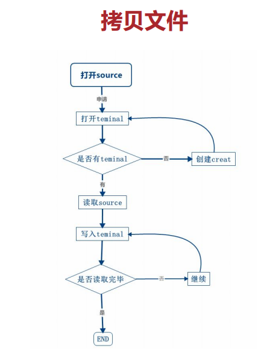

<<<<<<< HEAD
## 字符型强转整型-atoi( ) ##

描述:

C 库函数 int atoi(const char *str) 把参数 str 所指向的字符串转换为一个整数（类型为 int 型）
声明:

```c
int atoi(const char *str)
```

| 参数   | str -- 要转换为整数的字符串。                                |
| ------ | ------------------------------------------------------------ |
| 返回值 | 该函数返回转换后的长整数，如果没有执行有效的转换，则返回零。 |


## IO操作头文件 ##

在所有的 linux 系统中，如果需要对文件的进行操作，只要包含如下 4 个头文件即可。

```c
#include <unistd.h>
#include <sys/types.h>
#include <sys/stat.h>
#include <fcntl.h>
```

上面四个头文件中包含了打开，关闭，创建，读文件，写文件的函数，还有标志位，以及在不同 32 位以及 64 位系统下数据长度的宏变量定义不同。


## IO-open( )函数 ##

```c
int open(const char *path, int oflags);
int open(const char *path, int oflags,mode_t mode); 
```

– 参数path表示：路径名或者文件名。路径名为绝对路径名。
– 参数oflags表示：打开文件所采取的动作
O_RDONLY文件只读；O_WRONLY文件只写；O_RDWR文件可读可写

| O_APPEND   | 每次写操作都写入文件的末尾                                   |
| ---------- | ------------------------------------------------------------ |
| O_CREAT    | 如果指定文件不存在，则创建这个文件                           |
| O_EXCL     | 如果要创建的文件已存在，则返回  -1，并且修改 errno 的值      |
| O_TRUNC    | 如果文件存在，并且以只写/读写方式打开，则清空文件全部内容    |
| O_NOCTTY   | 如果路径名指向终端设备，不要把这个设备用作控制终端。         |
| O_NONBLOCK | 如果路径名指向 FIFO/块文件/字符文件，则把文件的打开和后继  I/O设置为非阻塞模式（nonblocking mode），后面会介绍什么是阻塞和非阻塞。 |
| O_NDELAY   | 和  O_NONBLOCK 功能类似，调用 O_NDELAY 和使用的O_NONBLOCK 功能是一样的。 |

– mode表示：设置创建文件的权限。权限的宏定义很麻烦，可以直接用数字替代
– 返回值：出错返回-1；否则返回文件句柄

示例:

```c
#include <stdio.h>
#include <sys/types.h>
#include <sys/stat.h>
#include <fcntl.h>
int main(){
    int fd;
    char *leds = "/dev/leds";
    char *test1 = "/bin/test1";
    char *test2 = "/bin/test2";
    
    if((fd = open(leds,O_RDWR|O_NOCTTY|O_NDELAY))<0){
        printf("open %s failed!\n",leds);
    }
        printf("\n%s fd is %d\n",leds,fd);
        
    if((fd = open(test1,O_RDWR,0777))<0){
        printf("open %s failed!\n",test1);
    }
        printf("%s fd is %d\n",test1,fd);   
        
    if((fd = open(test2,O_RDWR|O_CREAT,0777))<0){
        printf("open %s failed!\n",test2);
    }
        printf("%s fd is %d\n",test2,fd);   
}
```


## IO-creat( )函数 ##

关于 creat 函数，首先这个单词并不是表示创建的意思，创建的英文单词是“create”，这是早期的一个小的拼写错误，却一直沿用下来。

在介绍 open 函数的时候，可以看到 open 函数有两种形式，一个是两个参数一个是三个参数，早期的时候 open 只有三个参数的形式，三个参数的形式会导致 open 函数无法打开一个未创建的文件，也就是无法建立文件，所以就有了这个 creat 函数。

现在 creat 函数可以完全用 open 替代，考虑到在阅读代码的时候可能会碰到，所以简单介绍一下。creat 函数原型如下。 

```c
int creat(const char * pathname, mode_t mode);
```

 creat 函数只有两个参数，参数的含义和 open 类似。示例：

```c
//标准输入输出头文件
#include <stdio.h>
//文件操作函数头文件
#include <sys/types.h>
#include <sys/stat.h>
#include <fcntl.h>
int main()
{
    int fd;
    //开发板中已经存在/dev/leds文件
    char *leds = "/dev/leds";
    //开发板中不存在的文件/bin/test1
    char *test1 = "/bin/test1";
    //开发板中不存在的文件/bin/test2
    char *test2 = "/bin/test2";
    //需要新建的文件/bin/test3
    char *test3 = "/bin/test3";
    
    //使用open函数打开文件
    if((fd = open(leds, O_RDWR|O_NOCTTY|O_NDELAY))<0){
        printf("open %s failed\n",leds); 
    }
        printf("%s fd is %d\n",leds,fd);
    //使用open函数打开不存在的文件，不添加O_CREAT标识符，会报错
    if((fd = open(test1, O_RDWR))<0){
        printf("open %s failed\n",test1); 
    }
    //打开文件创建文件，添加标志位O_CREAT表示不存在这个文件则创建文件
        if((fd = open(test2, O_RDWR|O_CREAT,0777))<0){
        printf("open %s failed\n",test2); 
    }
        printf("%s fd is %d\n",test2,fd);
    
    fd = creat(test3,0777);
    if(fd = -1){
        printf("%s fd is %d\n",test3,fd);
    }
    else{
        printf("create %s is succeed\n",test3);
    }
}
```


## IO-close( )函数 ##

调用 close 函数之后，会取消 open 函数建立的映射关系，句柄将不再有效，占用的空间将被系统释放。

close 函数在头文件“ #include <unistd.h> ”中，close 函数的使用和参数都比较简单。

```C
int close(int fd);
```

参数 fd，使用 open 函数打开文件之后返回的句柄。
返回值，一般很少使用 close 的返回值


## IO-write( )函数 ##

write 函数在头文件“#include <unistd.h>”中。函数原型为 

```c
ssize_t write(int fd，const void *buf,size_t count)
```

参数 fd，使用 open 函数打开文件之后返回的句柄。
参数*buf，需要写入的数据。
参数 count，将参数*buf 中最多 count 个字节写入文件中。 
返回值为 ssize 类型，出错会返回-1，其它数值表示实际写入的字节数。

示例：

```c
//标准输入输出头文件
#include <stdio.h>
//文件操作函数头文件
#include <sys/types.h>
#include <sys/stat.h>
#include <fcntl.h>
#include <unistd.h>
#include <string.h>
int main()
{
    int fd;
    char *testwrite = "/bin/testwrite";
    ssize_t length_w;
    char buffer_write[] = "Hello Write Function!";
    if((fd = open(testwrite, O_RDWR|O_CREAT,0777))<0){
        printf("open %s failed\n",testwrite); 
    }
    
    //获取句柄
    length_w = write(fd,buffer_write,strlen(buffer_write));

    if(length_w == -1)
    {
        perror("write"); //打印错误
    }
    else{
        printf("Write Function OK!\n");
    }
    close(fd);
}
```


## IO-read( )函数 ##

read 函数在头文件“#include<unistd.h>”中。

函数原型为 

```
ssize_t read(int fd，void *buf,size_t len) 
```

参数 fd，使用 open 函数打开文件之后返回的句柄。 
参数*buf，读出的数据保存的位置。
参数 len，每次最多读 len 个字节。 

返回值为 ssize 类型，出错会返回-1，其它数值表示实际写入的字节数，返回值大于0小于len的数值都是正常的。

示例：

在1-9行，头文件。
在 20 行，使用 open 函数打开或者新建"/bin/testwrite"文件。 
在 23 行，使用 write 函数将 buffer 中的内容写到"/bin/testwrite"文件中。
在 35 行，使用 read 函数，将"/bin/testwrite"文件中的内容读出来。 
在 38 行，使用打印函数 printf 打印 read 函数读出的数据。 
在 39 行，调用 close 函数关闭打开的文件，程序结束。 最终测试的时候，除了会出现"/bin/testwrite"文件，还会打印 read

```c
//标准输入输出头文件
#include <stdio.h>
//文件操作函数头文件
#include <sys/types.h>
#include <sys/stat.h>
#include <fcntl.h>
#include <unistd.h>
#include <string.h>
#define MAX_SIZE 1000
int main(){
    int fd;
    ssize_t length_w,length_r = MAX_SIZE,ret;
    char *testwrite = "/bin/testwrite";
    char buffer_write[] = "Hello Write Function!";
    char buffer_read[MAX_SIZE];
    
    if((fd = open(testwrite,O_RDWR|O_CREAT,0777))<0){
        printf("open %s failed!\n",testwrite);
    }
    length_w = write(fd,buffer_write,strlen(buffer_write));
    if(length_w == -1){
        perror("write");
    }
    else{
        printf("Write Function OK!\n");
    }
    close(fd);
    
    if((fd = open(testwrite,O_RDWR|O_CREAT,0777))<0){
        printf("open %s failed!\n",testwrite);
    }
    if(ret = read(fd,buffer_read,length_r)){
        perror("read");
    }
    printf("Files Content is %s \n",buffer_read);
    close(fd);
}
```


## 设备输入输出-ioctl( )函数 ##

ioctl( )函数主要用于设备输入输出操作的系统调用

头文件: #include<unistd.h>

函数: int ioctl( int fd, int request, int cmd); 

- 参数 fd，函数 open     返回的句柄。 
- 参数 request 和参数     cmd，由内核驱动决定具体操作，例如request 可以代表那个 IO 口， cmd 代表对 IO     进行什么样的操作，也可以反过来。具体的含义由驱动工程师在驱动中 switch 决定。 
- 返回值：返回 0     成功；返回-1，出错。

```c
#include <stdio.h>
#include <stdlib.h>
#include <sys/types.h>
#include <sys/stat.h>
#include <fcntl.h>
#define LED_NUM 2
#define LED_C 2
//cmd为0，则灭，为1，则亮；
//io为0则是靠近蜂鸣器的小灯，为1则靠近独立按键的小灯
int main(int argc,char *argv[])
{
    int fd,led_num,led_c;
    char *leds = "/dev/leds";
    led_num = LED_NUM;
    led_c = LED_C;
    
    printf("argv1 is cmd;argv2 is io \n"); 
    //对传入的参数进行判断，超出范围直接退出
    if (atoi(argv[1]) >= led_c) {
        printf("argv1 is 0 or 1）");
        exit(1);
    }
    if (atoi(argv[2]) >= led_num) {
        printf("argv2 is 0 or 1）");
        exit(1);
    }
    //使用ioctl函数将参数传入内核9
    if((fd = open(leds, O_RDWR|O_NOCTTY|O_NDELAY))<0)
        printf("open %s failed\n",leds);   
    else{
            ioctl(fd,atoi(argv[1]),atoi(argv[2]));
            printf("ioctl %s success\n",leds);
        }
    close(fd);
    
    return(1);
}
```


## 时间-延时函数 ##

• linux系统编程中常用的延时函数：

​	– sleep、usleep等

• linux内核中的常用的延时函数：

​	– ndelay、udelay、mdelay等


• 函数sleep 是秒延时

• unsigned int sleep(unsigned int seconds); 

​	– 例如：sleep(1),即延时一秒。

​	– 返回值：无符号的整形数值，如果延时成功则返回0，如果延时过程中被打断，则返回剩余的秒数。例如sleep(5),返回值为3，那么实际延时就是5-3=2 秒

• 函数usleep 是微秒延时

• int usleep(useconds_t usec); 

​	– Useconds 需要小于1000000 

​	– 例如：usleep(10),表示延时10 微秒。

​	– 延时成功则返回0，失败则返回-1


## 时间-基本概念 ##

• 什么是UTC 时间？

​		世界同一时间

• 什么是UNIX 纪元时间？

​		1970年0时0分计算秒

• 什么是格林尼治标准时（GMT）时间？

​		0度时间

• 什么是机器日历时间

​		对于Linux来说就是UNIX时间


## 时间-时间调用 ##

• 获取机器时间函数

• time_t time(time_t *t);

​	 – 参数*t：以秒为单位的机器时间

​	– 返回值：如果参数为NULL，则返回机器时间;错误返回-1; 

​	– time_t类型实际是一个long int类型

```c
/*函数time头文件*/
#include<time.h>
#include<stdio.h> 
int main(void)
{
    time_t timep;
    
    time(&timep);
    printf("UTC time: 0x%08x\n", timep);
    timep = time(NULL);
    printf("UTC time: 0x%08x\n", timep);
    return 0;
}
```


## 时间-时间转换 ##

• tm结构体 

​		– 包含tm_sec;tm_min;tm_hour;int tm_mday等等成员 

​		– 函数ctime 

• 将时间转化为字符串格式 

​		char *ctime(const time_t *timep); 

• 将时间转化为格林威治时间 

​		struct tm *gmtime(const time_t *timep); 

• 时间转换为字符格式，注意这个函数的参数是tm 结构的 

​		char *asctime(const struct tm *tm); 

• 时间转化为本地时间 

​		struct tm *localtime(const time_t *clock);

```c
#include <stdio.h>
#include <time.h>
int main(void){
    time_t timep;
    struct tm *tblock;
    
    time(&timep);
    printf("ctime/timep is %s\n",ctime(&timep));
    
    printf("asctime is %s\n",asctime(gmtime(&timep)));
    
    tblock = localtime(&timep);
    printf("localtime is :%s\n",asctime(tblock));
    printf("localtime is:%s\n",ctime(&timep));
    return 0;
}
```


## 时间-处理器性能测试 ##

• 高精度的设置时间函数和读取时间函数 

• int gettimeofday(struct timeval *tv, struct timezone *tz); 

• int settimeofday(const struct timeval *tv, const struct timezone *tz); 

​	– 参数tv：用于保存获取的时间 

​	– 参数tz：可以缺省，传入NULL 

​	– 上面的函数比time要高6个数量级，可以达到微妙，这个精度就可以粗略 的计算代码执行时间了 

```c
/*函数time头文件*/
#include<time.h>
/*函数gettimeofday和settimeofday的头文件*/
#include<sys/time.h>
#include<stdio.h>
void function() 
{ 
     unsigned int i,j; 
     double y; 
     for(i=0;i<1000;i++) 
     for(j=0;j<1000;j++) 
     y=i/(j+1); //耗时操作
} 
main() 
{ 
    struct timeval tpstart,tpend; 
    float timeuse; 
    gettimeofday(&tpstart,NULL); //记录开始时间
    function();
    
    gettimeofday(&tpend,NULL); //记录结束时间
    
    timeuse = 1000000*(tpend.tv_sec-tpstart.tv_sec)+ 
    tpend.tv_usec-tpstart.tv_usec; //计算差值
    timeuse /= 1000000; 
    
    printf("Used Time:%f\n",timeuse); 
}
```


## 目录IO-查看文件信息-stat ##

用于查看文件信息

• 函数int stat(const char *path, struct stat *buf);

– 参数*path：文件路径

– 参数*buf：文件信息

– 返回值：成功为0，否则为-1

 

• 函数int fstat(int fd, struct stat *buf);

– 参数fd：文件描述符

– 参数*buf：文件信息

– 返回值：成功为0，否则为-1

 

• 函数int lstat(const char *path, struct stat *buf);

– 参数*path：文件路径

– 参数*buf：返回文件的信息，针对符号链接，lstat 返回链接本身，而不是而非目标文件

– 返回值：成功为0，否则为-1

 

```c
#include <stdio.h>
//通过man文档可以查看到stat函数组头文件
#include <sys/types.h>
#include <sys/stat.h>
#include <unistd.h>
//open函数的参数头文件
#include <fcntl.h>
int main(int argc,char *argv[])
{
    struct stat groupstat;
    int fd,ret;
    
    if(argc <2){
        printf("\nPlease input file path\n");
        return 1;
    }
//stat函数测试  
    ret = stat(argv[1],&groupstat);
    if(ret){
        printf("Please make sure file path\n");
        return 1;
    }
    printf("stat function test , %s of st_ino inode is %ld\n",argv[1],groupstat.st_ino);
    
//fstat函数测试
    fd = open(argv[1],O_RDWR|O_NOCTTY|O_NDELAY);
    if(fd<0)
    {
        printf("Please make sure file path\n");
        return 1;
    }
    ret = fstat(fd,&groupstat);
    if(ret){
        printf("Please make sure file path\n");
        return 1;
    }
    printf("fstat function test , %s of st_ino inode is %ld\n",argv[1],groupstat.st_ino);
    
//lstat函数测试 
    ret = lstat(argv[1],&groupstat);
    if(ret){
        printf("Please make sure file path\n");
        return 1;
    }
    printf("lstat function test , %s of st_ino inode is %ld\n",argv[1],groupstat.st_ino);
    return 0;
}
```


## 目录IO-修改权限-chmod ##

chmod函数用于修改权限

• int chmod(const char *path, mode_t mode);

 – 参数*path：文件路径。

– 参数mode：直接使用数字即可。和前面命令中chmod 777 xxx 中的777 这个参数含义类似，也可以使用文档中的组合值。

– 返回值：成功返回0，错误返回-1。

 

• int fchmod(int fd, mode_t mode); 

– 参数fd：文件描述符。

– 参数mode：直接使用数字即可。和前面命令中chmod 777 xxx 中的777 这个参数含义类似，也可以使用文档中的组合值。

– 返回值：成功返回0，错误返回-1。

 

chmod要求给出的是文件或目录所在的位置，

而fchmod主要针对的是文件，要求调用是使用相应的文件描述符。

```C
#include <stdio.h>
#include <sys/types.h>
#include <sys/stat.h>
#include <fcntl.h>
int main(int argc,char *argv[])
{
    int fd,ret;
    
    if(argc <3){
        printf("\nPlease input file path\n");
        return 1;
    }
    
//chmod函数测试 
    ret = chmod(argv[1],0777);
    if(ret<0){
        printf("Please make sure file path\n");
        return 1;
    }
    printf("chmod %s 0777 is success!\n",argv[1]);
//fchmod函数测试        
    fd = open(argv[2],O_RDWR|O_NOCTTY|O_NDELAY);
    if(fd<0)
    {
        printf("Please make sure file path\n");
        return 1;
    }
    ret = fchmod(fd,0555);
    if(ret<0){
        printf("Please make sure file path\n");
        return 1;
    }
    printf("fchmod %s 0555 is success!\n",argv[1]);
    
    return 0;
}
```


## 目录IO-获取当前目录-getcwd ##

用于获取当前运行的目录

• char *getcwd(char *buf, size_t size); 

– 参数*buf：保存当前目录的缓冲区 

– 参数size：在现代linux 中，buf 的长度至少可以为255 字节 

– 返回值：成功返回指向当前目录的指针，和buf 的值一样，错误返回NULL 

 

• char *getwd(char *buf);

该函数已经过时，使用的时候会有警告 

– 参数*buf：保存当前目录的缓冲区 

– 返回值：成功返回指向当前目录的指针，和buf 的值一样，错误返回NULL

 

• char *get_current_dir_name(void); 

– 参数：无 

– 返回值：成功返回指向当前目录的指针，错误返回NULL

```c
#include <stdio.h>
/*getcwd、getwd和get_current_dir_name
函数的头文件*/
#define __USE_GNU
#include <unistd.h>
#define LENTH 255
int main()
{
    char pwd[LENTH];
    char *wd;
//getcwd函数测试        
    if(!getcwd(pwd,LENTH)){
        perror("getcwd");
        return 1;
    }
    printf("\ngetcwd pwd is %s\n",pwd);
    
//getwd函数测试
    wd = getwd(pwd);
    if(!wd){
        perror("getcwd");
        return 1;
    }
    printf("\ngetwd pwd is %s\n",wd);
    
//get_current_dir_name函数测试  
    wd = get_current_dir_name();
    if(!wd){
        perror("getcwd");
        return 1;
    }
    printf("\nget_current pwd is %s\n",wd);
    
    return 0;
}
```


## 目录IO-创建文件目录-mkdir ##

- int mkdir(const char *     pathname, mode_t mode);

- 参数pathname：文件路径

- 参数mode：文件权限，直接用数字即可。如777

- 返回值：成功返回0，错误返回-1

```c
#include <stdio.h>
//mkdir函数头文件
#include <sys/stat.h>
#include <sys/types.h>
int main(int argc,char *argv[])
{
    int ret;
        
//检测参数  
    if(argc <2){
        printf("\nPlease input file path\n");
        return 1;
    }
//使用mkdir函数新建目录
    ret = mkdir(argv[1],0777);
    if(ret<0){
        printf("mkdir %s failed!\n",argv[1]);
        return 1;
    }
    printf("mkdir %s suceces！\n",argv[1]);
    
    return 0;
}
```

  

## 目录IO-删除目录-rmdir ##

• int rmdir(const char *pathname); 

– 参数*pathname：文件和目录的路径 

– 返回值：成功返回0，错误返回-1

```c
#include <stdio.h>
//rmdir函数头文件
#include <unistd.h>
int main(int argc,char *argv[])
{
    int ret;
        
//检测参数  
    if(argc <2){
        printf("\nPlease input file path\n");
        return 1;
    }
//使用rmdir函数删除目录
    ret = rmdir(argv[1]);
    if(ret<0){
        printf("rmdir %s failed!\n",argv[1]);
        return 1;
    }
    printf("rmdir %s suceces！\n",argv[1]);
    
    return 0;
}
```


## 目录IO-改变当前目录-chdir ##

- int chdir(const     char *path);
- 参数*path: 文件路径
- 返回值: 成功返回0, 失败返回-1

```c
#include <stdio.h>
#include <sys/types.h>
#include <sys/stat.h>
#include <fcntl.h>
//chdir和fchdir函数头文件
#include <unistd.h>
#define LENTH 255
int main(int argc,char *argv[])
{
    int ret;
    char pwd[LENTH];
//检测参数  
    if(argc <3){
        printf("\nPlease input file path\n");
        return 1;
    }
    
//getcwd函数获取当前目录        
    if(!getcwd(pwd,LENTH)){
        perror("getcwd");
        return 1;
    }
    printf("\ngetcwd pwd is %s\n",pwd);
    
//使用chdir函数转入其他目录
    ret = chdir(argv[1]);
    if(ret){
        printf("Please make sure file path\n");
        return 1;
    }
    printf("chdir %s is success！\n",argv[1]);
    
//转入其他目录，完成操作
//使用rmdir函数删除目录
    ret = rmdir(argv[2]);
    if(ret<0){
        printf("rmdir %s failed!\n",argv[2]);
        return 1;
    }
    printf("rmdir %s is success！\n",argv[2]);
    
//再次使用chdir回到pwd保存的目录
    ret = chdir(pwd);
    if(ret){
        printf("Please make sure file path\n");
        return 1;
    }
    printf("chdir %s is success！\n",pwd);
    return 0;
}
```


## 目录IO-打开关闭目录-opendir&closedir  ##

用于打开目录

• DIR *opendir(const char *name); 

– 参数：目录的路径。 

– 返回值：成功返回指向目录流的指针，错误返回NULL 

 

• int closedir(DIR *dirp); 

– 参数：opendir 返回的dir 指针 

– 返回值：成功返回0， 失败返回-1

```c
#include <stdio.h>
//opendir和closedir函数头文件
#include <dirent.h>
#include <sys/types.h>
int main(int argc,char *argv[])
{
    int ret;
    DIR *dir;
    
//检测参数  
    if(argc <2){
        printf("\nPlease input file path\n");
        return 1;
    }
//使用opendir函数打开目录
    dir = opendir(argv[1]);
    if(dir==NULL){
        printf("opendir %s failed!\n",argv[1]);
        return 1;
    }
    printf("opendir %s suceces！\n",argv[1]);
//使用closedir函数关闭目录
    closedir(dir);
    
    return 0;
}
```


## 目录IO-读取目录信息-readdir ##

• 读目录信息函数 

• struct dirent *readdir(DIR *dirp); 

– 参数dirp：opendir 函数打开目录后返回的文件指针。 

– 返回值：成功返回指向dirp 的指针dirent ，错误返回NULL。

```C
#include <stdio.h>
//opendir,closedir,readdir函数头文件
#include <dirent.h>
#include <sys/types.h>
int main(int argc,char *argv[])
{
    int ret;
    DIR *dir;
    struct dirent *catlog;
//检测参数  
    if(argc <2){
        printf("\nPlease input file path\n");
        return 1;
    }
//使用opendir函数打开目录
    dir = opendir(argv[1]);
    if(dir==NULL){
        printf("opendir %s failed!\n",argv[1]);
        return 1;
    }
    printf("opendir %s suceces！\n",argv[1]);
//使用readdir读取目录argv[1]
    catlog = readdir(dir);
    if(catlog == NULL){
        printf("readdir %s failed!\n",argv[1]);
        return 1;
    }
    printf("%s d_ino is %ld\n ",argv[1],catlog->d_ino);
//使用closedir函数关闭目录
    closedir(dir);
    
    return 0;
}
```


## 目录IO-硬链接-link ##

• 硬链接函数 

• int link(const char *oldpath, const char *newpath); 

– 参数*oldpath：已有的文件路径。 

– 参数*newpath：新建的硬链接文件路径。 

– 返回值：成功返回0，错误返回-1。

```c
#include <stdio.h>
//link函数头文件
#include <unistd.h>
int main(int argc,char *argv[])
{
    int ret;
    
    if(argc <3){
        printf("\nPlease input file path\n");
        return 1;
    }
//测试link函数
    ret = link(argv[1],argv[2]);
    if(ret)
    {
        printf("link failed");
        return 1;
    }
    printf("link %s to %s success!\n",argv[1],argv[2]);
    
    return 0;
}
```


## 目录IO-软连接-symlink ##

• int symlink(const char *oldpath, const char *newpath); 

– 参数*oldpath：已有的文件路径 

– 参数*newpath：新建的符号链接文件路径 

– 返回值：成功返回0，错误返回-1

```C
#include <stdio.h>
//symlink函数头文件
#include <unistd.h>
int main(int argc,char *argv[])
{
    int ret;
    
    if(argc <3){
        printf("\nPlease input file path\n");
        return 1;
    }
//测试symlink函数
    ret = symlink(argv[1],argv[2]);
    if(ret)
    {
        printf("symlink failed");
        return 1;
    }
    printf("symlink %s to %s success!\n",argv[1],argv[2]);
    
    return 0;
}
```


## 目录IO-解除链接-unlink ##

• 解除链接函数 

• int unlink(const char *pathname); 

– 参数*pathname：链接文件的路径 

– 返回值：成功返回0，错误返回-1 

– unlink指向软链接，删除软链接；指向最后一个硬链接，相当于删除文件

```c
#include <stdio.h>
//unlink函数头文件
#include <unistd.h>
int main(int argc,char *argv[])
{
    int ret;
    
    if(argc <2){
        printf("\nPlease input file path\n");
        return 1;
    }
//测试unlink函数
    ret = unlink(argv[1]);
    if(ret)
    {
        printf("unlink failed");
        return 1;
    }
    printf("unlink %s is success!\n",argv[1]);
    
    return 0;
}
```


## 目录IO-拷贝文件 ##

• Linux 下并没有专门的拷贝函数和接口，需要通过open，read， wite 等文件操作函数实现。 

• 拷贝流程



```c
#include <stdio.h>
#include <sys/types.h>
#include <sys/stat.h>
#include <fcntl.h>
#include <unistd.h>
#include <string.h>
//argv[1] is oldpath ; argv[2] is newpath
#define LENTH 1024
int main(int argc,char *argv[])
{
    int fds,fdt;
    char buffer[LENTH];
    char *fileold,*filenew;
    
    fileold = argv[1];
    filenew = argv[2];
    
    if(argc <3){
        printf("\nPlease input file path\n");
        return 1;
    }
    //打开oldpath     
    fds = open(fileold,O_RDWR);
    if(fds<0)
    {
        printf("Please make sure file path\n");
        return 1;
    }
    
    //打开newpath,如果没有则创建目标文件
    fdt = open(filenew,O_WRONLY|O_CREAT);
    if(fdt<0)
    {
        printf("Please make sure file path\n");
        return 1;
    }
    //读和写操作
    while(read(fds,buffer,LENTH)){
        write(fdt,buffer,strlen(buffer));
    }
    
    //关闭文件
    close(fds);
    close(fdt);
    
    printf("cp to finished!\n");
    printf("cp %s to %s success!\n",fileold,filenew);
    return 0;
}
```


## 目录IO-移动文件-rename ##

• int rename(const char *oldpath, const char *newpath) 

– 参数*oldpath：旧的文件路径 

– 参数*newpath：新的文件路径 

– 返回值：成功返回0，错误返回-1

```c
#include <stdio.h>
#include <sys/types.h>
#include <sys/stat.h>
#include <fcntl.h>
#include <unistd.h>
#include <string.h>
//argv[1] is oldpath ; argv[2] is newpath
int main(int argc,char *argv[])
{
    int ret;
    if(argc < 3){
        printf("\nPlease input file path\n");
        return 1;
    }
    if(ret = rename(argv[1],argv[2])){
        printf("\nerr\n");
    }
        
    printf("rename %s to %s success!\n",argv[1],argv[2]);
    return 0;
}
```


## 文件管理-判断文件访问权限-access ##

备注: 有名管道代码中有使用

**表头文件**

\#include<unistd.h>

**定义函数**

int access(const char * pathname, int mode);

- *pathname:     需要检测的文件路径名

- mode: 需要测试的操作模式

- - R_OK 检测读权限
  - W_OK 检测写权限
  - X_OK 检测执行权限
  - F_OK 检测文件是否存在

**返回值**

成功执行时，返回0。

失败返回-1，ermno被设为以下的某个值

- EINVAL：模式值无效
- EACCES：文件或路径名中包含的目录不可访问
- ELOOP：解释路径名过程中存在太多的符号连接
- ENAMETOOLONG：路径名太长
- ENOENT：路径名中的目录不存在或是无效的符号连接
- ENOTDIR：路径名中当作目录的组件并非目录
- EROFS：文件系统只读
- EFAULT：路径名指向可访问的空间外
- EIO：输入输出错误
- ENOMEM：不能获取足够的内核内存
- ETXTBSY：对程序写入出错

示例：

```c
#include<unistd.h>
int main()
{
    if (access(“/etc/passwd”,R_OK) = =0)
        printf(“/etc/passwd can be read\n”);
}
```


## 进程-进程ID-getpid & getppid ##

• 获取子进程的函数

• pid_t getpid(void) 

– 参数：无 

– 返回值：成功返回进程号 

 

• 获取父进程的函数

• pid_t getppid(void); 

– 参数：无 

– 返回值：成功返回父进程

```C
#include <stdio.h>
#include <sys/types.h>
#include <unistd.h>
void main()
{
    pid_t idp,id;
    
    idp = getppid();
    printf("ppid = %d\n",idp);//获取父进程ID
    
    id = getpid();
    printf("pid = %d\n",id);//获取子进程ID
}
```


## 进程-多程序运行-exec函数族 ##

• linux中，可以使用exec函数族将程序载入内存，实现多个程序的运行


• exec函数族参数 

– “l”和“ v ”表示参数是以列表还是以数组的方式提供的 

– “p”表示这个函数的第一个参数是*path，就是以绝对路径来提供程序的路径，也可以以当前目录作为目标 

– “e”表示为程序提供新的环境变量

execl.c

```c
#include<stdio.h> 
#include<string.h>
#include<stdlib.h>
#include <unistd.h>
//exec函数族
int main(void)
{
    if(execl("/mnt/udisk/helloexec","helloexec","execl",NULL) == -1){
        perror("execl error");
        exit(1);
    }
    //程序已经跳转走，如果正常execl不反回错误，下面的代码不会执行！
    printf("execl error！\n");
    return 0;
}
```

helloexec.c

```c
#include <stdio.h>
int main(int arc,char *argv[])
{
    printf("Hello %s!\n",argv[1]);
}
```


## 进程-创建新进程-fork ##

• linux中，可以使用fork函数创建和当前进程一模一样的进程，叫子进 程，原来的进程叫父进程 

• 创建进程函数 

• pid_t fork(void); 

​	– 参数：无 

​	– 返回值：执行成功，子进程pid 返回给父进程，0 返回给子进程；出现错 误-1，返回给父进程。执行失败的唯一情况是内存不够或者id 号用尽， 不过这种情况几乎很少发生。 

```c
#include <stdio.h>
#include <unistd.h>
main()
{
    pid_t pid;
    int i=100;
    
    pid = fork();
    //调用出错
    if(pid == -1){
        printf("fork failed\n");
        return 1;
    }
    //返回给父进程子进程号，返回值大于0
    else if(pid){
        i++;
        printf("\nThe father i = %d\n",i);
        printf("The father return value is %d\n",pid);
        printf("The father pid is %d\n",getpid());
        printf("The father ppid is %d\n",getppid());
        while(1);
    }
    //返回子进程0，返回值等于0返回给子进程
    else{
        i++;
        printf("\nThe child i = %d\n",i);
        printf("The child return value is %d\n",pid);
        printf("The child pid is %d\n",getpid());
        printf("The child ppid is %d\n",getppid());
        while(1);
    }
    return 0;
}
```

• fork函数（看了例子之后再回头理解一次下面几句话） 

– 系统函数fork 调用成功，会创建一个新的进程，它几乎会调用差不多完全一样的fork 进程 

– 子进程的pid 和父进程不一样，是新分配的 

– 子进程的ppid 会设置为父进程的pid，也就是说子进程和父进程各自的“父进程”不一样 

– 子进程中的资源统计信息会清零 

– 挂起的信号会被清除，也不会被继承 

– 所有文件锁也不会被子进程继承


## 进程-综合例程 ##

主要使用了exec函数族的函数

```c
#include <stdio.h>
#include <unistd.h>
#include <stdlib.h>
int main(void)
{
    char *arg[] = {"ls","-a",NULL};
    
    if(fork() == 0){
        //in child1
        printf("fork1 is OK;execl\n");
        
        if(execl("/bin/ls","ls","-a",NULL) == -1){
            perror("execl error");
            exit(1);
        }
    }
    usleep(20000);
    if(fork() == 0){
        //in child2
        printf("fork2 is OK;execv\n");
        
        if(execv("/bin/ls",arg) == -1){
            perror("execv error");
            exit(1);
        }
    }
    
    usleep(20000);
    if(fork() == 0){
        //in child3
        printf("fork3 is OK;execlp\n");
        
        if(execlp("ls","ls","-a",NULL) == -1){
            perror("execlp error");
            exit(1);
        }
    }
    
    usleep(20000);
    if(fork() == 0){
        //in child4
        printf("fork4 is OK;execvp\n");
        
        if(execvp("ls",arg) == -1){
            perror("execvp error");
            exit(1);
        }
    }
    
    usleep(20000);
    if(fork() == 0){
        //in child5
        printf("fork5 is OK;execle\n");
        
        if(execle("/bin/ls","ls","-a",NULL,NULL) == -1){
            perror("execle error");
            exit(1);
        }
    }
    
    usleep(20000);
    if(fork() == 0){
        //in child6
        printf("fork6 is OK;execve\n");
        
        if(execve("/bin/ls",arg,NULL) == -1){
            perror("execve error");
            exit(1);
        }
    }
    //加入小延时可以避免发生混乱的情况
    usleep(20000);
    return 0;
}
```


## 进程通信-无名管道-pipe ##

• 无名管道有一定的局限性 

– 它是属于半双工的通信方式 

– 只有具有“亲缘关系”的的进程才能使用这种通信方式，也就是父进程和子进程之间

 

• int pipe(int pipefd[2]) 

– 参数pipefd[0]：用于读管道 

– 参数pipefd[1]：用于写管道 

– 返回值：执行成功返回0，失败返回-1

```C
#include <stdio.h>
#include <sys/types.h>
#include <unistd.h>
#include <stdlib.h>
//进程读函数
void read_data(int *);
//进程写函数 
void write_data(int *);

int main(int argc,char *argv[])
{
    int pipes[2],rc;
    pid_t pid;
        
    rc = pipe(pipes);   //创建管道                 
    if(rc == -1){
        perror("\npipes\n");
        exit(1);
    }
        
    pid = fork();   //创建进程 
    switch(pid){
        case -1:
            perror("\nfork\n");
            exit(1);
        case 0:
            read_data(pipes);   //相同的pipes
        default:
            write_data(pipes);  //相同的pipes
    }   
    return 0;
}
//进程读函数
void read_data(int pipes[])
{
    int c,rc;
    
    //由于此函数只负责读，因此将写描述关闭(资源宝贵)
    close(pipes[1]);
    
    //阻塞，等待从管道读取数据
    //int 转为 unsiged char 输出到终端
    while( (rc = read(pipes[0],&c,1)) > 0 ){        
        putchar(c);                                    
    }
    exit(0);
}
//进程写函数
void write_data(int pipes[])
{
    int c,rc;
    //关闭读描述字
    close(pipes[0]);                          
    while( (c=getchar()) > 0 ){
        rc = write( pipes[1], &c, 1);   //写入管道
        if( rc == -1 ){
            perror("Parent: write");
            close(pipes[1]);
            exit(1);
        }
    }
    close( pipes[1] );
    exit(0);
}
```


## 进程通信-有名管道-fifo ##

• 无名管道只能用于有亲缘关于的进程通信，有名管道可以实现无亲缘 关系的通信 

• 有名管道fifo 给文件系统提供一个路径，这个路径和管道关联，只要 知道这个管道路径，就可以进行文件访问，fifo 是指先进先出，也就 是先写入的数据，先读出来 

• 有名管道的读写速度非常快 

 

• int mkfifo(const char *pathname, mode_t mode) 

– 参数*pathname：路径名，管道名称 

– 参数mode：管道的权限 

– 返回值：成功返回0，错误返回-1

creatc.c

```c
#include <stdio.h>
#include <unistd.h>
#include <string.h>
#include <sys/types.h>
#include <sys/stat.h>
#include <fcntl.h>
void filecopy(FILE *,char *);
int main(void)
{
    FILE *fp1;
    long int i = 100000;
    char buf[] = "I want to study Linux!\n";
    char *file1 = "data.txt";
    
    printf("begin!\n");
    
    if((fp1 = fopen(file1,"a+")) == NULL ){
            printf("can't open %s\n",file1);
    }
    while(i--)
    filecopy(fp1,buf);
    fclose(fp1);
    
    printf("over!\n");
    
    return 0;
}
void filecopy(FILE *ifp,char *buf)
{
    char c;
    int i,j;
    j = 0;
    i = strlen(buf)-1;  
    while(i--){
        putc(buf[j],ifp);
        j++;
    }
    putc('\n',ifp);
}
```

readpipe.c

```c
#include <unistd.h>  
#include <stdlib.h>  
#include <stdio.h>  
#include <fcntl.h>  
#include <sys/types.h>  
#include <sys/stat.h>  
#include <limits.h>  
#include <string.h>  
  
int main()  
{  
    const char *fifo_name = "my_fifo";  
    int pipe_fd = -1;  
    int data_fd = -1;  
    int res = 0;  
    int open_mode = O_RDONLY;  
    char buffer[PIPE_BUF + 1];  
    int bytes_read = 0;  
    int bytes_write = 0;  
    //清空缓冲数组  
    memset(buffer, '\0', sizeof(buffer));  
  
    printf("Process %d opening FIFO O_RDONLY\n", getpid());  
    //以只读阻塞方式打开管道文件，注意与fifowrite.c文件中的FIFO同名  
    pipe_fd = open(fifo_name, open_mode);  
    //以只写方式创建保存数据的文件  
    data_fd = open("DataFormFIFO.txt", O_WRONLY|O_CREAT, 0644);  
    printf("Process %d result %d\n",getpid(), pipe_fd);  
  
    if(pipe_fd != -1)  
    {  
        do  
        {  
            //读取FIFO中的数据，并把它保存在文件DataFormFIFO.txt文件中  
            res = read(pipe_fd, buffer, PIPE_BUF);  
            bytes_write = write(data_fd, buffer, res);  
            bytes_read += res;  
        }while(res > 0);  
        close(pipe_fd);  
        close(data_fd);  
    }  
    else  
        exit(EXIT_FAILURE);  
  
    printf("Process %d finished, %d bytes read\n", getpid(), bytes_read);  
    exit(EXIT_SUCCESS);  
} 
```

writepipe.c

```c
#include <unistd.h>  
#include <stdlib.h>  
#include <fcntl.h>  
#include <limits.h>  
#include <sys/types.h>  
#include <sys/stat.h>  
#include <stdio.h>  
#include <string.h>  
  
int main()  
{  
    const char *fifo_name = "my_fifo";
    char *file1 = "data.txt";   
    int pipe_fd = -1;  
    int data_fd = -1;  
    int res = 0;  
    const int open_mode = O_WRONLY;  
    int bytes_sent = 0;  
    char buffer[PIPE_BUF + 1];  
  
    if(access(fifo_name, F_OK) == -1)  
    {  
        //管道文件不存在  
        //创建命名管道  
        res = mkfifo(fifo_name, 0777);  
        if(res != 0)  
        {  
            fprintf(stderr, "Could not create fifo %s\n", fifo_name);  
            exit(EXIT_FAILURE);  
        }  
    }  
  
    printf("Process %d opening FIFO O_WRONLY\n", getpid());  
    //以只写阻塞方式打开FIFO文件，以只读方式打开数据文件  
    pipe_fd = open(fifo_name, open_mode);  
    data_fd = open(file1, O_RDONLY);  
    printf("Process %d result %d\n", getpid(), pipe_fd);  
  
    if(pipe_fd != -1)  
    {  
        int bytes_read = 0;  
        //向数据文件读取数据  
        bytes_read = read(data_fd, buffer, PIPE_BUF);  
        buffer[bytes_read] = '\0';  
        while(bytes_read > 0)  
        {  
            //向FIFO文件写数据  
            res = write(pipe_fd, buffer, bytes_read);  
            if(res == -1)  
            {  
                fprintf(stderr, "Write error on pipe\n");  
                exit(EXIT_FAILURE);  
            }  
            //累加写的字节数，并继续读取数据  
            bytes_sent += res;  
            bytes_read = read(data_fd, buffer, PIPE_BUF);  
            buffer[bytes_read] = '\0';  
        }  
        close(pipe_fd);  
        close(data_fd);  
    }  
    else  
        exit(EXIT_FAILURE);  
  
    printf("Process %d finished\n", getpid());  
    exit(EXIT_SUCCESS);  
} 
```

## 进程通信-有名管道-例程2 ##

写进程:

```c
#include <fcntl.h>
#include <unistd.h>
#include <stdio.h>
#include <string.h>
#include <errno.h>
#include <sys/types.h>
#include <sys/stat.h>
#define SIZE 100
int main(int argc, char *argv[])
{
    int fd = 0;
    int ret = 0;
    char buf[SIZE] = {"fifo data\n"};
    //创建管道
    ret = mkfifo("FIFO", 0666);
    if (-1 == ret && EEXIST != errno)
    {
        perror("FIFO error");
        return -1;
    }
    // open管道
    fd = open("FIFO", O_WRONLY);
    if (fd < 0)
    {
        perror("open fifo error");
        return -1;
    }
    //在管道里写内容
    write(fd, buf, strlen(buf));
    close(fd);
    return 0;
}
```

读进程：

```c
#include<fcntl.h>
#include<unistd.h>
#include<stdio.h>
#include<string.h>
#include<errno.h>
#include <sys/types.h>
#include <sys/stat.h>
 
#define SIZE 100
int main(int argc,char *argv[]){
 
   int fd=0;
   int ret =0;
   char buf[SIZE]={"0"};
 
 
  //open管道
  fd= open("FIFO",O_RDONLY);
  if(fd <0){
    perror("open fifo error");
    return -1;
  }
 
  //读管道内容
  read(fd,buf,SIZE-1);
  //输出结果
  printf("buf = %s\n",buf);
  //关闭管道
  close(fd);
  return 0;
}
```


## 进程通信-消息队列-msgrcv&msgsnd ##

• 消息队列就是一个消息的链表。可以把消息看作一个记录，具有特定 的格式以及特定的优先级 

• 对消息队列有写权限的进程可以向其中按照一定的规则添加新消息； 对消息队列有读权限的进程则可以从消息队列中读走消息。 

• man 2 msgrcv 

 

• 函数ssize_t msgrcv(int msqid, void *msgp, size_t msgsz, long msgtyp,int msgflg) 

– 参数msqid：消息队列的标识码 

– 参数*msgp：指向消息缓冲区的指针 

– 参数msgsz：消息的长短 

– 参数msgtyp

​	• msgtyp等于0 ,则返回队列的最早的一个消息 

​	• msgtyp大于0，则返回其类型为mtype的第一个消息 

​	• msgtyp小于0,则返回其类型小于或等于mtype参数的绝对值的最小的一个消息 

– 参数msgflg：标志位, 标志位为0，则表示忽略 

– 返回值：成功返回数据长度，错误返回-1

 

• 函数int msgsnd(int msqid, const void *msgp, size_t msgsz, int msgflg) 

– 参数msqid：消息队列的标识码 

– 参数*msgp：指向消息缓冲区的指针，用来暂时存储发送和接收的消息，是用户可定义的通用结构 

– 参数msgsz：消息的长短 

– 参数msgflg：标志位 

– 返回值：成功返回0，错误返回-1

 

• 结构体msgp，是一个标准的通用结构 

– struct msgstru{

​	long mtype; //大于0 

​	char mtext[nbyte];} 

• 函数int msgget(key_t key, int msgflg) 

– 参数“key”：消息队列关联的标识符 

– 参数“msgflg”：消息队列的建立标志和存取权限。IPC_CREAT 如果内核 中没有此队列则创建它；IPC_EXCL 当和IPC_CREAT 一起使用时，如果 队列已经存在，则失败 

– 返回值：执行成功则返回消息队列的标识符，否则返回-1

msgsent.c

```c
#include <unistd.h>  
#include <stdlib.h>  
#include <stdio.h>  
#include <string.h>  
#include <sys/msg.h>  
#include <errno.h>  
  
#define MAX_TEXT 512  
struct msg_st  
{  
    long int msg_type;  
    char text[MAX_TEXT];  
};  
  
int main()
{  
    int running = 1;  
    struct msg_st data;  
    char buffer[BUFSIZ];  
    int msgid = -1;  
  
    //建立消息队列  
    msgid = msgget((key_t)1234, 0666 | IPC_CREAT);  
    if(msgid == -1)  
    {  
        fprintf(stderr, "msgget failed with error: %d\n", errno);  
        exit(EXIT_FAILURE);  
    }  
  
    //向消息队列中写消息，直到写入end  
    while(running)  
    {  
        //输入数据  
        printf("Enter some text: ");  
        fgets(buffer, BUFSIZ, stdin);  
        data.msg_type = 1;    //注意2  
        strcpy(data.text, buffer);  
        //向队列发送数据  
        if(msgsnd(msgid, (void*)&data, MAX_TEXT, 0) == -1)  
        {  
            fprintf(stderr, "msgsnd failed\n");  
            exit(EXIT_FAILURE);  
        }  
        //输入end结束输入  
        if(strncmp(buffer, "end", 3) == 0)  
            running = 0;  
        sleep(1);  
    }  
    exit(EXIT_SUCCESS);  
}
```

msgreceive.c

```c
#include <unistd.h>  
#include <stdlib.h>  
#include <stdio.h>  
#include <string.h>  
#include <errno.h>  
#include <sys/msg.h>  
  
struct msg_st
{  
    long int msg_type;  
    char text[BUFSIZ];  
};  
  
int main()  
{  
    int running = 1;  
    int msgid = -1;  
    struct msg_st data;  
    long int msgtype = 0; //注意1  
  
    //建立消息队列  
    msgid = msgget((key_t)1234, 0666 | IPC_CREAT);  
    if(msgid == -1)  
    {  
        fprintf(stderr, "msgget failed with error: %d\n", errno);  
        exit(EXIT_FAILURE);  
    }  
    //从队列中获取消息，直到遇到end消息为止  
    while(running)  
    {  
        if(msgrcv(msgid, (void*)&data, BUFSIZ, msgtype, 0) == -1)  
        {  
            fprintf(stderr, "msgrcv failed with errno: %d\n", errno);  
            exit(EXIT_FAILURE);  
        }  
        printf("You wrote: %s\n",data.text);  
        //遇到end结束  
        if(strncmp(data.text, "end", 3) == 0)  
            running = 0;  
    }  
    //删除消息队列  
    if(msgctl(msgid, IPC_RMID, 0) == -1)  
    {  
        fprintf(stderr, "msgctl(IPC_RMID) failed\n");  
        exit(EXIT_FAILURE);  
    }  
    exit(EXIT_SUCCESS);  
}
```


## 进程通信-信号-signal ##

可以参考: https://blog.csdn.net/yuanyuan320/article/details/109988383

• 信号用于处理异步事件，信号的通信方式理解起来还是有一定难度的， 它既可以在一个进程内进行通信，发送信号给进程，又可以用于进程外通信

• 头文件: signal.h

• 闹钟函数

unsigned int alarm(unsigned int seconds) 

​	– 参数seconds：闹钟的时间，单位为秒 

​	– 返回值：成功返回0 或者返回剩余时间；错误返回-1 

 

• 设置某一信号的对应动作

sighandler_t signal(int signum, sighandler_t handler); 

​	– 参数signum：等待的信号 

​	– 参数handler：信号到来之后，触发的处理方式 

​	– 返回值：成功返回0，错误返回-1

 

• sigaction函数的功能是检查或修改与指定信号相关联的处理动作

int sigaction(int signum, const struct sigaction *act, struct sigaction *oldact);

​	– 参数signum: 指出要捕获的信号类型

​	– 参数*act: 指定新的信号处理方式

​	– 参数*oldact: 输出先前信号的处理方式（如果不为NULL的话）。

​	– 返回值：成功返回0，错误返回-1

 

• sigprocmask()函数

int sigprocmask( int how, const sigset_t *restrict set, sigset_t *restrict oset );

​	– how可选用的值。注意，不能阻塞SIGKILL和SIGSTOP信号。

| how         | 说明                        |
| ----------- | --------------------------- |
| SIG_BLOCK   | 加入信号到进程屏蔽          |
| SIG_UNBLOCK | 从进程屏蔽里将信号删除      |
| SIG_SETMASK | 将set的值设定为新的进程屏蔽 |

​	– 参数set：为指向信号集的指针，在此专指新设的信号集，如果仅想读取现在的屏蔽值，可将其置为NULL。

​	– 参数oldset：也是指向信号集的指针，在此存放原来的信号集。

 

• 函数sigpending 返回在送往进程的时候被阻塞挂起的信号集合

int sigpending（sigset_t *set）

​	– 参数*set: 被阻塞挂起的信号集合通过参数set

 

• 函数sigismember 判断某个集合中是否有某个信号

int sigismember(const sigset_t *set,int signum);

​	– 参数set： 信号集标识符号的地址。

​	– 参数signum： 信号的编号。

 

• 函数sigdelset 将signum所标识的信号从信号集合set是删除。

int sigdelset(sigset_t *set,int signum);

​	– 参数set： 信号集标识的地址。

​	– 参数signum： 信号的编号。

 

• 函数pause 用于捕捉进程挂起直到捕捉到信号

• 常见信号 

​	– SIGALRM：闹钟 

​	– SIGHUP：终端发出的结束信号 

​	– SIGINT：键盘的ctrl+c 

​	– SIGKILL：kill命令产生的信号 

​	– SIGSTOP：键盘ctrl+z

 

sin_hello.c

```c
#include<unistd.h>
#include<stdio.h>
#include<signal.h>
void handler()
{
    printf("hello\n");
}
int main(void)
{
    int i;
    signal(SIGALRM, handler);
    alarm(5);
    
    for(i=1;i<7;i++){
        printf("sleep %d....\n",i);
        sleep(1);
    }
    
    return 0;
}
```

sigset.c

```c
#include <unistd.h>  
#include <signal.h>  
#include <sys/types.h>  
#include <stdlib.h>  
#include <stdio.h>  
void handler(int sig)  
{  
    printf("Handler the signal %d\n", sig);  
}  
  
int main(void)  
{  
    sigset_t sigset;//用于记录屏蔽字  
    sigset_t ign;//用于记录被阻塞的信号集  
    struct sigaction act; 
    
    //清空信号集  
    sigemptyset(&sigset);  //初始化信号集
    sigemptyset(&ign);  
    //向信号集中添加信号SIGINT  
    sigaddset(&sigset, SIGINT);  
  
    //设置处理函数和信号集      
    act.sa_handler = handler;  //收到信号时,执行这个函数
    sigemptyset(&act.sa_mask);  //初始化信号集
    act.sa_flags = 0;  
    sigaction(SIGINT, &act, 0);  //sigaction检查或修改与指定信号相关联的处理动作
  
    printf("Wait the signal SIGINT...\n");  
    pause();//挂起进程，等待信号  
  
    //设置进程屏蔽字，在本例中为屏蔽SIGINT   
    sigprocmask(SIG_SETMASK, &sigset, 0);     
    printf("Please press Ctrl+c in 10 seconds...\n");  
    sleep(10); 
    
    //测试SIGINT是否被屏蔽,sigpending函数返回在送往进程的时候被阻塞挂起的信号集合
    sigpending(&ign);  
    //sigismember 如果信号集里已有该信号则返回1，否则返回0。如果有错误则返回-1。出错的情况及其错误代码见下：
    if(sigismember(&ign, SIGINT))  
        printf("The SIGINT signal has ignored\n"); 
    
    //在信号集中删除信号SIGINT  
    sigdelset(&sigset, SIGINT);  
    printf("Wait the signal SIGINT...\n"); 
    
    //将进程的屏蔽字重新设置，即取消对SIGINT的屏蔽  
    //并挂起进程  
    sigsuspend(&sigset);  
  
    printf("The app will exit in 5 seconds!\n");  
    sleep(5);  
    exit(0);  
}
```


## 进程通信-信号量(*) ##

• 信号和信号量 

​	– 信号与信号量是不同的两种事物。 

​	– 信号量是用来调协进程对共享资源的访问的。为了防止出现因多个程序 同时访问一个共享资源而引发的一系列问题，通过生成并使用令牌来授 权，在任一时刻只能有一个执行线程访问代码的临界区域。临界区域是 指执行数据更新的代码需要独占式地执行，而信号量就可以提供这样的 一种访问机制，让一个临界区同一时间只有一个线程在访问它。 

• union semum 

​	– union semun { int val; struct semid_ds *buf; unsigned short *arry; } 

​	– 以一种数据类型存储数据，以另一种数据类型来读取数据 

• int semget(key_t key,int nsems,int semflg) 

​	– semget((key_t)1234, 1, 0666 | IPC_CREAT) 

​	– 参数key不相关的进程可以通过它访问一个信号量，只有semget函数才直 接使用信号量键，所有其他的信号量函数使用由semget函数返回的信号 量标识符 

​	– 参数num_sems指定需要的信号量数目，它的值几乎总是1 

​	– 第三个参数sem_flags是一组标志，权限+创建（如果不存在则创建，存在则打开） 

• semget使用的时候建立的结构体 

​	– struct sembuf{short sem_num;short sem_op;short sem_flg;} 

​	– sem_num除非使用一组信号量，否则它为0 

​	– sem_op操作时需要改变的数据，-1即P等待，+1即V发送信号 

​	– sem_flg通常为SEM_UNDO,使操作系统跟踪信号 

• int semop（int semid，struct sembuf *sops，size_t nsops） 

​	– semop(sem_id, &sem_b, 1)PV 操作通过调用semop函数来实现 

​	– semid：信号集的识别码 – sops：指向存储信号操作结构的数组指针 

​	– nsops：信号操作结构的数量，恒大于或等于1 

• int semctl(int semid,int semnum,int cmd, /*union semun arg*/) 

​	– semctl(sem_id, 0, SETVAL, sem_union)系统调用semctl用来执行在信号量集 上的控制操作。这和在消息队列中的系统调用msgctl是十分相似的。但这 两个系统调用的参数略有不同。 

​	– semid信号量集IPC标识符 

​	– semnum操作信号在信号集中的编号 

​	– cmd指出要操作的具体命令，SETVAL设置信号量集中的一个单独的信号量 的值，IPC_RMID将信号量集从内存中删除

​	– sem_union指向内核中使用的数据结构的指针

• rand() 

​	– rand()函数是产生随机数的一个随机函数 

• fflush()

​	– fflush() 清除读写缓冲区，需要立即把输出缓冲区的数据进行物理写入时 

​	– 缓冲区有stdin和stdout 

```c
#include <unistd.h>  
#include <sys/types.h>  
#include <sys/stat.h>  
#include <fcntl.h>  
#include <stdlib.h>  
#include <stdio.h>  
#include <string.h>  
#include <sys/sem.h>  
  
union semun  
{  
    int val;  
    struct semid_ds *buf;  
    unsigned short *arry;  
};  
  
static int sem_id = 0;  
  
static int set_semvalue();  
static void del_semvalue();  
static int semaphore_p();  
static int semaphore_v();  
  
int main(int argc, char *argv[])  
{  
    char message = 'X';  
    int i = 0;  
  
    //创建信号量  
    sem_id = semget((key_t)1234, 1, 0666 | IPC_CREAT);  
  
    if(argc > 1)  
    {  
        //程序第一次被调用，初始化信号量  
        if(!set_semvalue())  
        {  
            fprintf(stderr, "Failed to initialize semaphore\n");  
            exit(EXIT_FAILURE);  
        }  
        //设置要输出到屏幕中的信息，即其参数的第一个字符  
        message = argv[1][0];  
        sleep(2);  
    }  
    for(i = 0; i < 10; ++i)  
    {  
        //进入临界区  
        if(!semaphore_p())  
            exit(EXIT_FAILURE);  
        //向屏幕中输出数据  
        printf("%c", message);  
        //清理缓冲区，然后休眠随机时间  
        fflush(stdout);  
        sleep(rand() % 3);  
        //离开临界区前再一次向屏幕输出数据  
        printf("%c", message);  
        fflush(stdout);  
        //离开临界区，休眠随机时间后继续循环  
        if(!semaphore_v())  
            exit(EXIT_FAILURE);  
        sleep(rand() % 2);  
    }  
  
    sleep(10);  
    printf("\n%d - finished\n", getpid());  
  
    if(argc > 1)  
    {  
        //如果程序是第一次被调用，则在退出前删除信号量  
        sleep(3);  
        del_semvalue();  
    }  
    exit(EXIT_SUCCESS);  
}  
  
static int set_semvalue()  
{  
    //用于初始化信号量，在使用信号量前必须这样做  
    union semun sem_union;  
  
    sem_union.val = 1;  
    if(semctl(sem_id, 0, SETVAL, sem_union) == -1)  
        return 0;  
    return 1;  
}  
  
static void del_semvalue()  
{  
    //删除信号量  
    union semun sem_union;  
  
    if(semctl(sem_id, 0, IPC_RMID, sem_union) == -1)  
        fprintf(stderr, "Failed to delete semaphore\n");  
}  
  
static int semaphore_p()  
{  
    //对信号量做减1操作，即等待P（sv）  
    struct sembuf sem_b;  
   sem_b.sem_num = 0;  
    sem_b.sem_op = -1;//P()  
    sem_b.sem_flg = SEM_UNDO;  
    if(semop(sem_id, &sem_b, 1) == -1)  
    {  
        fprintf(stderr, "semaphore_p failed\n");  
        return 0;  
    }  
    return 1;  
}  
  
static int semaphore_v()  
{  
    //这是一个释放操作，它使信号量变为可用，即发送信号V（sv）  
    struct sembuf sem_b;  
    sem_b.sem_num = 0;  
    sem_b.sem_op = 1;//V()  
    sem_b.sem_flg = SEM_UNDO;  
    if(semop(sem_id, &sem_b, 1) == -1)  
    {  
        fprintf(stderr, "semaphore_v failed\n");  
        return 0;  
    }  
    return 1;  
}
```


## 进程通信-共享内存(*) ##

• 共享内存 

​	– 共享内存是进程间通信中最简单的方式之一。共享内存在各种进程间通 信方式中具有最高的效率。因为系统内核没有对访问共享内存进行同步， 您必须提供自己的同步措施。解决这些问题的常用方法是通过使用信号 量进行同步。 

 

• shmdata.h 

• struct shared_use_st { int written; char text[TEXT_SZ]; }; 

​	– written作为一个标志，非0：表示可读，0表示可写 

​	– text记录写入

 

• shmread.c 

• int shmget(key_t key, size_t size, int shmflg) 

​	– shmget((key_t)1234, sizeof(struct shared_use_st), 0666|IPC_CREAT) 

​	– shmget得到一个共享内存标识符或创建一个共享内存对象 

​	– key建立新的共享内存对象 

​	– size新建立的内存大小 

​	– shmflg标识符 和读取的文本 

 

• void *shmat(int shmid, const void *shmaddr, int shmflg) 

​	– shmat(shmid, 0, 0) – 返回共享的内存地址，否则返回-1 

​	– shmid共享内存标识符 – shmaddr指定共享内存出现在进程内存地址的什么位置，直接指定为NULL 让内核自己决定一个合适的地址位置 

​	– shmflg SHM_RDONLY：为只读模式，其他为读写模式 

• shm == (void*)-1 

​	– 将-1转化为指针地址，这样书写便于移植 

 

• 设置共享内存 

​	– shared = (struct shared_use_st*)shm 

​	– shared->written = 0 

• int shmdt(const void *shmaddr) – shmdt(shm) == -1 

​	– shmaddr：连接的共享内存的起始地址 

• int shmctl(int shmid, int cmd, struct shmid_ds *buf) 

​	– shmctl(shmid, IPC_RMID, 0) == -1 

​	– shmid共享内存标识符 – cmd IPC_RMID：删除这片共享内存 

​	– buf共享内存管理结构体

 

shmdata.h

```C
#ifndef _SHMDATA_H_HEADER  
#define _SHMDATA_H_HEADER  
  
#define TEXT_SZ 2048  
  
struct shared_use_st  
{  
    //作为一个标志，非0：表示可读，0表示可写
    int written;
    //记录写入和读取的文本    
    char text[TEXT_SZ];  
};  
  
#endif
```

shmread.c

```c
#include <unistd.h>  
#include <stdlib.h>  
#include <stdio.h>  
#include <sys/shm.h>  
#include "shmdata.h"  
  
int main(void)  
{  
    int running = 1;//程序是否继续运行的标志  
    void *shm = NULL;//分配的共享内存的原始首地址  
    struct shared_use_st *shared;//指向shm  
    int shmid;//共享内存标识符  
    //创建共享内存  
    shmid = shmget((key_t)1234, sizeof(struct shared_use_st), 0666|IPC_CREAT);  
    if(shmid == -1)  
    {  
        fprintf(stderr, "shmget failed\n");  
        exit(EXIT_FAILURE);  
    }  
    //将共享内存连接到当前进程的地址空间  
    shm = shmat(shmid, 0, 0);  
    if(shm == (void*)-1)  
    {  
        fprintf(stderr, "shmat failed\n");  
        exit(EXIT_FAILURE);  
    }  
    printf("\nMemory attached at %p\n", shm);  
    //设置共享内存  
    shared = (struct shared_use_st*)shm;  
    shared->written = 0;  
    while(running)//读取共享内存中的数据  
    {  
        //没有进程向共享内存定数据有数据可读取  
        if(shared->written != 0)  
        {  
            printf("You wrote: %s", shared->text);  
            sleep(rand() % 3);  
            //读取完数据，设置written使共享内存段可写  
            shared->written = 0;  
            //输入了end，退出循环（程序）  
            if(strncmp(shared->text, "end", 3) == 0)  
                running = 0;  
        }  
        else//有其他进程在写数据，不能读取数据  
            sleep(1);  
    }  
    //把共享内存从当前进程中分离  
    if(shmdt(shm) == -1)  
    {  
        fprintf(stderr, "shmdt failed\n");  
        exit(EXIT_FAILURE);  
    }  
    //删除共享内存  
    if(shmctl(shmid, IPC_RMID, 0) == -1)  
    {  
        fprintf(stderr, "shmctl(IPC_RMID) failed\n");  
        exit(EXIT_FAILURE);  
    }  
    exit(EXIT_SUCCESS);  
}
```

shmwrite.c

```c
#include <unistd.h>  
#include <stdlib.h>  
#include <stdio.h>  
#include <string.h>  
#include <sys/shm.h>  
#include "shmdata.h"  
  
int main(void)  
{  
    int running = 1;  
    void *shm = NULL;  
    struct shared_use_st *shared = NULL;  
    char buffer[BUFSIZ + 1];//用于保存输入的文本  
    int shmid;  
    //创建共享内存  
    shmid = shmget((key_t)1234, sizeof(struct shared_use_st), 0666|IPC_CREAT);  
    if(shmid == -1)  
    {  
        fprintf(stderr, "shmget failed\n");  
        exit(EXIT_FAILURE);  
    }  
    //将共享内存连接到当前进程的地址空间  
    shm = shmat(shmid, (void*)0, 0);  
    if(shm == (void*)-1)  
    {  
        fprintf(stderr, "shmat failed\n");  
        exit(EXIT_FAILURE);  
    }  
    printf("Memory attached at %p\n", shm);  
    //设置共享内存  
    shared = (struct shared_use_st*)shm;  
    while(running)//向共享内存中写数据  
    {  
        //数据还没有被读取，则等待数据被读取,不能向共享内存中写入文本  
        while(shared->written == 1)  
        {  
            sleep(1);  
            printf("Waiting...\n");  
        }  
        //向共享内存中写入数据  
        printf("Enter some text: ");  
        fgets(buffer, BUFSIZ, stdin);  
        strncpy(shared->text, buffer, TEXT_SZ);  
        //写完数据，设置written使共享内存段可读  
        shared->written = 1;  
        //输入了end，退出循环（程序）  
        if(strncmp(buffer, "end", 3) == 0)  
            running = 0;  
    }  
    //把共享内存从当前进程中分离  
    if(shmdt(shm) == -1)  
    {  
        fprintf(stderr, "shmdt failed\n");  
        exit(EXIT_FAILURE);  
    }  
    sleep(2);  
    exit(EXIT_SUCCESS);  
}
```


## 网络通信-TCP ##

• int socket(int domain, int type, int protocol); 

​	– socket()函数用于根据指定的地址族、数据类型和协议来分配一个套接口 的描述字及其所用的资源 

​	– socket(AF_INET, SOCK_STREAM, 0) 

​	– domain目前仅支持AF_INET格式，也就是说ARPA Internet地址格式 

​	– typetype新套接口的类型描述,SOCK_STREAM 提供面向连接的稳定数据传输，即TCP协议。 

​	– protocol套接口所用的协议。如调用者不想指定，可用0指定，表示缺省。 

 

• extern void bzero（void *s, int n）; 

​	– bzero(&s_add,sizeof(struct sockaddr_in)) 

​	– s 要置零的数据的起始地址； 

​	– n 要置零的数据字节个数。 

• in_addr_t inet_addr(const char *cp) 

​	– inet_addr(argv[1]) 

​	– inet_addr()的功能是将一个点分十进制的IP转换成一个长整数型数（u_long类型） 

• u_short htons( u_short hostshort) 

​	– 将主机的无符号短整形数转换成网络字节顺序 

​	– s_add.sin_port=htons(portnum) – hostshort：主机字节顺序表达的16位数 

• int connect (int sockfd,struct sockaddr * serv_addr,int addrlen) 

​	– 建立与一个端口的连接 

​	– sockfd标识一个未连接套接口的描述字 

​	– serv_addr套接字s想要连接的主机地址和端口号 

​	– addrlen缓冲区name的长度 


• int bind(int sockfd, struct sockaddr *addr, socklen_t addrlen) – bind()函数通过给一个未命名套接口分配一个本地名字来为套接口建立本 地捆绑（主机地址/端口号）

 

• int listen(SOCKET sockfd, int backlog) 

​	– listen函数使用主动连接套接字变为被连接套接口，使得一个进程可以接 受其它进程的请求，从而成为一个服务器进程。在TCP服务器编程中listen 函数把进程变为一个服务器，并指定相应的套接字变为被动连接。 

​	– if(-1 == listen(sfp,5)) 

​	– sockfd 一个已绑定未被连接的套接字描述符 

​	– backlog 连接请求队列的最大长度 

 

• int accept(int sockfd, struct sockaddr* addr, socklen_t* len) 

​	– accept默认会阻塞进程，直到有一个客户连接建立后返回，它返回的是一个新可用的套接字，这个套接字是连接套接字 

• uint32_t ntohl(uint32_t netlong); 

​	– ntohl()是将一个无符号长整形数从网络字节顺序转换为主机字节顺序 

​	– netlong：一个以网络字节顺序表达的32位数 

• uint16_t ntohs(uint16_t netshort) 

​	– ntohs将一个无符号短整形数从网络字节顺序转换为主机字节顺序 

​	– netshort：一个以网络字节顺序表达的16位数 

• ssize_t send (int s,const void *msg,size_t len,int flags) 

​	– send(nfp, buffer, strlen(buffer), 0) 

​	– s指定发送端套接字描述符 

​	– msg一个存放应用程式要发送数据的缓冲区 

​	– len参数指明实际要发送的数据的字节数 

​	– flags参数一般置0 

 

client.c

```c
#include <stdlib.h>
#include <stdio.h>
#include <sys/socket.h>
#include <netinet/in.h>
#include <string.h>
int main(int argc, char **argv)
{
    int cfd;
    int recbyte;
    int sin_size;
    char buffer[1024] = {0};
    struct sockaddr_in s_add, c_add;
    unsigned short portnum = 0x8888;
    printf("Hello,welcome to client!\r\n");
    if(argc != 2)
    {
            printf("usage: echo ip\n");
            return -1;
    }
    cfd = socket(AF_INET, SOCK_STREAM, 0);
    if(-1 == cfd)
    {
            printf("socket fail ! \r\n");
            return -1;
    }
    printf("socket ok !\r\n");
    bzero(&s_add,sizeof(struct sockaddr_in));
    s_add.sin_family=AF_INET;
    s_add.sin_addr.s_addr= inet_addr(argv[1]);
    s_add.sin_port=htons(portnum);
    printf("s_addr = %#x ,port : %#x\r\n",s_add.sin_addr.s_addr,s_add.sin_port);
    if(-1 == connect(cfd,(struct sockaddr *)(&s_add), sizeof(struct sockaddr)))
    {
            printf("connect fail !\r\n");
            return -1;
    }
    printf("connect ok !\r\n");
    while(1)
    {
            if(-1 == (recbyte = read(cfd, buffer, 1024)))
            {
                    printf("read data fail !\r\n");
                    return -1;
            }
            printf("read ok\r\nREC:\r\n");
            buffer[recbyte]='\0';
            printf("%s\r\n",buffer);
    }
    close(cfd);
    return 0;
}
```

server.c

```
#include <stdlib.h>
#include <sys/types.h>
#include <stdio.h>
#include <sys/socket.h>
#include <netinet/in.h>
#include <string.h>
int main()
{
    int sfp, nfp, num = 0;
    struct sockaddr_in s_add,c_add;
    int sin_size;
    unsigned short portnum=0x8888;
    char buffer[100] = {0};
    printf("Hello,welcome to my server !\r\n");
    sfp = socket(AF_INET, SOCK_STREAM, 0);
    if(-1 == sfp)
    {
            printf("socket fail ! \r\n");
            return -1;
    }
    printf("socket ok !\r\n");
    bzero(&s_add,sizeof(struct sockaddr_in));
    s_add.sin_family=AF_INET;
    s_add.sin_addr.s_addr=htonl(INADDR_ANY);
    s_add.sin_port=htons(portnum);
    if(-1 == bind(sfp,(struct sockaddr *)(&s_add), sizeof(struct sockaddr)))
    {
            printf("bind fail !\r\n");
            return -1;
    }
    printf("bind ok !\r\n");
    if(-1 == listen(sfp,5))
    {
            printf("listen fail !\r\n");
            return -1;
    }
    printf("listen ok\r\n");


            sin_size = sizeof(struct sockaddr_in);
            nfp = accept(sfp, (struct sockaddr *)(&c_add), &sin_size);
            if(-1 == nfp)
            {
                    printf("accept fail !\r\n");
                    return -1;
            }
            printf("accept ok!\r\nServer start get connect from %#x : %#x\r\n", 
                                    ntohl(c_add.sin_addr.s_addr), ntohs(c_add.sin_port));
            while(1)
            {
                    memset(buffer, 0, 100);
                    sprintf(buffer, "hello,welcome to my server(%d) \r\n", num++);
                    send(nfp, buffer, strlen(buffer), 0);
                    usleep(500000);
            }

            close(nfp);

    close(sfp);
    return 0;
}
```


## 网络通信-UDP ##

• 变量sockaddr_in和TCP通信中类似 

• ssize_t sendto(int socket, const void *message, size_t length, int flags, const struct sockaddr *dest_addr, socklen_t dest_len) 

​	– sendto(sockfd, sendline, strlen(sendline), 0, (struct sockaddr *)&servaddr, sizeof(servaddr)) 

​	– socket一个标识套接口的描述字 

​	– message包含待发送数据的缓冲区 

​	– length buf缓冲区中数据的长度 

​	– flags调用方式标志位 

​	– dest_addr指针，指向目的套接口的地址 

​	– dest_lento所指地址的长度 

 

• ssize_t recvfrom(int sockfd,void *buf,int len,unsigned int flags, struct sockaddr *from,socket_t *fromlen); 

​	– recvfrom(sockfd, recvline, 1024, 0, NULL, NULL) 

​	– sockfd：标识一个已连接套接口的描述字 

​	– buf接收数据缓冲区 – len缓冲区长度 

​	– flags调用操作方式。是以下一个或者多个标志的组合体，可通过or操作连在一起 

​	– from（可选）指针，指向装有源地址的缓冲区 

​	– fromlen（可选）指针，指向from缓冲区长度值

UDPservice.c

```c
#include <stdio.h>
#include <string.h>
#include <sys/socket.h>
#include <netinet/in.h>
int main(int argc, char **argv)
{
    int n;
    char recvline[1024] = {0};
    int sockfd;
    struct sockaddr_in servaddr;
    /* 创建一个UDP连接的socket */
    sockfd = socket(PF_INET, SOCK_DGRAM, 0);
    /* 变量servaddr清零 */
    bzero(&servaddr, sizeof(servaddr));
    servaddr.sin_family = AF_INET;
    servaddr.sin_addr.s_addr = htonl(INADDR_ANY);   
    servaddr.sin_port = htons(50001);
    /* 绑定servaddr到创建的socket上 */
    bind(sockfd, (struct sockaddr *)&servaddr, sizeof(servaddr));
    /* 接收客户端发送的数据 */
    recvfrom(sockfd, recvline, 1024, 0, NULL, NULL);
    printf("%s\n", recvline);
    /* 关闭socket连接 */
    close(sockfd);
}
```

UDPclient.c

```c
#include <stdio.h>
#include <string.h>
#include <sys/socket.h>
#include <netinet/in.h>
int main(int argc, char **argv)
{
    int sockfd;
    struct sockaddr_in servaddr;
    if(argc != 2)
    {
            printf("usgae: ./client [ip]\n");
            return -1;
    }
    /* 创建一个UDP的socket连接 */
    sockfd = socket(PF_INET, SOCK_DGRAM, 0);
    /* 变量servaddr清零 */
    bzero(&servaddr, sizeof(servaddr));
    servaddr.sin_family = AF_INET;
    servaddr.sin_port = htons(50001);
    servaddr.sin_addr.s_addr = inet_addr(argv[1]);
    char sendline[100];
    sprintf(sendline, "Hello, world!");
    /*  发送数据 */
    sendto(sockfd, sendline, strlen(sendline), 0, (struct sockaddr *)&servaddr, sizeof(servaddr));
    /* 关闭socket连接 */
    close(sockfd);
    return 1;
}
```
=======
## 字符型强转整型-atoi( ) ##

描述:

C 库函数 int atoi(const char *str) 把参数 str 所指向的字符串转换为一个整数（类型为 int 型）
声明:

```c
int atoi(const char *str)
```

| 参数   | str -- 要转换为整数的字符串。                                |
| ------ | ------------------------------------------------------------ |
| 返回值 | 该函数返回转换后的长整数，如果没有执行有效的转换，则返回零。 |


## IO操作头文件 ##

在所有的 linux 系统中，如果需要对文件的进行操作，只要包含如下 4 个头文件即可。

```c
#include <unistd.h>
#include <sys/types.h>
#include <sys/stat.h>
#include <fcntl.h>
```

上面四个头文件中包含了打开，关闭，创建，读文件，写文件的函数，还有标志位，以及在不同 32 位以及 64 位系统下数据长度的宏变量定义不同。


## IO-open( )函数 ##

```c
int open(const char *path, int oflags);
int open(const char *path, int oflags,mode_t mode); 
```

– 参数path表示：路径名或者文件名。路径名为绝对路径名。
– 参数oflags表示：打开文件所采取的动作
O_RDONLY文件只读；O_WRONLY文件只写；O_RDWR文件可读可写

| O_APPEND   | 每次写操作都写入文件的末尾                                   |
| ---------- | ------------------------------------------------------------ |
| O_CREAT    | 如果指定文件不存在，则创建这个文件                           |
| O_EXCL     | 如果要创建的文件已存在，则返回  -1，并且修改 errno 的值      |
| O_TRUNC    | 如果文件存在，并且以只写/读写方式打开，则清空文件全部内容    |
| O_NOCTTY   | 如果路径名指向终端设备，不要把这个设备用作控制终端。         |
| O_NONBLOCK | 如果路径名指向 FIFO/块文件/字符文件，则把文件的打开和后继  I/O设置为非阻塞模式（nonblocking mode），后面会介绍什么是阻塞和非阻塞。 |
| O_NDELAY   | 和  O_NONBLOCK 功能类似，调用 O_NDELAY 和使用的O_NONBLOCK 功能是一样的。 |

– mode表示：设置创建文件的权限。权限的宏定义很麻烦，可以直接用数字替代
– 返回值：出错返回-1；否则返回文件句柄

示例:

```c
#include <stdio.h>
#include <sys/types.h>
#include <sys/stat.h>
#include <fcntl.h>
int main(){
    int fd;
    char *leds = "/dev/leds";
    char *test1 = "/bin/test1";
    char *test2 = "/bin/test2";
    
    if((fd = open(leds,O_RDWR|O_NOCTTY|O_NDELAY))<0){
        printf("open %s failed!\n",leds);
    }
        printf("\n%s fd is %d\n",leds,fd);
        
    if((fd = open(test1,O_RDWR,0777))<0){
        printf("open %s failed!\n",test1);
    }
        printf("%s fd is %d\n",test1,fd);   
        
    if((fd = open(test2,O_RDWR|O_CREAT,0777))<0){
        printf("open %s failed!\n",test2);
    }
        printf("%s fd is %d\n",test2,fd);   
}
```


## IO-creat( )函数 ##

关于 creat 函数，首先这个单词并不是表示创建的意思，创建的英文单词是“create”，这是早期的一个小的拼写错误，却一直沿用下来。

在介绍 open 函数的时候，可以看到 open 函数有两种形式，一个是两个参数一个是三个参数，早期的时候 open 只有三个参数的形式，三个参数的形式会导致 open 函数无法打开一个未创建的文件，也就是无法建立文件，所以就有了这个 creat 函数。

现在 creat 函数可以完全用 open 替代，考虑到在阅读代码的时候可能会碰到，所以简单介绍一下。creat 函数原型如下。 

```c
int creat(const char * pathname, mode_t mode);
```

 creat 函数只有两个参数，参数的含义和 open 类似。示例：

```c
//标准输入输出头文件
#include <stdio.h>
//文件操作函数头文件
#include <sys/types.h>
#include <sys/stat.h>
#include <fcntl.h>
int main()
{
    int fd;
    //开发板中已经存在/dev/leds文件
    char *leds = "/dev/leds";
    //开发板中不存在的文件/bin/test1
    char *test1 = "/bin/test1";
    //开发板中不存在的文件/bin/test2
    char *test2 = "/bin/test2";
    //需要新建的文件/bin/test3
    char *test3 = "/bin/test3";
    
    //使用open函数打开文件
    if((fd = open(leds, O_RDWR|O_NOCTTY|O_NDELAY))<0){
        printf("open %s failed\n",leds); 
    }
        printf("%s fd is %d\n",leds,fd);
    //使用open函数打开不存在的文件，不添加O_CREAT标识符，会报错
    if((fd = open(test1, O_RDWR))<0){
        printf("open %s failed\n",test1); 
    }
    //打开文件创建文件，添加标志位O_CREAT表示不存在这个文件则创建文件
        if((fd = open(test2, O_RDWR|O_CREAT,0777))<0){
        printf("open %s failed\n",test2); 
    }
        printf("%s fd is %d\n",test2,fd);
    
    fd = creat(test3,0777);
    if(fd = -1){
        printf("%s fd is %d\n",test3,fd);
    }
    else{
        printf("create %s is succeed\n",test3);
    }
}
```


## IO-close( )函数 ##

调用 close 函数之后，会取消 open 函数建立的映射关系，句柄将不再有效，占用的空间将被系统释放。

close 函数在头文件“ #include <unistd.h> ”中，close 函数的使用和参数都比较简单。

```C
int close(int fd);
```

参数 fd，使用 open 函数打开文件之后返回的句柄。
返回值，一般很少使用 close 的返回值


## IO-write( )函数 ##

write 函数在头文件“#include <unistd.h>”中。函数原型为 

```c
ssize_t write(int fd，const void *buf,size_t count)
```

参数 fd，使用 open 函数打开文件之后返回的句柄。
参数*buf，需要写入的数据。
参数 count，将参数*buf 中最多 count 个字节写入文件中。 
返回值为 ssize 类型，出错会返回-1，其它数值表示实际写入的字节数。

示例：

```c
//标准输入输出头文件
#include <stdio.h>
//文件操作函数头文件
#include <sys/types.h>
#include <sys/stat.h>
#include <fcntl.h>
#include <unistd.h>
#include <string.h>
int main()
{
    int fd;
    char *testwrite = "/bin/testwrite";
    ssize_t length_w;
    char buffer_write[] = "Hello Write Function!";
    if((fd = open(testwrite, O_RDWR|O_CREAT,0777))<0){
        printf("open %s failed\n",testwrite); 
    }
    
    //获取句柄
    length_w = write(fd,buffer_write,strlen(buffer_write));

    if(length_w == -1)
    {
        perror("write"); //打印错误
    }
    else{
        printf("Write Function OK!\n");
    }
    close(fd);
}
```


## IO-read( )函数 ##

read 函数在头文件“#include<unistd.h>”中。

函数原型为 

```
ssize_t read(int fd，void *buf,size_t len) 
```

参数 fd，使用 open 函数打开文件之后返回的句柄。 
参数*buf，读出的数据保存的位置。
参数 len，每次最多读 len 个字节。 

返回值为 ssize 类型，出错会返回-1，其它数值表示实际写入的字节数，返回值大于0小于len的数值都是正常的。

示例：

在1-9行，头文件。
在 20 行，使用 open 函数打开或者新建"/bin/testwrite"文件。 
在 23 行，使用 write 函数将 buffer 中的内容写到"/bin/testwrite"文件中。
在 35 行，使用 read 函数，将"/bin/testwrite"文件中的内容读出来。 
在 38 行，使用打印函数 printf 打印 read 函数读出的数据。 
在 39 行，调用 close 函数关闭打开的文件，程序结束。 最终测试的时候，除了会出现"/bin/testwrite"文件，还会打印 read

```c
//标准输入输出头文件
#include <stdio.h>
//文件操作函数头文件
#include <sys/types.h>
#include <sys/stat.h>
#include <fcntl.h>
#include <unistd.h>
#include <string.h>
#define MAX_SIZE 1000
int main(){
    int fd;
    ssize_t length_w,length_r = MAX_SIZE,ret;
    char *testwrite = "/bin/testwrite";
    char buffer_write[] = "Hello Write Function!";
    char buffer_read[MAX_SIZE];
    
    if((fd = open(testwrite,O_RDWR|O_CREAT,0777))<0){
        printf("open %s failed!\n",testwrite);
    }
    length_w = write(fd,buffer_write,strlen(buffer_write));
    if(length_w == -1){
        perror("write");
    }
    else{
        printf("Write Function OK!\n");
    }
    close(fd);
    
    if((fd = open(testwrite,O_RDWR|O_CREAT,0777))<0){
        printf("open %s failed!\n",testwrite);
    }
    if(ret = read(fd,buffer_read,length_r)){
        perror("read");
    }
    printf("Files Content is %s \n",buffer_read);
    close(fd);
}
```


## 设备输入输出-ioctl( )函数 ##

ioctl( )函数主要用于设备输入输出操作的系统调用

头文件: #include<unistd.h>

函数: int ioctl( int fd, int request, int cmd); 

- 参数 fd，函数 open     返回的句柄。 
- 参数 request 和参数     cmd，由内核驱动决定具体操作，例如request 可以代表那个 IO 口， cmd 代表对 IO     进行什么样的操作，也可以反过来。具体的含义由驱动工程师在驱动中 switch 决定。 
- 返回值：返回 0     成功；返回-1，出错。

```c
#include <stdio.h>
#include <stdlib.h>
#include <sys/types.h>
#include <sys/stat.h>
#include <fcntl.h>
#define LED_NUM 2
#define LED_C 2
//cmd为0，则灭，为1，则亮；
//io为0则是靠近蜂鸣器的小灯，为1则靠近独立按键的小灯
int main(int argc,char *argv[])
{
    int fd,led_num,led_c;
    char *leds = "/dev/leds";
    led_num = LED_NUM;
    led_c = LED_C;
    
    printf("argv1 is cmd;argv2 is io \n"); 
    //对传入的参数进行判断，超出范围直接退出
    if (atoi(argv[1]) >= led_c) {
        printf("argv1 is 0 or 1）");
        exit(1);
    }
    if (atoi(argv[2]) >= led_num) {
        printf("argv2 is 0 or 1）");
        exit(1);
    }
    //使用ioctl函数将参数传入内核9
    if((fd = open(leds, O_RDWR|O_NOCTTY|O_NDELAY))<0)
        printf("open %s failed\n",leds);   
    else{
            ioctl(fd,atoi(argv[1]),atoi(argv[2]));
            printf("ioctl %s success\n",leds);
        }
    close(fd);
    
    return(1);
}
```


## 时间-延时函数 ##

• linux系统编程中常用的延时函数：

​	– sleep、usleep等

• linux内核中的常用的延时函数：

​	– ndelay、udelay、mdelay等


• 函数sleep 是秒延时

• unsigned int sleep(unsigned int seconds); 

​	– 例如：sleep(1),即延时一秒。

​	– 返回值：无符号的整形数值，如果延时成功则返回0，如果延时过程中被打断，则返回剩余的秒数。例如sleep(5),返回值为3，那么实际延时就是5-3=2 秒

• 函数usleep 是微秒延时

• int usleep(useconds_t usec); 

​	– Useconds 需要小于1000000 

​	– 例如：usleep(10),表示延时10 微秒。

​	– 延时成功则返回0，失败则返回-1


## 时间-基本概念 ##

• 什么是UTC 时间？

​		世界同一时间

• 什么是UNIX 纪元时间？

​		1970年0时0分计算秒

• 什么是格林尼治标准时（GMT）时间？

​		0度时间

• 什么是机器日历时间

​		对于Linux来说就是UNIX时间


## 时间-时间调用 ##

• 获取机器时间函数

• time_t time(time_t *t);

​	 – 参数*t：以秒为单位的机器时间

​	– 返回值：如果参数为NULL，则返回机器时间;错误返回-1; 

​	– time_t类型实际是一个long int类型

```c
/*函数time头文件*/
#include<time.h>
#include<stdio.h> 
int main(void)
{
    time_t timep;
    
    time(&timep);
    printf("UTC time: 0x%08x\n", timep);
    timep = time(NULL);
    printf("UTC time: 0x%08x\n", timep);
    return 0;
}
```


## 时间-时间转换 ##

• tm结构体 

​		– 包含tm_sec;tm_min;tm_hour;int tm_mday等等成员 

​		– 函数ctime 

• 将时间转化为字符串格式 

​		char *ctime(const time_t *timep); 

• 将时间转化为格林威治时间 

​		struct tm *gmtime(const time_t *timep); 

• 时间转换为字符格式，注意这个函数的参数是tm 结构的 

​		char *asctime(const struct tm *tm); 

• 时间转化为本地时间 

​		struct tm *localtime(const time_t *clock);

```c
#include <stdio.h>
#include <time.h>
int main(void){
    time_t timep;
    struct tm *tblock;
    
    time(&timep);
    printf("ctime/timep is %s\n",ctime(&timep));
    
    printf("asctime is %s\n",asctime(gmtime(&timep)));
    
    tblock = localtime(&timep);
    printf("localtime is :%s\n",asctime(tblock));
    printf("localtime is:%s\n",ctime(&timep));
    return 0;
}
```


## 时间-处理器性能测试 ##

• 高精度的设置时间函数和读取时间函数 

• int gettimeofday(struct timeval *tv, struct timezone *tz); 

• int settimeofday(const struct timeval *tv, const struct timezone *tz); 

​	– 参数tv：用于保存获取的时间 

​	– 参数tz：可以缺省，传入NULL 

​	– 上面的函数比time要高6个数量级，可以达到微妙，这个精度就可以粗略 的计算代码执行时间了 

```c
/*函数time头文件*/
#include<time.h>
/*函数gettimeofday和settimeofday的头文件*/
#include<sys/time.h>
#include<stdio.h>
void function() 
{ 
     unsigned int i,j; 
     double y; 
     for(i=0;i<1000;i++) 
     for(j=0;j<1000;j++) 
     y=i/(j+1); //耗时操作
} 
main() 
{ 
    struct timeval tpstart,tpend; 
    float timeuse; 
    gettimeofday(&tpstart,NULL); //记录开始时间
    function();
    
    gettimeofday(&tpend,NULL); //记录结束时间
    
    timeuse = 1000000*(tpend.tv_sec-tpstart.tv_sec)+ 
    tpend.tv_usec-tpstart.tv_usec; //计算差值
    timeuse /= 1000000; 
    
    printf("Used Time:%f\n",timeuse); 
}
```


## 目录IO-查看文件信息-stat ##

用于查看文件信息

• 函数int stat(const char *path, struct stat *buf);

– 参数*path：文件路径

– 参数*buf：文件信息

– 返回值：成功为0，否则为-1

 

• 函数int fstat(int fd, struct stat *buf);

– 参数fd：文件描述符

– 参数*buf：文件信息

– 返回值：成功为0，否则为-1

 

• 函数int lstat(const char *path, struct stat *buf);

– 参数*path：文件路径

– 参数*buf：返回文件的信息，针对符号链接，lstat 返回链接本身，而不是而非目标文件

– 返回值：成功为0，否则为-1

 

```c
#include <stdio.h>
//通过man文档可以查看到stat函数组头文件
#include <sys/types.h>
#include <sys/stat.h>
#include <unistd.h>
//open函数的参数头文件
#include <fcntl.h>
int main(int argc,char *argv[])
{
    struct stat groupstat;
    int fd,ret;
    
    if(argc <2){
        printf("\nPlease input file path\n");
        return 1;
    }
//stat函数测试  
    ret = stat(argv[1],&groupstat);
    if(ret){
        printf("Please make sure file path\n");
        return 1;
    }
    printf("stat function test , %s of st_ino inode is %ld\n",argv[1],groupstat.st_ino);
    
//fstat函数测试
    fd = open(argv[1],O_RDWR|O_NOCTTY|O_NDELAY);
    if(fd<0)
    {
        printf("Please make sure file path\n");
        return 1;
    }
    ret = fstat(fd,&groupstat);
    if(ret){
        printf("Please make sure file path\n");
        return 1;
    }
    printf("fstat function test , %s of st_ino inode is %ld\n",argv[1],groupstat.st_ino);
    
//lstat函数测试 
    ret = lstat(argv[1],&groupstat);
    if(ret){
        printf("Please make sure file path\n");
        return 1;
    }
    printf("lstat function test , %s of st_ino inode is %ld\n",argv[1],groupstat.st_ino);
    return 0;
}
```


## 目录IO-修改权限-chmod ##

chmod函数用于修改权限

• int chmod(const char *path, mode_t mode);

 – 参数*path：文件路径。

– 参数mode：直接使用数字即可。和前面命令中chmod 777 xxx 中的777 这个参数含义类似，也可以使用文档中的组合值。

– 返回值：成功返回0，错误返回-1。

 

• int fchmod(int fd, mode_t mode); 

– 参数fd：文件描述符。

– 参数mode：直接使用数字即可。和前面命令中chmod 777 xxx 中的777 这个参数含义类似，也可以使用文档中的组合值。

– 返回值：成功返回0，错误返回-1。

 

chmod要求给出的是文件或目录所在的位置，

而fchmod主要针对的是文件，要求调用是使用相应的文件描述符。

```C
#include <stdio.h>
#include <sys/types.h>
#include <sys/stat.h>
#include <fcntl.h>
int main(int argc,char *argv[])
{
    int fd,ret;
    
    if(argc <3){
        printf("\nPlease input file path\n");
        return 1;
    }
    
//chmod函数测试 
    ret = chmod(argv[1],0777);
    if(ret<0){
        printf("Please make sure file path\n");
        return 1;
    }
    printf("chmod %s 0777 is success!\n",argv[1]);
//fchmod函数测试        
    fd = open(argv[2],O_RDWR|O_NOCTTY|O_NDELAY);
    if(fd<0)
    {
        printf("Please make sure file path\n");
        return 1;
    }
    ret = fchmod(fd,0555);
    if(ret<0){
        printf("Please make sure file path\n");
        return 1;
    }
    printf("fchmod %s 0555 is success!\n",argv[1]);
    
    return 0;
}
```


## 目录IO-获取当前目录-getcwd ##

用于获取当前运行的目录

• char *getcwd(char *buf, size_t size); 

– 参数*buf：保存当前目录的缓冲区 

– 参数size：在现代linux 中，buf 的长度至少可以为255 字节 

– 返回值：成功返回指向当前目录的指针，和buf 的值一样，错误返回NULL 

 

• char *getwd(char *buf);

该函数已经过时，使用的时候会有警告 

– 参数*buf：保存当前目录的缓冲区 

– 返回值：成功返回指向当前目录的指针，和buf 的值一样，错误返回NULL

 

• char *get_current_dir_name(void); 

– 参数：无 

– 返回值：成功返回指向当前目录的指针，错误返回NULL

```c
#include <stdio.h>
/*getcwd、getwd和get_current_dir_name
函数的头文件*/
#define __USE_GNU
#include <unistd.h>
#define LENTH 255
int main()
{
    char pwd[LENTH];
    char *wd;
//getcwd函数测试        
    if(!getcwd(pwd,LENTH)){
        perror("getcwd");
        return 1;
    }
    printf("\ngetcwd pwd is %s\n",pwd);
    
//getwd函数测试
    wd = getwd(pwd);
    if(!wd){
        perror("getcwd");
        return 1;
    }
    printf("\ngetwd pwd is %s\n",wd);
    
//get_current_dir_name函数测试  
    wd = get_current_dir_name();
    if(!wd){
        perror("getcwd");
        return 1;
    }
    printf("\nget_current pwd is %s\n",wd);
    
    return 0;
}
```


## 目录IO-创建文件目录-mkdir ##

- int mkdir(const char *     pathname, mode_t mode);

- 参数pathname：文件路径

- 参数mode：文件权限，直接用数字即可。如777

- 返回值：成功返回0，错误返回-1

```c
#include <stdio.h>
//mkdir函数头文件
#include <sys/stat.h>
#include <sys/types.h>
int main(int argc,char *argv[])
{
    int ret;
        
//检测参数  
    if(argc <2){
        printf("\nPlease input file path\n");
        return 1;
    }
//使用mkdir函数新建目录
    ret = mkdir(argv[1],0777);
    if(ret<0){
        printf("mkdir %s failed!\n",argv[1]);
        return 1;
    }
    printf("mkdir %s suceces！\n",argv[1]);
    
    return 0;
}
```

  

## 目录IO-删除目录-rmdir ##

• int rmdir(const char *pathname); 

– 参数*pathname：文件和目录的路径 

– 返回值：成功返回0，错误返回-1

```c
#include <stdio.h>
//rmdir函数头文件
#include <unistd.h>
int main(int argc,char *argv[])
{
    int ret;
        
//检测参数  
    if(argc <2){
        printf("\nPlease input file path\n");
        return 1;
    }
//使用rmdir函数删除目录
    ret = rmdir(argv[1]);
    if(ret<0){
        printf("rmdir %s failed!\n",argv[1]);
        return 1;
    }
    printf("rmdir %s suceces！\n",argv[1]);
    
    return 0;
}
```


## 目录IO-改变当前目录-chdir ##

- int chdir(const     char *path);
- 参数*path: 文件路径
- 返回值: 成功返回0, 失败返回-1

```c
#include <stdio.h>
#include <sys/types.h>
#include <sys/stat.h>
#include <fcntl.h>
//chdir和fchdir函数头文件
#include <unistd.h>
#define LENTH 255
int main(int argc,char *argv[])
{
    int ret;
    char pwd[LENTH];
//检测参数  
    if(argc <3){
        printf("\nPlease input file path\n");
        return 1;
    }
    
//getcwd函数获取当前目录        
    if(!getcwd(pwd,LENTH)){
        perror("getcwd");
        return 1;
    }
    printf("\ngetcwd pwd is %s\n",pwd);
    
//使用chdir函数转入其他目录
    ret = chdir(argv[1]);
    if(ret){
        printf("Please make sure file path\n");
        return 1;
    }
    printf("chdir %s is success！\n",argv[1]);
    
//转入其他目录，完成操作
//使用rmdir函数删除目录
    ret = rmdir(argv[2]);
    if(ret<0){
        printf("rmdir %s failed!\n",argv[2]);
        return 1;
    }
    printf("rmdir %s is success！\n",argv[2]);
    
//再次使用chdir回到pwd保存的目录
    ret = chdir(pwd);
    if(ret){
        printf("Please make sure file path\n");
        return 1;
    }
    printf("chdir %s is success！\n",pwd);
    return 0;
}
```


## 目录IO-打开关闭目录-opendir&closedir  ##

用于打开目录

• DIR *opendir(const char *name); 

– 参数：目录的路径。 

– 返回值：成功返回指向目录流的指针，错误返回NULL 

 

• int closedir(DIR *dirp); 

– 参数：opendir 返回的dir 指针 

– 返回值：成功返回0， 失败返回-1

```c
#include <stdio.h>
//opendir和closedir函数头文件
#include <dirent.h>
#include <sys/types.h>
int main(int argc,char *argv[])
{
    int ret;
    DIR *dir;
    
//检测参数  
    if(argc <2){
        printf("\nPlease input file path\n");
        return 1;
    }
//使用opendir函数打开目录
    dir = opendir(argv[1]);
    if(dir==NULL){
        printf("opendir %s failed!\n",argv[1]);
        return 1;
    }
    printf("opendir %s suceces！\n",argv[1]);
//使用closedir函数关闭目录
    closedir(dir);
    
    return 0;
}
```


## 目录IO-读取目录信息-readdir ##

• 读目录信息函数 

• struct dirent *readdir(DIR *dirp); 

– 参数dirp：opendir 函数打开目录后返回的文件指针。 

– 返回值：成功返回指向dirp 的指针dirent ，错误返回NULL。

```C
#include <stdio.h>
//opendir,closedir,readdir函数头文件
#include <dirent.h>
#include <sys/types.h>
int main(int argc,char *argv[])
{
    int ret;
    DIR *dir;
    struct dirent *catlog;
//检测参数  
    if(argc <2){
        printf("\nPlease input file path\n");
        return 1;
    }
//使用opendir函数打开目录
    dir = opendir(argv[1]);
    if(dir==NULL){
        printf("opendir %s failed!\n",argv[1]);
        return 1;
    }
    printf("opendir %s suceces！\n",argv[1]);
//使用readdir读取目录argv[1]
    catlog = readdir(dir);
    if(catlog == NULL){
        printf("readdir %s failed!\n",argv[1]);
        return 1;
    }
    printf("%s d_ino is %ld\n ",argv[1],catlog->d_ino);
//使用closedir函数关闭目录
    closedir(dir);
    
    return 0;
}
```


## 目录IO-硬链接-link ##

• 硬链接函数 

• int link(const char *oldpath, const char *newpath); 

– 参数*oldpath：已有的文件路径。 

– 参数*newpath：新建的硬链接文件路径。 

– 返回值：成功返回0，错误返回-1。

```c
#include <stdio.h>
//link函数头文件
#include <unistd.h>
int main(int argc,char *argv[])
{
    int ret;
    
    if(argc <3){
        printf("\nPlease input file path\n");
        return 1;
    }
//测试link函数
    ret = link(argv[1],argv[2]);
    if(ret)
    {
        printf("link failed");
        return 1;
    }
    printf("link %s to %s success!\n",argv[1],argv[2]);
    
    return 0;
}
```


## 目录IO-软连接-symlink ##

• int symlink(const char *oldpath, const char *newpath); 

– 参数*oldpath：已有的文件路径 

– 参数*newpath：新建的符号链接文件路径 

– 返回值：成功返回0，错误返回-1

```C
#include <stdio.h>
//symlink函数头文件
#include <unistd.h>
int main(int argc,char *argv[])
{
    int ret;
    
    if(argc <3){
        printf("\nPlease input file path\n");
        return 1;
    }
//测试symlink函数
    ret = symlink(argv[1],argv[2]);
    if(ret)
    {
        printf("symlink failed");
        return 1;
    }
    printf("symlink %s to %s success!\n",argv[1],argv[2]);
    
    return 0;
}
```


## 目录IO-解除链接-unlink ##

• 解除链接函数 

• int unlink(const char *pathname); 

– 参数*pathname：链接文件的路径 

– 返回值：成功返回0，错误返回-1 

– unlink指向软链接，删除软链接；指向最后一个硬链接，相当于删除文件

```c
#include <stdio.h>
//unlink函数头文件
#include <unistd.h>
int main(int argc,char *argv[])
{
    int ret;
    
    if(argc <2){
        printf("\nPlease input file path\n");
        return 1;
    }
//测试unlink函数
    ret = unlink(argv[1]);
    if(ret)
    {
        printf("unlink failed");
        return 1;
    }
    printf("unlink %s is success!\n",argv[1]);
    
    return 0;
}
```


## 目录IO-拷贝文件 ##

• Linux 下并没有专门的拷贝函数和接口，需要通过open，read， wite 等文件操作函数实现。 

• 拷贝流程


```c
#include <stdio.h>
#include <sys/types.h>
#include <sys/stat.h>
#include <fcntl.h>
#include <unistd.h>
#include <string.h>
//argv[1] is oldpath ; argv[2] is newpath
#define LENTH 1024
int main(int argc,char *argv[])
{
    int fds,fdt;
    char buffer[LENTH];
    char *fileold,*filenew;
    
    fileold = argv[1];
    filenew = argv[2];
    
    if(argc <3){
        printf("\nPlease input file path\n");
        return 1;
    }
    //打开oldpath     
    fds = open(fileold,O_RDWR);
    if(fds<0)
    {
        printf("Please make sure file path\n");
        return 1;
    }
    
    //打开newpath,如果没有则创建目标文件
    fdt = open(filenew,O_WRONLY|O_CREAT);
    if(fdt<0)
    {
        printf("Please make sure file path\n");
        return 1;
    }
    //读和写操作
    while(read(fds,buffer,LENTH)){
        write(fdt,buffer,strlen(buffer));
    }
    
    //关闭文件
    close(fds);
    close(fdt);
    
    printf("cp to finished!\n");
    printf("cp %s to %s success!\n",fileold,filenew);
    return 0;
}
```


## 目录IO-移动文件-rename ##

• int rename(const char *oldpath, const char *newpath) 

– 参数*oldpath：旧的文件路径 

– 参数*newpath：新的文件路径 

– 返回值：成功返回0，错误返回-1

```c
#include <stdio.h>
#include <sys/types.h>
#include <sys/stat.h>
#include <fcntl.h>
#include <unistd.h>
#include <string.h>
//argv[1] is oldpath ; argv[2] is newpath
int main(int argc,char *argv[])
{
    int ret;
    if(argc < 3){
        printf("\nPlease input file path\n");
        return 1;
    }
    if(ret = rename(argv[1],argv[2])){
        printf("\nerr\n");
    }
        
    printf("rename %s to %s success!\n",argv[1],argv[2]);
    return 0;
}
```


## 文件管理-判断文件访问权限-access ##

备注: 有名管道代码中有使用

**表头文件**

\#include<unistd.h>

**定义函数**

int access(const char * pathname, int mode);

- *pathname:     需要检测的文件路径名

- mode: 需要测试的操作模式

- - R_OK 检测读权限
  - W_OK 检测写权限
  - X_OK 检测执行权限
  - F_OK 检测文件是否存在

**返回值**

成功执行时，返回0。

失败返回-1，ermno被设为以下的某个值

- EINVAL：模式值无效
- EACCES：文件或路径名中包含的目录不可访问
- ELOOP：解释路径名过程中存在太多的符号连接
- ENAMETOOLONG：路径名太长
- ENOENT：路径名中的目录不存在或是无效的符号连接
- ENOTDIR：路径名中当作目录的组件并非目录
- EROFS：文件系统只读
- EFAULT：路径名指向可访问的空间外
- EIO：输入输出错误
- ENOMEM：不能获取足够的内核内存
- ETXTBSY：对程序写入出错

示例：

```c
#include<unistd.h>
int main()
{
    if (access(“/etc/passwd”,R_OK) = =0)
        printf(“/etc/passwd can be read\n”);
}
```


## 进程-进程ID-getpid & getppid ##

• 获取子进程的函数

• pid_t getpid(void) 

– 参数：无 

– 返回值：成功返回进程号 

 

• 获取父进程的函数

• pid_t getppid(void); 

– 参数：无 

– 返回值：成功返回父进程

```C
#include <stdio.h>
#include <sys/types.h>
#include <unistd.h>
void main()
{
    pid_t idp,id;
    
    idp = getppid();
    printf("ppid = %d\n",idp);//获取父进程ID
    
    id = getpid();
    printf("pid = %d\n",id);//获取子进程ID
}
```


## 进程-多程序运行-exec函数族 ##

• linux中，可以使用exec函数族将程序载入内存，实现多个程序的运行


• exec函数族参数 

– “l”和“ v ”表示参数是以列表还是以数组的方式提供的 

– “p”表示这个函数的第一个参数是*path，就是以绝对路径来提供程序的路径，也可以以当前目录作为目标 

– “e”表示为程序提供新的环境变量

execl.c

```c
#include<stdio.h> 
#include<string.h>
#include<stdlib.h>
#include <unistd.h>
//exec函数族
int main(void)
{
    if(execl("/mnt/udisk/helloexec","helloexec","execl",NULL) == -1){
        perror("execl error");
        exit(1);
    }
    //程序已经跳转走，如果正常execl不反回错误，下面的代码不会执行！
    printf("execl error！\n");
    return 0;
}
```

helloexec.c

```c
#include <stdio.h>
int main(int arc,char *argv[])
{
    printf("Hello %s!\n",argv[1]);
}
```


## 进程-创建新进程-fork ##

• linux中，可以使用fork函数创建和当前进程一模一样的进程，叫子进 程，原来的进程叫父进程 

• 创建进程函数 

• pid_t fork(void); 

​	– 参数：无 

​	– 返回值：执行成功，子进程pid 返回给父进程，0 返回给子进程；出现错 误-1，返回给父进程。执行失败的唯一情况是内存不够或者id 号用尽， 不过这种情况几乎很少发生。 

```c
#include <stdio.h>
#include <unistd.h>
main()
{
    pid_t pid;
    int i=100;
    
    pid = fork();
    //调用出错
    if(pid == -1){
        printf("fork failed\n");
        return 1;
    }
    //返回给父进程子进程号，返回值大于0
    else if(pid){
        i++;
        printf("\nThe father i = %d\n",i);
        printf("The father return value is %d\n",pid);
        printf("The father pid is %d\n",getpid());
        printf("The father ppid is %d\n",getppid());
        while(1);
    }
    //返回子进程0，返回值等于0返回给子进程
    else{
        i++;
        printf("\nThe child i = %d\n",i);
        printf("The child return value is %d\n",pid);
        printf("The child pid is %d\n",getpid());
        printf("The child ppid is %d\n",getppid());
        while(1);
    }
    return 0;
}
```

• fork函数（看了例子之后再回头理解一次下面几句话） 

– 系统函数fork 调用成功，会创建一个新的进程，它几乎会调用差不多完全一样的fork 进程 

– 子进程的pid 和父进程不一样，是新分配的 

– 子进程的ppid 会设置为父进程的pid，也就是说子进程和父进程各自的“父进程”不一样 

– 子进程中的资源统计信息会清零 

– 挂起的信号会被清除，也不会被继承 

– 所有文件锁也不会被子进程继承


## 进程-综合例程 ##

主要使用了exec函数族的函数

```c
#include <stdio.h>
#include <unistd.h>
#include <stdlib.h>
int main(void)
{
    char *arg[] = {"ls","-a",NULL};
    
    if(fork() == 0){
        //in child1
        printf("fork1 is OK;execl\n");
        
        if(execl("/bin/ls","ls","-a",NULL) == -1){
            perror("execl error");
            exit(1);
        }
    }
    usleep(20000);
    if(fork() == 0){
        //in child2
        printf("fork2 is OK;execv\n");
        
        if(execv("/bin/ls",arg) == -1){
            perror("execv error");
            exit(1);
        }
    }
    
    usleep(20000);
    if(fork() == 0){
        //in child3
        printf("fork3 is OK;execlp\n");
        
        if(execlp("ls","ls","-a",NULL) == -1){
            perror("execlp error");
            exit(1);
        }
    }
    
    usleep(20000);
    if(fork() == 0){
        //in child4
        printf("fork4 is OK;execvp\n");
        
        if(execvp("ls",arg) == -1){
            perror("execvp error");
            exit(1);
        }
    }
    
    usleep(20000);
    if(fork() == 0){
        //in child5
        printf("fork5 is OK;execle\n");
        
        if(execle("/bin/ls","ls","-a",NULL,NULL) == -1){
            perror("execle error");
            exit(1);
        }
    }
    
    usleep(20000);
    if(fork() == 0){
        //in child6
        printf("fork6 is OK;execve\n");
        
        if(execve("/bin/ls",arg,NULL) == -1){
            perror("execve error");
            exit(1);
        }
    }
    //加入小延时可以避免发生混乱的情况
    usleep(20000);
    return 0;
}
```


## 进程通信-无名管道-pipe ##

• 无名管道有一定的局限性 

– 它是属于半双工的通信方式 

– 只有具有“亲缘关系”的的进程才能使用这种通信方式，也就是父进程和子进程之间

 

• int pipe(int pipefd[2]) 

– 参数pipefd[0]：用于读管道 

– 参数pipefd[1]：用于写管道 

– 返回值：执行成功返回0，失败返回-1

```C
#include <stdio.h>
#include <sys/types.h>
#include <unistd.h>
#include <stdlib.h>
//进程读函数
void read_data(int *);
//进程写函数 
void write_data(int *);

int main(int argc,char *argv[])
{
    int pipes[2],rc;
    pid_t pid;
        
    rc = pipe(pipes);   //创建管道                 
    if(rc == -1){
        perror("\npipes\n");
        exit(1);
    }
        
    pid = fork();   //创建进程 
    switch(pid){
        case -1:
            perror("\nfork\n");
            exit(1);
        case 0:
            read_data(pipes);   //相同的pipes
        default:
            write_data(pipes);  //相同的pipes
    }   
    return 0;
}
//进程读函数
void read_data(int pipes[])
{
    int c,rc;
    
    //由于此函数只负责读，因此将写描述关闭(资源宝贵)
    close(pipes[1]);
    
    //阻塞，等待从管道读取数据
    //int 转为 unsiged char 输出到终端
    while( (rc = read(pipes[0],&c,1)) > 0 ){        
        putchar(c);                                    
    }
    exit(0);
}
//进程写函数
void write_data(int pipes[])
{
    int c,rc;
    //关闭读描述字
    close(pipes[0]);                          
    while( (c=getchar()) > 0 ){
        rc = write( pipes[1], &c, 1);   //写入管道
        if( rc == -1 ){
            perror("Parent: write");
            close(pipes[1]);
            exit(1);
        }
    }
    close( pipes[1] );
    exit(0);
}
```


## 进程通信-有名管道-fifo ##

• 无名管道只能用于有亲缘关于的进程通信，有名管道可以实现无亲缘 关系的通信 

• 有名管道fifo 给文件系统提供一个路径，这个路径和管道关联，只要 知道这个管道路径，就可以进行文件访问，fifo 是指先进先出，也就 是先写入的数据，先读出来 

• 有名管道的读写速度非常快 

 

• int mkfifo(const char *pathname, mode_t mode) 

– 参数*pathname：路径名，管道名称 

– 参数mode：管道的权限 

– 返回值：成功返回0，错误返回-1

creatc.c

```c
#include <stdio.h>
#include <unistd.h>
#include <string.h>
#include <sys/types.h>
#include <sys/stat.h>
#include <fcntl.h>
void filecopy(FILE *,char *);
int main(void)
{
    FILE *fp1;
    long int i = 100000;
    char buf[] = "I want to study Linux!\n";
    char *file1 = "data.txt";
    
    printf("begin!\n");
    
    if((fp1 = fopen(file1,"a+")) == NULL ){
            printf("can't open %s\n",file1);
    }
    while(i--)
    filecopy(fp1,buf);
    fclose(fp1);
    
    printf("over!\n");
    
    return 0;
}
void filecopy(FILE *ifp,char *buf)
{
    char c;
    int i,j;
    j = 0;
    i = strlen(buf)-1;  
    while(i--){
        putc(buf[j],ifp);
        j++;
    }
    putc('\n',ifp);
}
```

readpipe.c

```c
#include <unistd.h>  
#include <stdlib.h>  
#include <stdio.h>  
#include <fcntl.h>  
#include <sys/types.h>  
#include <sys/stat.h>  
#include <limits.h>  
#include <string.h>  
  
int main()  
{  
    const char *fifo_name = "my_fifo";  
    int pipe_fd = -1;  
    int data_fd = -1;  
    int res = 0;  
    int open_mode = O_RDONLY;  
    char buffer[PIPE_BUF + 1];  
    int bytes_read = 0;  
    int bytes_write = 0;  
    //清空缓冲数组  
    memset(buffer, '\0', sizeof(buffer));  
  
    printf("Process %d opening FIFO O_RDONLY\n", getpid());  
    //以只读阻塞方式打开管道文件，注意与fifowrite.c文件中的FIFO同名  
    pipe_fd = open(fifo_name, open_mode);  
    //以只写方式创建保存数据的文件  
    data_fd = open("DataFormFIFO.txt", O_WRONLY|O_CREAT, 0644);  
    printf("Process %d result %d\n",getpid(), pipe_fd);  
  
    if(pipe_fd != -1)  
    {  
        do  
        {  
            //读取FIFO中的数据，并把它保存在文件DataFormFIFO.txt文件中  
            res = read(pipe_fd, buffer, PIPE_BUF);  
            bytes_write = write(data_fd, buffer, res);  
            bytes_read += res;  
        }while(res > 0);  
        close(pipe_fd);  
        close(data_fd);  
    }  
    else  
        exit(EXIT_FAILURE);  
  
    printf("Process %d finished, %d bytes read\n", getpid(), bytes_read);  
    exit(EXIT_SUCCESS);  
} 
```

writepipe.c

```c
#include <unistd.h>  
#include <stdlib.h>  
#include <fcntl.h>  
#include <limits.h>  
#include <sys/types.h>  
#include <sys/stat.h>  
#include <stdio.h>  
#include <string.h>  
  
int main()  
{  
    const char *fifo_name = "my_fifo";
    char *file1 = "data.txt";   
    int pipe_fd = -1;  
    int data_fd = -1;  
    int res = 0;  
    const int open_mode = O_WRONLY;  
    int bytes_sent = 0;  
    char buffer[PIPE_BUF + 1];  
  
    if(access(fifo_name, F_OK) == -1)  
    {  
        //管道文件不存在  
        //创建命名管道  
        res = mkfifo(fifo_name, 0777);  
        if(res != 0)  
        {  
            fprintf(stderr, "Could not create fifo %s\n", fifo_name);  
            exit(EXIT_FAILURE);  
        }  
    }  
  
    printf("Process %d opening FIFO O_WRONLY\n", getpid());  
    //以只写阻塞方式打开FIFO文件，以只读方式打开数据文件  
    pipe_fd = open(fifo_name, open_mode);  
    data_fd = open(file1, O_RDONLY);  
    printf("Process %d result %d\n", getpid(), pipe_fd);  
  
    if(pipe_fd != -1)  
    {  
        int bytes_read = 0;  
        //向数据文件读取数据  
        bytes_read = read(data_fd, buffer, PIPE_BUF);  
        buffer[bytes_read] = '\0';  
        while(bytes_read > 0)  
        {  
            //向FIFO文件写数据  
            res = write(pipe_fd, buffer, bytes_read);  
            if(res == -1)  
            {  
                fprintf(stderr, "Write error on pipe\n");  
                exit(EXIT_FAILURE);  
            }  
            //累加写的字节数，并继续读取数据  
            bytes_sent += res;  
            bytes_read = read(data_fd, buffer, PIPE_BUF);  
            buffer[bytes_read] = '\0';  
        }  
        close(pipe_fd);  
        close(data_fd);  
    }  
    else  
        exit(EXIT_FAILURE);  
  
    printf("Process %d finished\n", getpid());  
    exit(EXIT_SUCCESS);  
} 
```

## 进程通信-有名管道-例程2 ##

写进程:

```c
#include <fcntl.h>
#include <unistd.h>
#include <stdio.h>
#include <string.h>
#include <errno.h>
#include <sys/types.h>
#include <sys/stat.h>
#define SIZE 100
int main(int argc, char *argv[])
{
    int fd = 0;
    int ret = 0;
    char buf[SIZE] = {"fifo data\n"};
    //创建管道
    ret = mkfifo("FIFO", 0666);
    if (-1 == ret && EEXIST != errno)
    {
        perror("FIFO error");
        return -1;
    }
    // open管道
    fd = open("FIFO", O_WRONLY);
    if (fd < 0)
    {
        perror("open fifo error");
        return -1;
    }
    //在管道里写内容
    write(fd, buf, strlen(buf));
    close(fd);
    return 0;
}
```

读进程：

```c
#include<fcntl.h>
#include<unistd.h>
#include<stdio.h>
#include<string.h>
#include<errno.h>
#include <sys/types.h>
#include <sys/stat.h>
 
#define SIZE 100
int main(int argc,char *argv[]){
 
   int fd=0;
   int ret =0;
   char buf[SIZE]={"0"};
 
 
  //open管道
  fd= open("FIFO",O_RDONLY);
  if(fd <0){
    perror("open fifo error");
    return -1;
  }
 
  //读管道内容
  read(fd,buf,SIZE-1);
  //输出结果
  printf("buf = %s\n",buf);
  //关闭管道
  close(fd);
  return 0;
}
```


## 进程通信-消息队列-msgrcv&msgsnd ##

• 消息队列就是一个消息的链表。可以把消息看作一个记录，具有特定 的格式以及特定的优先级 

• 对消息队列有写权限的进程可以向其中按照一定的规则添加新消息； 对消息队列有读权限的进程则可以从消息队列中读走消息。 

• man 2 msgrcv 

 

• 函数ssize_t msgrcv(int msqid, void *msgp, size_t msgsz, long msgtyp,int msgflg) 

– 参数msqid：消息队列的标识码 

– 参数*msgp：指向消息缓冲区的指针 

– 参数msgsz：消息的长短 

– 参数msgtyp

​	• msgtyp等于0 ,则返回队列的最早的一个消息 

​	• msgtyp大于0，则返回其类型为mtype的第一个消息 

​	• msgtyp小于0,则返回其类型小于或等于mtype参数的绝对值的最小的一个消息 

– 参数msgflg：标志位, 标志位为0，则表示忽略 

– 返回值：成功返回数据长度，错误返回-1

 

• 函数int msgsnd(int msqid, const void *msgp, size_t msgsz, int msgflg) 

– 参数msqid：消息队列的标识码 

– 参数*msgp：指向消息缓冲区的指针，用来暂时存储发送和接收的消息，是用户可定义的通用结构 

– 参数msgsz：消息的长短 

– 参数msgflg：标志位 

– 返回值：成功返回0，错误返回-1

 

• 结构体msgp，是一个标准的通用结构 

– struct msgstru{

​	long mtype; //大于0 

​	char mtext[nbyte];} 

• 函数int msgget(key_t key, int msgflg) 

– 参数“key”：消息队列关联的标识符 

– 参数“msgflg”：消息队列的建立标志和存取权限。IPC_CREAT 如果内核 中没有此队列则创建它；IPC_EXCL 当和IPC_CREAT 一起使用时，如果 队列已经存在，则失败 

– 返回值：执行成功则返回消息队列的标识符，否则返回-1

msgsent.c

```c
#include <unistd.h>  
#include <stdlib.h>  
#include <stdio.h>  
#include <string.h>  
#include <sys/msg.h>  
#include <errno.h>  
  
#define MAX_TEXT 512  
struct msg_st  
{  
    long int msg_type;  
    char text[MAX_TEXT];  
};  
  
int main()
{  
    int running = 1;  
    struct msg_st data;  
    char buffer[BUFSIZ];  
    int msgid = -1;  
  
    //建立消息队列  
    msgid = msgget((key_t)1234, 0666 | IPC_CREAT);  
    if(msgid == -1)  
    {  
        fprintf(stderr, "msgget failed with error: %d\n", errno);  
        exit(EXIT_FAILURE);  
    }  
  
    //向消息队列中写消息，直到写入end  
    while(running)  
    {  
        //输入数据  
        printf("Enter some text: ");  
        fgets(buffer, BUFSIZ, stdin);  
        data.msg_type = 1;    //注意2  
        strcpy(data.text, buffer);  
        //向队列发送数据  
        if(msgsnd(msgid, (void*)&data, MAX_TEXT, 0) == -1)  
        {  
            fprintf(stderr, "msgsnd failed\n");  
            exit(EXIT_FAILURE);  
        }  
        //输入end结束输入  
        if(strncmp(buffer, "end", 3) == 0)  
            running = 0;  
        sleep(1);  
    }  
    exit(EXIT_SUCCESS);  
}
```

msgreceive.c

```c
#include <unistd.h>  
#include <stdlib.h>  
#include <stdio.h>  
#include <string.h>  
#include <errno.h>  
#include <sys/msg.h>  
  
struct msg_st
{  
    long int msg_type;  
    char text[BUFSIZ];  
};  
  
int main()  
{  
    int running = 1;  
    int msgid = -1;  
    struct msg_st data;  
    long int msgtype = 0; //注意1  
  
    //建立消息队列  
    msgid = msgget((key_t)1234, 0666 | IPC_CREAT);  
    if(msgid == -1)  
    {  
        fprintf(stderr, "msgget failed with error: %d\n", errno);  
        exit(EXIT_FAILURE);  
    }  
    //从队列中获取消息，直到遇到end消息为止  
    while(running)  
    {  
        if(msgrcv(msgid, (void*)&data, BUFSIZ, msgtype, 0) == -1)  
        {  
            fprintf(stderr, "msgrcv failed with errno: %d\n", errno);  
            exit(EXIT_FAILURE);  
        }  
        printf("You wrote: %s\n",data.text);  
        //遇到end结束  
        if(strncmp(data.text, "end", 3) == 0)  
            running = 0;  
    }  
    //删除消息队列  
    if(msgctl(msgid, IPC_RMID, 0) == -1)  
    {  
        fprintf(stderr, "msgctl(IPC_RMID) failed\n");  
        exit(EXIT_FAILURE);  
    }  
    exit(EXIT_SUCCESS);  
}
```


## 进程通信-信号-signal ##

可以参考: https://blog.csdn.net/yuanyuan320/article/details/109988383

• 信号用于处理异步事件，信号的通信方式理解起来还是有一定难度的， 它既可以在一个进程内进行通信，发送信号给进程，又可以用于进程外通信

• 头文件: signal.h

• 闹钟函数

unsigned int alarm(unsigned int seconds) 

​	– 参数seconds：闹钟的时间，单位为秒 

​	– 返回值：成功返回0 或者返回剩余时间；错误返回-1 

 

• 设置某一信号的对应动作

sighandler_t signal(int signum, sighandler_t handler); 

​	– 参数signum：等待的信号 

​	– 参数handler：信号到来之后，触发的处理方式 

​	– 返回值：成功返回0，错误返回-1

 

• sigaction函数的功能是检查或修改与指定信号相关联的处理动作

int sigaction(int signum, const struct sigaction *act, struct sigaction *oldact);

​	– 参数signum: 指出要捕获的信号类型

​	– 参数*act: 指定新的信号处理方式

​	– 参数*oldact: 输出先前信号的处理方式（如果不为NULL的话）。

​	– 返回值：成功返回0，错误返回-1

 

• sigprocmask()函数

int sigprocmask( int how, const sigset_t *restrict set, sigset_t *restrict oset );

​	– how可选用的值。注意，不能阻塞SIGKILL和SIGSTOP信号。

| how         | 说明                        |
| ----------- | --------------------------- |
| SIG_BLOCK   | 加入信号到进程屏蔽          |
| SIG_UNBLOCK | 从进程屏蔽里将信号删除      |
| SIG_SETMASK | 将set的值设定为新的进程屏蔽 |

​	– 参数set：为指向信号集的指针，在此专指新设的信号集，如果仅想读取现在的屏蔽值，可将其置为NULL。

​	– 参数oldset：也是指向信号集的指针，在此存放原来的信号集。

 

• 函数sigpending 返回在送往进程的时候被阻塞挂起的信号集合

int sigpending（sigset_t *set）

​	– 参数*set: 被阻塞挂起的信号集合通过参数set

 

• 函数sigismember 判断某个集合中是否有某个信号

int sigismember(const sigset_t *set,int signum);

​	– 参数set： 信号集标识符号的地址。

​	– 参数signum： 信号的编号。

 

• 函数sigdelset 将signum所标识的信号从信号集合set是删除。

int sigdelset(sigset_t *set,int signum);

​	– 参数set： 信号集标识的地址。

​	– 参数signum： 信号的编号。

 

• 函数pause 用于捕捉进程挂起直到捕捉到信号

• 常见信号 

​	– SIGALRM：闹钟 

​	– SIGHUP：终端发出的结束信号 

​	– SIGINT：键盘的ctrl+c 

​	– SIGKILL：kill命令产生的信号 

​	– SIGSTOP：键盘ctrl+z

 

sin_hello.c

```c
#include<unistd.h>
#include<stdio.h>
#include<signal.h>
void handler()
{
    printf("hello\n");
}
int main(void)
{
    int i;
    signal(SIGALRM, handler);
    alarm(5);
    
    for(i=1;i<7;i++){
        printf("sleep %d....\n",i);
        sleep(1);
    }
    
    return 0;
}
```

sigset.c

```c
#include <unistd.h>  
#include <signal.h>  
#include <sys/types.h>  
#include <stdlib.h>  
#include <stdio.h>  
void handler(int sig)  
{  
    printf("Handler the signal %d\n", sig);  
}  
  
int main(void)  
{  
    sigset_t sigset;//用于记录屏蔽字  
    sigset_t ign;//用于记录被阻塞的信号集  
    struct sigaction act; 
    
    //清空信号集  
    sigemptyset(&sigset);  //初始化信号集
    sigemptyset(&ign);  
    //向信号集中添加信号SIGINT  
    sigaddset(&sigset, SIGINT);  
  
    //设置处理函数和信号集      
    act.sa_handler = handler;  //收到信号时,执行这个函数
    sigemptyset(&act.sa_mask);  //初始化信号集
    act.sa_flags = 0;  
    sigaction(SIGINT, &act, 0);  //sigaction检查或修改与指定信号相关联的处理动作
  
    printf("Wait the signal SIGINT...\n");  
    pause();//挂起进程，等待信号  
  
    //设置进程屏蔽字，在本例中为屏蔽SIGINT   
    sigprocmask(SIG_SETMASK, &sigset, 0);     
    printf("Please press Ctrl+c in 10 seconds...\n");  
    sleep(10); 
    
    //测试SIGINT是否被屏蔽,sigpending函数返回在送往进程的时候被阻塞挂起的信号集合
    sigpending(&ign);  
    //sigismember 如果信号集里已有该信号则返回1，否则返回0。如果有错误则返回-1。出错的情况及其错误代码见下：
    if(sigismember(&ign, SIGINT))  
        printf("The SIGINT signal has ignored\n"); 
    
    //在信号集中删除信号SIGINT  
    sigdelset(&sigset, SIGINT);  
    printf("Wait the signal SIGINT...\n"); 
    
    //将进程的屏蔽字重新设置，即取消对SIGINT的屏蔽  
    //并挂起进程  
    sigsuspend(&sigset);  
  
    printf("The app will exit in 5 seconds!\n");  
    sleep(5);  
    exit(0);  
}
```


## 进程通信-信号量(*) ##

• 信号和信号量 

​	– 信号与信号量是不同的两种事物。 

​	– 信号量是用来调协进程对共享资源的访问的。为了防止出现因多个程序 同时访问一个共享资源而引发的一系列问题，通过生成并使用令牌来授 权，在任一时刻只能有一个执行线程访问代码的临界区域。临界区域是 指执行数据更新的代码需要独占式地执行，而信号量就可以提供这样的 一种访问机制，让一个临界区同一时间只有一个线程在访问它。 

• union semum 

​	– union semun { int val; struct semid_ds *buf; unsigned short *arry; } 

​	– 以一种数据类型存储数据，以另一种数据类型来读取数据 

• int semget(key_t key,int nsems,int semflg) 

​	– semget((key_t)1234, 1, 0666 | IPC_CREAT) 

​	– 参数key不相关的进程可以通过它访问一个信号量，只有semget函数才直 接使用信号量键，所有其他的信号量函数使用由semget函数返回的信号 量标识符 

​	– 参数num_sems指定需要的信号量数目，它的值几乎总是1 

​	– 第三个参数sem_flags是一组标志，权限+创建（如果不存在则创建，存在则打开） 

• semget使用的时候建立的结构体 

​	– struct sembuf{short sem_num;short sem_op;short sem_flg;} 

​	– sem_num除非使用一组信号量，否则它为0 

​	– sem_op操作时需要改变的数据，-1即P等待，+1即V发送信号 

​	– sem_flg通常为SEM_UNDO,使操作系统跟踪信号 

• int semop（int semid，struct sembuf *sops，size_t nsops） 

​	– semop(sem_id, &sem_b, 1)PV 操作通过调用semop函数来实现 

​	– semid：信号集的识别码 – sops：指向存储信号操作结构的数组指针 

​	– nsops：信号操作结构的数量，恒大于或等于1 

• int semctl(int semid,int semnum,int cmd, /*union semun arg*/) 

​	– semctl(sem_id, 0, SETVAL, sem_union)系统调用semctl用来执行在信号量集 上的控制操作。这和在消息队列中的系统调用msgctl是十分相似的。但这 两个系统调用的参数略有不同。 

​	– semid信号量集IPC标识符 

​	– semnum操作信号在信号集中的编号 

​	– cmd指出要操作的具体命令，SETVAL设置信号量集中的一个单独的信号量 的值，IPC_RMID将信号量集从内存中删除

​	– sem_union指向内核中使用的数据结构的指针

• rand() 

​	– rand()函数是产生随机数的一个随机函数 

• fflush()

​	– fflush() 清除读写缓冲区，需要立即把输出缓冲区的数据进行物理写入时 

​	– 缓冲区有stdin和stdout 

```c
#include <unistd.h>  
#include <sys/types.h>  
#include <sys/stat.h>  
#include <fcntl.h>  
#include <stdlib.h>  
#include <stdio.h>  
#include <string.h>  
#include <sys/sem.h>  
  
union semun  
{  
    int val;  
    struct semid_ds *buf;  
    unsigned short *arry;  
};  
  
static int sem_id = 0;  
  
static int set_semvalue();  
static void del_semvalue();  
static int semaphore_p();  
static int semaphore_v();  
  
int main(int argc, char *argv[])  
{  
    char message = 'X';  
    int i = 0;  
  
    //创建信号量  
    sem_id = semget((key_t)1234, 1, 0666 | IPC_CREAT);  
  
    if(argc > 1)  
    {  
        //程序第一次被调用，初始化信号量  
        if(!set_semvalue())  
        {  
            fprintf(stderr, "Failed to initialize semaphore\n");  
            exit(EXIT_FAILURE);  
        }  
        //设置要输出到屏幕中的信息，即其参数的第一个字符  
        message = argv[1][0];  
        sleep(2);  
    }  
    for(i = 0; i < 10; ++i)  
    {  
        //进入临界区  
        if(!semaphore_p())  
            exit(EXIT_FAILURE);  
        //向屏幕中输出数据  
        printf("%c", message);  
        //清理缓冲区，然后休眠随机时间  
        fflush(stdout);  
        sleep(rand() % 3);  
        //离开临界区前再一次向屏幕输出数据  
        printf("%c", message);  
        fflush(stdout);  
        //离开临界区，休眠随机时间后继续循环  
        if(!semaphore_v())  
            exit(EXIT_FAILURE);  
        sleep(rand() % 2);  
    }  
  
    sleep(10);  
    printf("\n%d - finished\n", getpid());  
  
    if(argc > 1)  
    {  
        //如果程序是第一次被调用，则在退出前删除信号量  
        sleep(3);  
        del_semvalue();  
    }  
    exit(EXIT_SUCCESS);  
}  
  
static int set_semvalue()  
{  
    //用于初始化信号量，在使用信号量前必须这样做  
    union semun sem_union;  
  
    sem_union.val = 1;  
    if(semctl(sem_id, 0, SETVAL, sem_union) == -1)  
        return 0;  
    return 1;  
}  
  
static void del_semvalue()  
{  
    //删除信号量  
    union semun sem_union;  
  
    if(semctl(sem_id, 0, IPC_RMID, sem_union) == -1)  
        fprintf(stderr, "Failed to delete semaphore\n");  
}  
  
static int semaphore_p()  
{  
    //对信号量做减1操作，即等待P（sv）  
    struct sembuf sem_b;  
   sem_b.sem_num = 0;  
    sem_b.sem_op = -1;//P()  
    sem_b.sem_flg = SEM_UNDO;  
    if(semop(sem_id, &sem_b, 1) == -1)  
    {  
        fprintf(stderr, "semaphore_p failed\n");  
        return 0;  
    }  
    return 1;  
}  
  
static int semaphore_v()  
{  
    //这是一个释放操作，它使信号量变为可用，即发送信号V（sv）  
    struct sembuf sem_b;  
    sem_b.sem_num = 0;  
    sem_b.sem_op = 1;//V()  
    sem_b.sem_flg = SEM_UNDO;  
    if(semop(sem_id, &sem_b, 1) == -1)  
    {  
        fprintf(stderr, "semaphore_v failed\n");  
        return 0;  
    }  
    return 1;  
}
```


## 进程通信-共享内存(*) ##

• 共享内存 

​	– 共享内存是进程间通信中最简单的方式之一。共享内存在各种进程间通 信方式中具有最高的效率。因为系统内核没有对访问共享内存进行同步， 您必须提供自己的同步措施。解决这些问题的常用方法是通过使用信号 量进行同步。 

 

• shmdata.h 

• struct shared_use_st { int written; char text[TEXT_SZ]; }; 

​	– written作为一个标志，非0：表示可读，0表示可写 

​	– text记录写入

 

• shmread.c 

• int shmget(key_t key, size_t size, int shmflg) 

​	– shmget((key_t)1234, sizeof(struct shared_use_st), 0666|IPC_CREAT) 

​	– shmget得到一个共享内存标识符或创建一个共享内存对象 

​	– key建立新的共享内存对象 

​	– size新建立的内存大小 

​	– shmflg标识符 和读取的文本 

 

• void *shmat(int shmid, const void *shmaddr, int shmflg) 

​	– shmat(shmid, 0, 0) – 返回共享的内存地址，否则返回-1 

​	– shmid共享内存标识符 – shmaddr指定共享内存出现在进程内存地址的什么位置，直接指定为NULL 让内核自己决定一个合适的地址位置 

​	– shmflg SHM_RDONLY：为只读模式，其他为读写模式 

• shm == (void*)-1 

​	– 将-1转化为指针地址，这样书写便于移植 

 

• 设置共享内存 

​	– shared = (struct shared_use_st*)shm 

​	– shared->written = 0 

• int shmdt(const void *shmaddr) – shmdt(shm) == -1 

​	– shmaddr：连接的共享内存的起始地址 

• int shmctl(int shmid, int cmd, struct shmid_ds *buf) 

​	– shmctl(shmid, IPC_RMID, 0) == -1 

​	– shmid共享内存标识符 – cmd IPC_RMID：删除这片共享内存 

​	– buf共享内存管理结构体

 

shmdata.h

```C
#ifndef _SHMDATA_H_HEADER  
#define _SHMDATA_H_HEADER  
  
#define TEXT_SZ 2048  
  
struct shared_use_st  
{  
    //作为一个标志，非0：表示可读，0表示可写
    int written;
    //记录写入和读取的文本    
    char text[TEXT_SZ];  
};  
  
#endif
```

shmread.c

```c
#include <unistd.h>  
#include <stdlib.h>  
#include <stdio.h>  
#include <sys/shm.h>  
#include "shmdata.h"  
  
int main(void)  
{  
    int running = 1;//程序是否继续运行的标志  
    void *shm = NULL;//分配的共享内存的原始首地址  
    struct shared_use_st *shared;//指向shm  
    int shmid;//共享内存标识符  
    //创建共享内存  
    shmid = shmget((key_t)1234, sizeof(struct shared_use_st), 0666|IPC_CREAT);  
    if(shmid == -1)  
    {  
        fprintf(stderr, "shmget failed\n");  
        exit(EXIT_FAILURE);  
    }  
    //将共享内存连接到当前进程的地址空间  
    shm = shmat(shmid, 0, 0);  
    if(shm == (void*)-1)  
    {  
        fprintf(stderr, "shmat failed\n");  
        exit(EXIT_FAILURE);  
    }  
    printf("\nMemory attached at %p\n", shm);  
    //设置共享内存  
    shared = (struct shared_use_st*)shm;  
    shared->written = 0;  
    while(running)//读取共享内存中的数据  
    {  
        //没有进程向共享内存定数据有数据可读取  
        if(shared->written != 0)  
        {  
            printf("You wrote: %s", shared->text);  
            sleep(rand() % 3);  
            //读取完数据，设置written使共享内存段可写  
            shared->written = 0;  
            //输入了end，退出循环（程序）  
            if(strncmp(shared->text, "end", 3) == 0)  
                running = 0;  
        }  
        else//有其他进程在写数据，不能读取数据  
            sleep(1);  
    }  
    //把共享内存从当前进程中分离  
    if(shmdt(shm) == -1)  
    {  
        fprintf(stderr, "shmdt failed\n");  
        exit(EXIT_FAILURE);  
    }  
    //删除共享内存  
    if(shmctl(shmid, IPC_RMID, 0) == -1)  
    {  
        fprintf(stderr, "shmctl(IPC_RMID) failed\n");  
        exit(EXIT_FAILURE);  
    }  
    exit(EXIT_SUCCESS);  
}
```

shmwrite.c

```c
#include <unistd.h>  
#include <stdlib.h>  
#include <stdio.h>  
#include <string.h>  
#include <sys/shm.h>  
#include "shmdata.h"  
  
int main(void)  
{  
    int running = 1;  
    void *shm = NULL;  
    struct shared_use_st *shared = NULL;  
    char buffer[BUFSIZ + 1];//用于保存输入的文本  
    int shmid;  
    //创建共享内存  
    shmid = shmget((key_t)1234, sizeof(struct shared_use_st), 0666|IPC_CREAT);  
    if(shmid == -1)  
    {  
        fprintf(stderr, "shmget failed\n");  
        exit(EXIT_FAILURE);  
    }  
    //将共享内存连接到当前进程的地址空间  
    shm = shmat(shmid, (void*)0, 0);  
    if(shm == (void*)-1)  
    {  
        fprintf(stderr, "shmat failed\n");  
        exit(EXIT_FAILURE);  
    }  
    printf("Memory attached at %p\n", shm);  
    //设置共享内存  
    shared = (struct shared_use_st*)shm;  
    while(running)//向共享内存中写数据  
    {  
        //数据还没有被读取，则等待数据被读取,不能向共享内存中写入文本  
        while(shared->written == 1)  
        {  
            sleep(1);  
            printf("Waiting...\n");  
        }  
        //向共享内存中写入数据  
        printf("Enter some text: ");  
        fgets(buffer, BUFSIZ, stdin);  
        strncpy(shared->text, buffer, TEXT_SZ);  
        //写完数据，设置written使共享内存段可读  
        shared->written = 1;  
        //输入了end，退出循环（程序）  
        if(strncmp(buffer, "end", 3) == 0)  
            running = 0;  
    }  
    //把共享内存从当前进程中分离  
    if(shmdt(shm) == -1)  
    {  
        fprintf(stderr, "shmdt failed\n");  
        exit(EXIT_FAILURE);  
    }  
    sleep(2);  
    exit(EXIT_SUCCESS);  
}
```


## 网络通信-TCP ##

• int socket(int domain, int type, int protocol); 

​	– socket()函数用于根据指定的地址族、数据类型和协议来分配一个套接口 的描述字及其所用的资源 

​	– socket(AF_INET, SOCK_STREAM, 0) 

​	– domain目前仅支持AF_INET格式，也就是说ARPA Internet地址格式 

​	– typetype新套接口的类型描述,SOCK_STREAM 提供面向连接的稳定数据传输，即TCP协议。 

​	– protocol套接口所用的协议。如调用者不想指定，可用0指定，表示缺省。 

 

• extern void bzero（void *s, int n）; 

​	– bzero(&s_add,sizeof(struct sockaddr_in)) 

​	– s 要置零的数据的起始地址； 

​	– n 要置零的数据字节个数。 

• in_addr_t inet_addr(const char *cp) 

​	– inet_addr(argv[1]) 

​	– inet_addr()的功能是将一个点分十进制的IP转换成一个长整数型数（u_long类型） 

• u_short htons( u_short hostshort) 

​	– 将主机的无符号短整形数转换成网络字节顺序 

​	– s_add.sin_port=htons(portnum) – hostshort：主机字节顺序表达的16位数 

• int connect (int sockfd,struct sockaddr * serv_addr,int addrlen) 

​	– 建立与一个端口的连接 

​	– sockfd标识一个未连接套接口的描述字 

​	– serv_addr套接字s想要连接的主机地址和端口号 

​	– addrlen缓冲区name的长度 


• int bind(int sockfd, struct sockaddr *addr, socklen_t addrlen) – bind()函数通过给一个未命名套接口分配一个本地名字来为套接口建立本 地捆绑（主机地址/端口号）

 

• int listen(SOCKET sockfd, int backlog) 

​	– listen函数使用主动连接套接字变为被连接套接口，使得一个进程可以接 受其它进程的请求，从而成为一个服务器进程。在TCP服务器编程中listen 函数把进程变为一个服务器，并指定相应的套接字变为被动连接。 

​	– if(-1 == listen(sfp,5)) 

​	– sockfd 一个已绑定未被连接的套接字描述符 

​	– backlog 连接请求队列的最大长度 

 

• int accept(int sockfd, struct sockaddr* addr, socklen_t* len) 

​	– accept默认会阻塞进程，直到有一个客户连接建立后返回，它返回的是一个新可用的套接字，这个套接字是连接套接字 

• uint32_t ntohl(uint32_t netlong); 

​	– ntohl()是将一个无符号长整形数从网络字节顺序转换为主机字节顺序 

​	– netlong：一个以网络字节顺序表达的32位数 

• uint16_t ntohs(uint16_t netshort) 

​	– ntohs将一个无符号短整形数从网络字节顺序转换为主机字节顺序 

​	– netshort：一个以网络字节顺序表达的16位数 

• ssize_t send (int s,const void *msg,size_t len,int flags) 

​	– send(nfp, buffer, strlen(buffer), 0) 

​	– s指定发送端套接字描述符 

​	– msg一个存放应用程式要发送数据的缓冲区 

​	– len参数指明实际要发送的数据的字节数 

​	– flags参数一般置0 

 

client.c

```c
#include <stdlib.h>
#include <stdio.h>
#include <sys/socket.h>
#include <netinet/in.h>
#include <string.h>
int main(int argc, char **argv)
{
    int cfd;
    int recbyte;
    int sin_size;
    char buffer[1024] = {0};
    struct sockaddr_in s_add, c_add;
    unsigned short portnum = 0x8888;
    printf("Hello,welcome to client!\r\n");
    if(argc != 2)
    {
            printf("usage: echo ip\n");
            return -1;
    }
    cfd = socket(AF_INET, SOCK_STREAM, 0);
    if(-1 == cfd)
    {
            printf("socket fail ! \r\n");
            return -1;
    }
    printf("socket ok !\r\n");
    bzero(&s_add,sizeof(struct sockaddr_in));
    s_add.sin_family=AF_INET;
    s_add.sin_addr.s_addr= inet_addr(argv[1]);
    s_add.sin_port=htons(portnum);
    printf("s_addr = %#x ,port : %#x\r\n",s_add.sin_addr.s_addr,s_add.sin_port);
    if(-1 == connect(cfd,(struct sockaddr *)(&s_add), sizeof(struct sockaddr)))
    {
            printf("connect fail !\r\n");
            return -1;
    }
    printf("connect ok !\r\n");
    while(1)
    {
            if(-1 == (recbyte = read(cfd, buffer, 1024)))
            {
                    printf("read data fail !\r\n");
                    return -1;
            }
            printf("read ok\r\nREC:\r\n");
            buffer[recbyte]='\0';
            printf("%s\r\n",buffer);
    }
    close(cfd);
    return 0;
}
```

server.c

```
#include <stdlib.h>
#include <sys/types.h>
#include <stdio.h>
#include <sys/socket.h>
#include <netinet/in.h>
#include <string.h>
int main()
{
    int sfp, nfp, num = 0;
    struct sockaddr_in s_add,c_add;
    int sin_size;
    unsigned short portnum=0x8888;
    char buffer[100] = {0};
    printf("Hello,welcome to my server !\r\n");
    sfp = socket(AF_INET, SOCK_STREAM, 0);
    if(-1 == sfp)
    {
            printf("socket fail ! \r\n");
            return -1;
    }
    printf("socket ok !\r\n");
    bzero(&s_add,sizeof(struct sockaddr_in));
    s_add.sin_family=AF_INET;
    s_add.sin_addr.s_addr=htonl(INADDR_ANY);
    s_add.sin_port=htons(portnum);
    if(-1 == bind(sfp,(struct sockaddr *)(&s_add), sizeof(struct sockaddr)))
    {
            printf("bind fail !\r\n");
            return -1;
    }
    printf("bind ok !\r\n");
    if(-1 == listen(sfp,5))
    {
            printf("listen fail !\r\n");
            return -1;
    }
    printf("listen ok\r\n");


            sin_size = sizeof(struct sockaddr_in);
            nfp = accept(sfp, (struct sockaddr *)(&c_add), &sin_size);
            if(-1 == nfp)
            {
                    printf("accept fail !\r\n");
                    return -1;
            }
            printf("accept ok!\r\nServer start get connect from %#x : %#x\r\n", 
                                    ntohl(c_add.sin_addr.s_addr), ntohs(c_add.sin_port));
            while(1)
            {
                    memset(buffer, 0, 100);
                    sprintf(buffer, "hello,welcome to my server(%d) \r\n", num++);
                    send(nfp, buffer, strlen(buffer), 0);
                    usleep(500000);
            }

            close(nfp);

    close(sfp);
    return 0;
}
```


## 网络通信-UDP ##

• 变量sockaddr_in和TCP通信中类似 

• ssize_t sendto(int socket, const void *message, size_t length, int flags, const struct sockaddr *dest_addr, socklen_t dest_len) 

​	– sendto(sockfd, sendline, strlen(sendline), 0, (struct sockaddr *)&servaddr, sizeof(servaddr)) 

​	– socket一个标识套接口的描述字 

​	– message包含待发送数据的缓冲区 

​	– length buf缓冲区中数据的长度 

​	– flags调用方式标志位 

​	– dest_addr指针，指向目的套接口的地址 

​	– dest_lento所指地址的长度 

 

• ssize_t recvfrom(int sockfd,void *buf,int len,unsigned int flags, struct sockaddr *from,socket_t *fromlen); 

​	– recvfrom(sockfd, recvline, 1024, 0, NULL, NULL) 

​	– sockfd：标识一个已连接套接口的描述字 

​	– buf接收数据缓冲区 – len缓冲区长度 

​	– flags调用操作方式。是以下一个或者多个标志的组合体，可通过or操作连在一起 

​	– from（可选）指针，指向装有源地址的缓冲区 

​	– fromlen（可选）指针，指向from缓冲区长度值

UDPservice.c

```c
#include <stdio.h>
#include <string.h>
#include <sys/socket.h>
#include <netinet/in.h>
int main(int argc, char **argv)
{
    int n;
    char recvline[1024] = {0};
    int sockfd;
    struct sockaddr_in servaddr;
    /* 创建一个UDP连接的socket */
    sockfd = socket(PF_INET, SOCK_DGRAM, 0);
    /* 变量servaddr清零 */
    bzero(&servaddr, sizeof(servaddr));
    servaddr.sin_family = AF_INET;
    servaddr.sin_addr.s_addr = htonl(INADDR_ANY);   
    servaddr.sin_port = htons(50001);
    /* 绑定servaddr到创建的socket上 */
    bind(sockfd, (struct sockaddr *)&servaddr, sizeof(servaddr));
    /* 接收客户端发送的数据 */
    recvfrom(sockfd, recvline, 1024, 0, NULL, NULL);
    printf("%s\n", recvline);
    /* 关闭socket连接 */
    close(sockfd);
}
```

UDPclient.c

```c
#include <stdio.h>
#include <string.h>
#include <sys/socket.h>
#include <netinet/in.h>
int main(int argc, char **argv)
{
    int sockfd;
    struct sockaddr_in servaddr;
    if(argc != 2)
    {
            printf("usgae: ./client [ip]\n");
            return -1;
    }
    /* 创建一个UDP的socket连接 */
    sockfd = socket(PF_INET, SOCK_DGRAM, 0);
    /* 变量servaddr清零 */
    bzero(&servaddr, sizeof(servaddr));
    servaddr.sin_family = AF_INET;
    servaddr.sin_port = htons(50001);
    servaddr.sin_addr.s_addr = inet_addr(argv[1]);
    char sendline[100];
    sprintf(sendline, "Hello, world!");
    /*  发送数据 */
    sendto(sockfd, sendline, strlen(sendline), 0, (struct sockaddr *)&servaddr, sizeof(servaddr));
    /* 关闭socket连接 */
    close(sockfd);
    return 1;
}
```
>>>>>>> 74a2d3c9d9df3854d1f22d1c7136d23a2d5ba9b3
