# 前言 #

> Windows Subsystem for Linux（简称*WSL*）是一个在Windows 10上能够运行原生Linux二进制可执行文件（ELF格式）的兼容层。

# 1. WSL安装部署 #

## (1). 启用子系统功能 ##

1.打开“ 设置 -> 应用 -> 程序和功能 -> 启用或关闭Windows功能”，然后选中“适用于Linux的Windows子系统”和“虚拟机平台”。

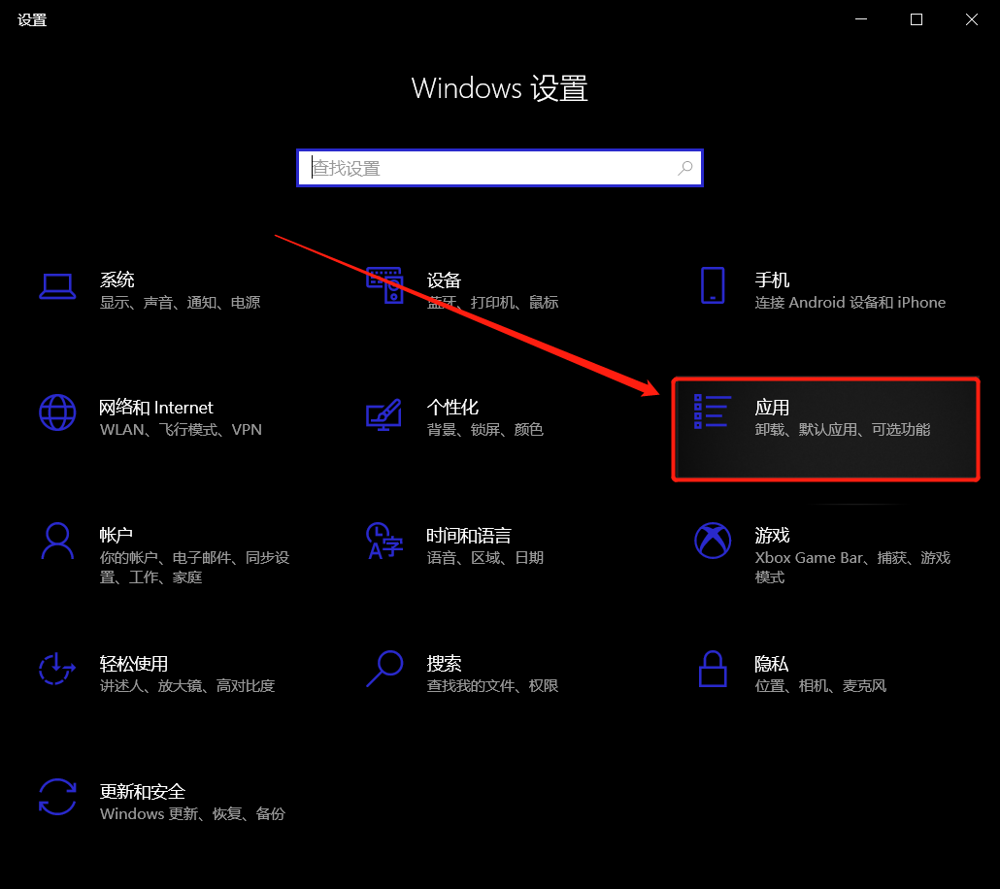

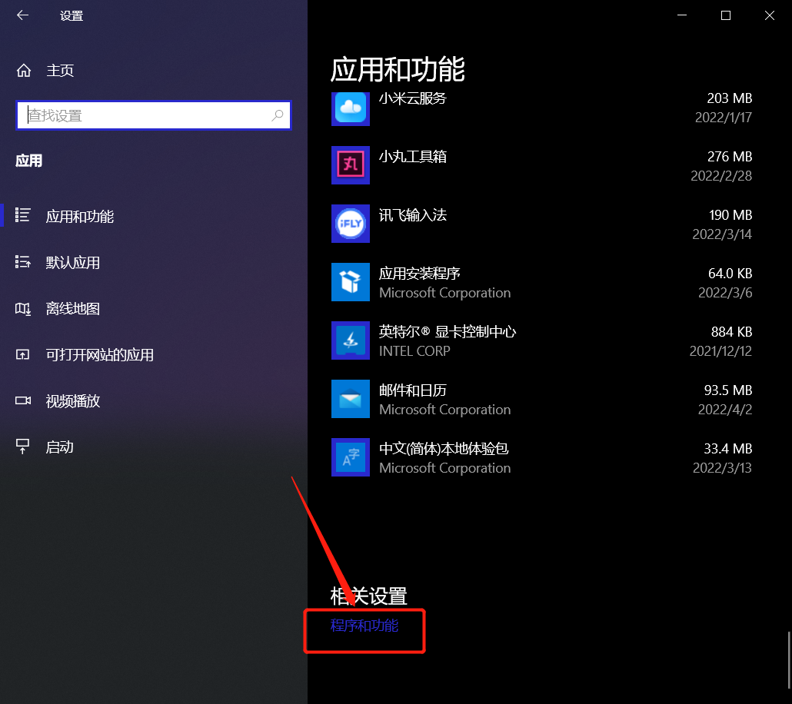

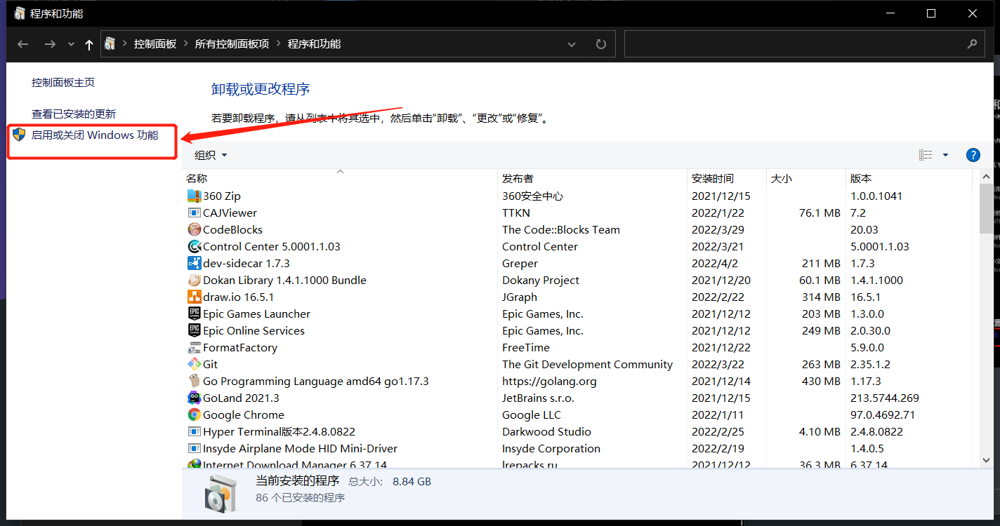

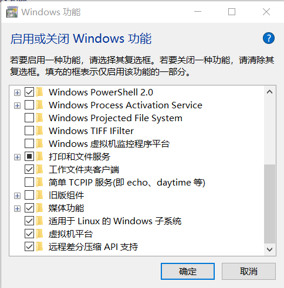


## (2). 下载Ubuntu ##

在“Microsoft Store”中搜索“Ubuntu 18.04 LTS”，然后下载安装即可。

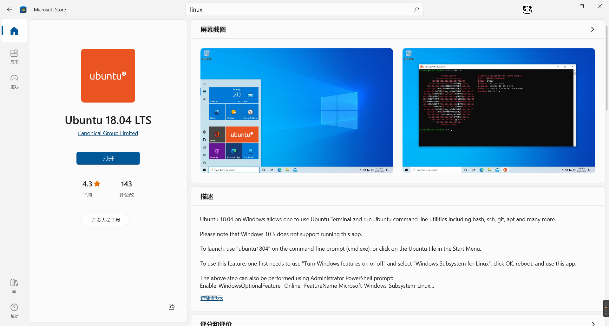


## (3). 启用root ##

执行以下命令启用root用户。

```shell
sudo passwd root
```

到这里，已经可以使用 WSL 了，但是我希望通过Xshell来使用，因为XShell相对方便输入命令，所以需要启用SSH服务。

# 2. SSH安装和开机启动

## (1). 启用SSH服务 ##

首先安装ssh

```shell
sudo apt install openssh-server
```

然后编辑配置文件

```shell
sudo vim /etc/ssh/sshd_config
```

在vim中搜索定位PermitRootLogin，可直接查找：PermitRootLogin

找到以下配置：

```shell
#LoginGraceTime 2m
#PermitRootLogin prohibit-password
#StrictModes yes
#MaxAuthTries 6
#MaxSessions 10
```

修改为：

```shell
LoginGraceTime 2m
PermitRootLogin yes
StrictModes yes
#MaxAuthTries 6
#MaxSessions 10
```

然后，重启ssh，使配置生效

```shell
sudo service ssh restart
```


## (2). 配置开机启动SSH ##

 右键 此电脑-管理-系统工具-任务计划程序-创建基本任务

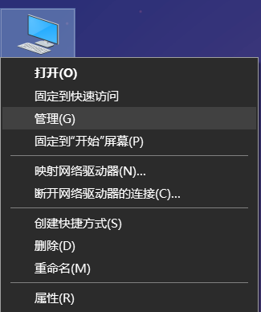

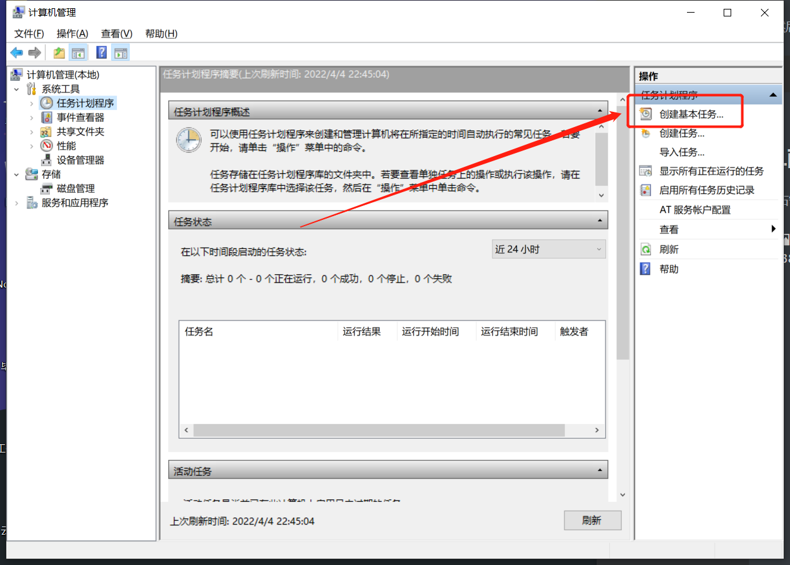

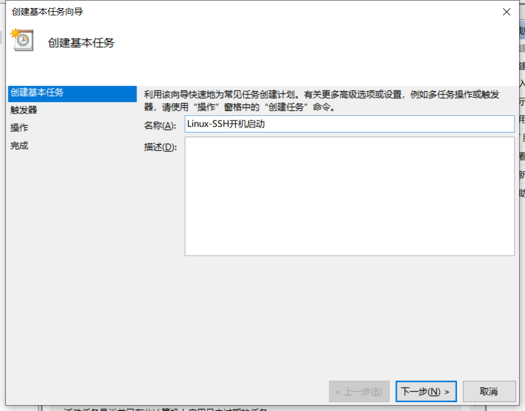

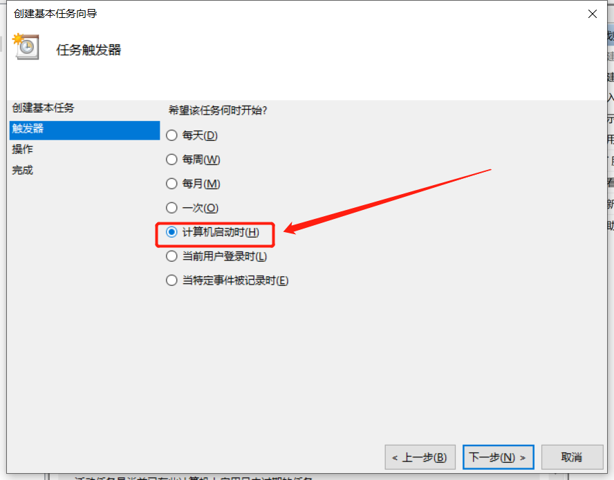

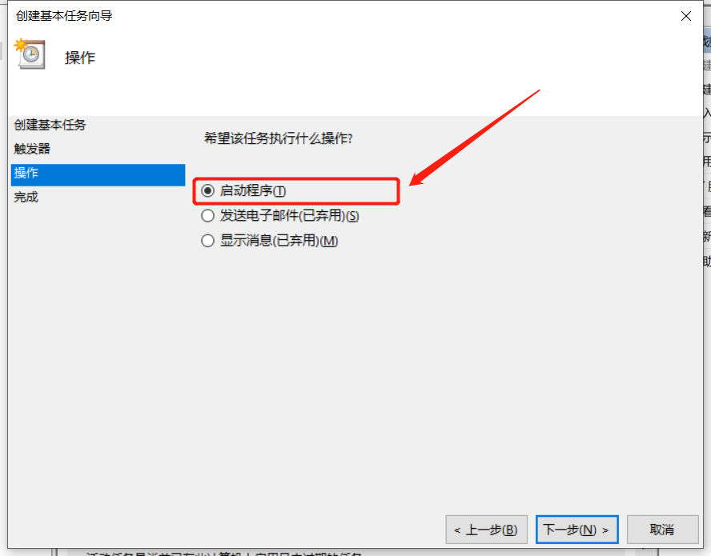

### 方法一

这里程序或脚本 填: 

```shell
%windir%\System32\bash.exe
```

 添加参数 填: 

```shell
-c "echo 你的linux密码|sudo -S /etc/init.d/ssh restart"
```

### 方法二

也可以使用以下配置，这个配置不用最高权限运行，也不用密码

程序或脚本 填：

```shell
cmd
```

添加参数填：

```shell
/c "wsl -u root bash -c 'service ssh restart' "
```

### 方法三

程序或脚本 填：

```shell
powershell
```

添加参数填：

```shell
wsl -u root bash -c 'service ssh restart'
```

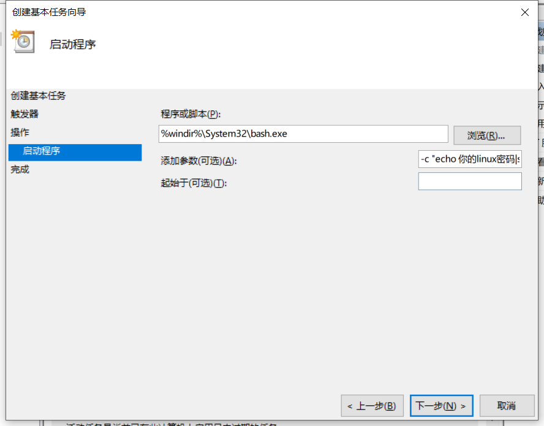

然后，下一步。

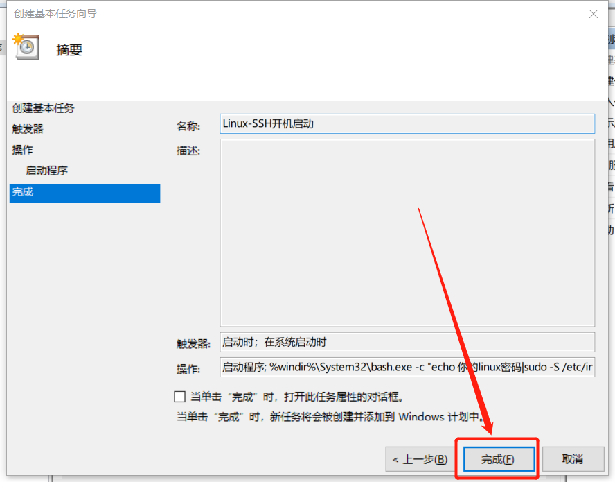

点击完成。

在“任务计划程序库”中，找到刚刚的服务，右键点击，选择属性，然后选择隐藏。这个如果不设置的话，每次开机会弹下黑窗口。

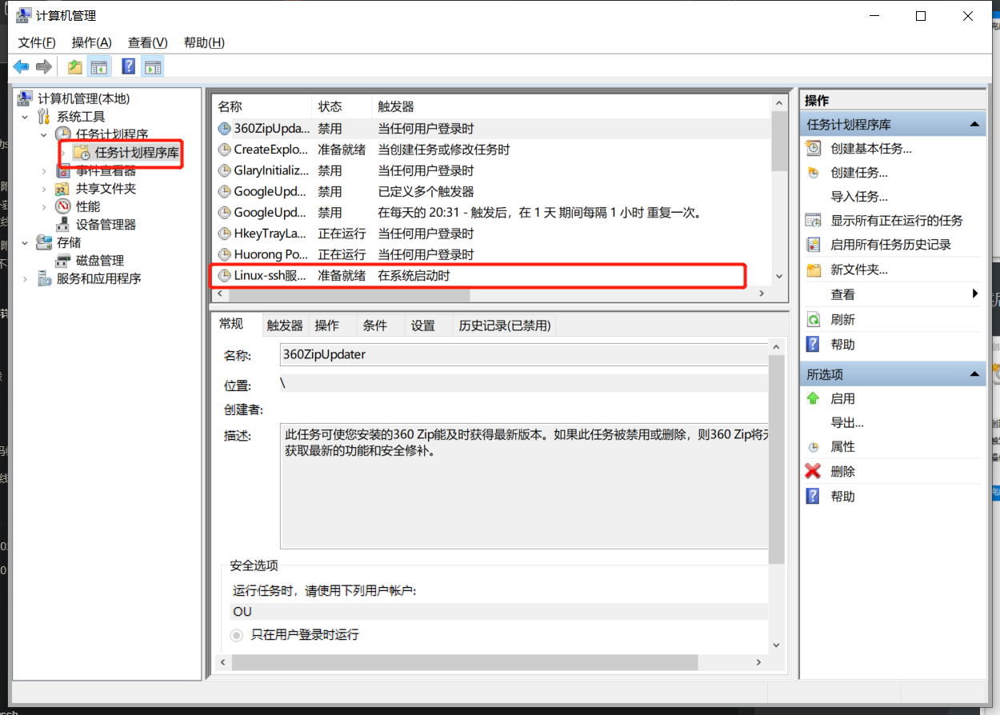

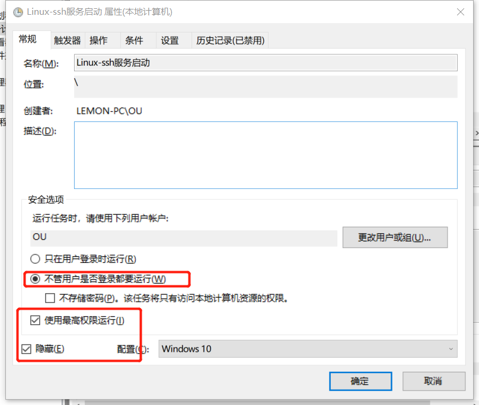

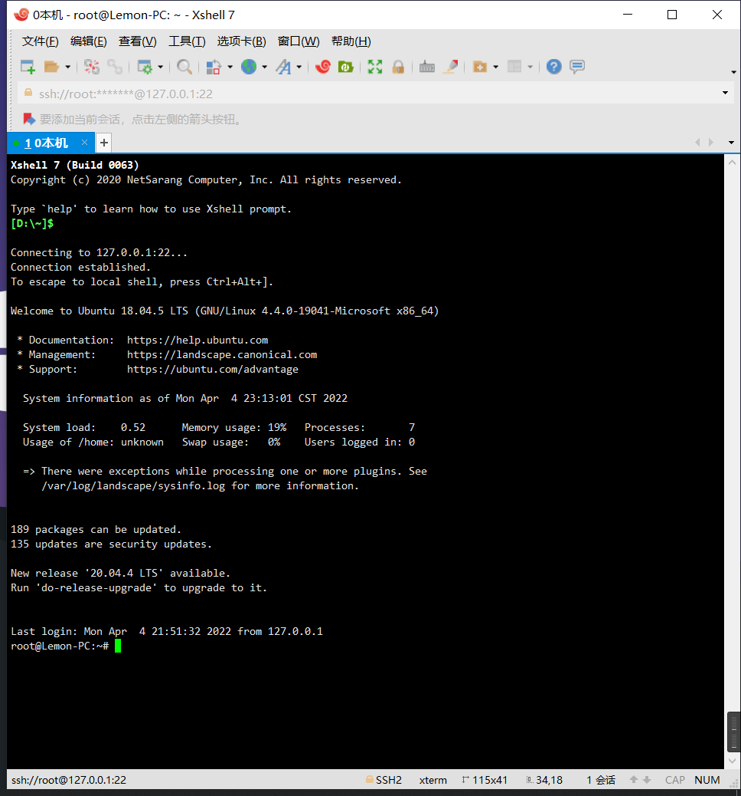

# 3. 添加中文字体并设置为默认

## (1). 修改文件

```shell
sudo vim etc/locale.gen
```

删掉文件中 # zh_CN.UTF-8 前的 #

## (2).  下载语言包

```shell
sudo locale-gen
```


## (3). 修改中文为默认(可选)

```shell
sudo dpkg-reconfigure locales
```


## (4). 下载中文字体和语言包

```shell
sudo apt-get install fonts-wqy-microhei ttf-wqy-zenhei language-pack-zh-hans language-pack-gnome-zh-hans language-pack-kde-zh-hans manpages-zh
```

查看已安装的中文字体

```shell
fc-list :lang=zh-cn
```


## (5). 重启WSL

```shell
wsl --shutdown
```

 

# 4.卸载WSL #

## (1). cmd输入，查看wsl版本

```shell
wslconfig /l
```

## (2). 输入wslconfig \u <name>注销需要删除的子系统

```shell
wslconfig \u Ubuntu-18.04
```

## (3). 卸载Ubuntu-18.04
